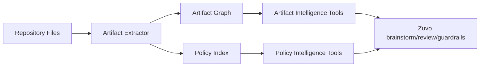

# CodeSift Artifact and Policy Intelligence -- Design Specification

> **spec_id:** 2026-04-05-codesift-artifact-policy-intelligence-2145
> **topic:** CodeSift Artifact and Policy Intelligence
> **status:** Reviewed
> **created_at:** 2026-04-05T14:45:00Z
> **approved_at:** null
> **approval_mode:** async
> **author:** zuvo:brainstorm

## Problem Statement

CodeSift already provides strong code-centric retrieval for symbols, references, call chains, clones, and hotspots, and Zuvo already depends on that model for deep code exploration. However, the current integration is weak for repositories whose primary value is not executable code but structured artifacts such as skills, prompts, plugins, hook configs, policy files, and markdown-driven automation contracts.

That creates four product gaps:

1. Artifact-heavy repos are explored mostly through generic text search rather than first-class semantics.
2. There is no named policy-analysis surface that higher-level systems can rely on for guardrails and rule authoring.
3. Trigger collisions, policy overlap, and artifact graph relationships are not explicit MCP-level operations.
4. Zuvo cannot ask CodeSift for structured evidence bundles tailored to review packs and policy generation.

If nothing changes, CodeSift remains excellent for code repos but underpowered for the prompt/plugin/policy layer that tools like Zuvo increasingly need.

## Design Decisions

- **[AUTO-DECISION] Scope this spec to new CodeSift capability contracts, not CodeSift internal file layout.**  
  Rationale: the CodeSift repository is not in this workspace, so this spec must define the external MCP surface and indexing behavior clearly enough to drive a separate CodeSift-local plan.  
  Alternatives considered: guessing internal CodeSift file paths; deferring CodeSift work entirely.

- **[AUTO-DECISION] Introduce two new capability families:** artifact intelligence and policy intelligence.  
  Rationale: they solve related but distinct problems. Artifact intelligence models repository objects and relationships; policy intelligence reasons about rules, overlaps, and evidence.  
  Alternatives considered: a single generic `semantic_search` enhancement.

- **[AUTO-DECISION] Keep all additions backward-compatible and additive.**  
  Rationale: Zuvo and existing CodeSift consumers already depend on the current toolset. New functionality must not change existing response shapes.  
  Alternatives considered: replacing existing search tools with a new unified response model.

- **[AUTO-DECISION] Make outputs typed and evidence-first.**  
  Rationale: Zuvo review packs and guardrails need structured, machine-consumable results rather than loose prose.  
  Alternatives considered: returning only ranked markdown summaries.

- **[AUTO-DECISION] Runtime enforcement stays outside CodeSift.**  
  Rationale: CodeSift should discover, explain, and validate. Zuvo or other orchestrators decide whether to warn or block.  
  Alternatives considered: embedding guardrail execution in CodeSift tools.

- **[AUTO-DECISION] Use clean-room implementation only.**  
  Rationale: behavior and product requirements may be inspired by the analyzed repo, but CodeSift tooling, parsers, graph construction, and ranking logic are implemented from scratch.  
  Alternatives considered: porting parser or rule logic from external promptware repos.

## Solution Overview

CodeSift will expand from code intelligence to repository artifact intelligence.

The system gains:

1. **Artifact-aware indexing** for markdown frontmatter, hook manifests, plugin manifests, YAML/TOML configs, and named policy files.
2. **Artifact graph retrieval** so a client can trace relationships between skills, hooks, agents, configs, docs, and policies.
3. **Policy intelligence tools** that find overlapping rules, explain why a policy matches a target, and package evidence for review or guardrail authoring.

High-level flow:

## Detailed Design

### Data Model

CodeSift adds two new indexed entity families.

**Artifact node schema**

- `artifact_id`
- `artifact_type`
  - `skill`
  - `agent`
  - `hook`
  - `plugin_manifest`
  - `policy`
  - `doc`
  - `command`
  - `config`
- `path`
- `title`
- `summary`
- `frontmatter`
- `exports_or_capabilities`
- `triggers`
- `tool_references`
- `related_symbols`
- `tags`

**Artifact edges**

- `references`
- `invokes`
- `loads`
- `documents`
- `extends`
- `conflicts_with`
- `supersedes`

**Policy index schema**

- `policy_id`
- `source_path`
- `event_scope`
- `action_type`
- `target_scope`
- `predicate_fingerprint`
- `pattern_family`
- `confidence`
- `evidence_refs`

**Evidence bundle schema**

- `subject`
- `subject_type`
- `matched_artifacts`
- `matched_policies`
- `collisions`
- `supporting_snippets`
- `confidence`
- `recommended_next_queries`

### API Surface

New MCP tools proposed for CodeSift:

1. `search_artifacts(repo, query, artifact_types?, detail_level?, token_budget?)`
   - Purpose: semantic and lexical search over non-code repository artifacts
   - Returns: typed artifact hits with summaries, triggers, and path references

2. `trace_artifact_graph(repo, artifact_id, direction?, depth?)`
   - Purpose: graph traversal between skills, hooks, docs, policies, configs, and commands
   - Returns: nodes, edges, and a compact explanation of the path

3. `detect_trigger_collisions(repo, scope?, artifact_types?)`
   - Purpose: find overlapping triggers, duplicate intent routing, or policies targeting the same event/path/tool combination
   - Returns: collision sets with severity and rationale

4. `search_policy_patterns(repo, query, event_scope?, target_scope?)`
   - Purpose: find similar or overlapping policy logic by intent, not only by raw regex/text
   - Returns: normalized pattern matches and families

5. `explain_policy_match(repo, policy_ref, target_ref)`
   - Purpose: explain why a policy would match a file, artifact, or action candidate
   - Returns: predicate-level evidence and missing/fulfilled conditions

6. `build_evidence_bundle(repo, subject, mode?)`
   - Purpose: return a structured bundle for higher-level review or authoring workflows
   - Modes:
     - `review-errors`
     - `review-types`
     - `review-comments`
     - `policy-authoring`
     - `artifact-overview`

Response rules:

- All tools must include stable IDs, file paths, and confidence annotations.
- All tools must be additive; they do not replace existing `search_symbols`, `detect_communities`, or `codebase_retrieval`.
- All tools must degrade gracefully when a repo has few or no artifact files.
- All tools must use a consistent response envelope:
  - `status`: `ok | no_signal | partial`
  - `repo`
  - `results`
  - `confidence`
  - `notes`
- Error semantics:
  - unsupported artifact types or missing indexes return `status: partial` with explanatory notes, not silent empty arrays
  - malformed artifact files are reported as notes tied to file paths instead of failing the whole request
- `index_file(path)` must update artifact and policy indexes for markdown, YAML, TOML, and JSON files with the same freshness guarantees currently expected for code files.

### Integration Points

**Zuvo-side consumer touchpoints**

Existing Zuvo files that will consume or document the new CodeSift capability family:

- `shared/includes/codesift-setup.md`
  Add new tool selection guidance for artifact and policy intelligence.
- `docs/codesift-integration.md`
  Document the new tools, use cases, and degraded-mode behavior.
- `skills/brainstorm/agents/code-explorer.md`
  Use artifact graph and artifact search when analyzing skill/plugin/prompt repos.
- `skills/brainstorm/agents/business-analyst.md`
  Use policy intelligence to find pain points and overlap in rule-heavy repos.
- `skills/review/SKILL.md`
  Use evidence bundles to support focused review packs.
- `skills/code-audit/SKILL.md`
  Optionally consume policy patterns where CQ/CAP heuristics overlap with structured rules.
- Planned `skills/guardrails/SKILL.md`
  Use policy intelligence to generate or validate project policies.

**CodeSift-side implementation boundaries**

Because the CodeSift repository is not part of this workspace, this spec constrains the following internal modules conceptually rather than by path:

- artifact extraction/indexing pipeline
- graph storage and traversal layer
- MCP tool registry and response typing
- ranking and evidence packaging layer

The CodeSift-local implementation plan must map these concepts onto concrete repo paths during its own planning phase.

### Edge Cases

- **Artifact-light repos**
  - Scenario: a normal application repo contains almost no skills, hooks, or policies.
  - Risk: noisy or empty artifact results.
  - Handling: artifact tools return explicit low-signal responses and recommend falling back to code-centric tools.

- **Mixed repos**
  - Scenario: a monorepo contains both executable code and artifact-heavy plugin directories.
  - Risk: artifact indexing pollutes code search ranking.
  - Handling: artifact tools stay separate from existing code tools; callers opt in per task.

- **Ambiguous trigger collisions**
  - Scenario: two skills share overlapping natural-language triggers but target different workflows.
  - Risk: false positives in collision detection.
  - Handling: collision reports must distinguish exact collisions from fuzzy semantic overlaps and surface confidence levels.

- **Stale index after documentation or policy edits**
  - Scenario: only markdown or YAML changed.
  - Risk: clients get stale artifact graphs.
  - Handling: `index_file` must update artifact and policy indexes for non-code files as first-class entities.

- **Large markdown repos**
  - Scenario: docs-heavy repo with hundreds of files and repeated boilerplate.
  - Risk: low-value duplicate hits dominate results.
  - Handling: rank by artifact salience, frontmatter richness, referenced tools, and graph centrality rather than raw text similarity alone.

- **Private conversation references**
  - Scenario: future evidence bundles combine artifact intelligence with conversation search.
  - Risk: privacy or over-broad retrieval.
  - Handling: conversation data remains opt-in and separate; this spec does not require blending conversation results into artifact tools by default.

### Acceptance Criteria

1. CodeSift can index and retrieve artifact-heavy repository objects such as skills, hooks, plugin manifests, policies, commands, and config files as first-class entities.
2. A client can query artifact relationships through `trace_artifact_graph` and receive stable node/edge outputs suitable for downstream automation.
3. A client can detect overlapping routing or policy definitions through `detect_trigger_collisions` with explicit confidence and rationale.
4. A client can request policy-aware evidence through `search_policy_patterns`, `explain_policy_match`, and `build_evidence_bundle` without requiring runtime enforcement logic inside CodeSift.
5. Existing CodeSift code-centric tools remain backward-compatible and unchanged in behavior.
6. Zuvo can document and later consume the new CodeSift capabilities without copying any logic or schemas from the analyzed reference repo.

## Out of Scope

- Runtime blocking, warning, or confirmation logic
- A graphical UI for artifact graphs or policy inspection
- Automatic migration of third-party rule formats into CodeSift-native policy structures
- Breaking changes to existing CodeSift MCP tools
- Guessing or prescribing concrete internal file paths in the CodeSift repository without a CodeSift-local planning pass

## Open Questions

None. This spec fixes the capability families, tool boundaries, and additive contract model. The only deferred work is mapping them onto concrete files in the CodeSift repository during a separate implementation plan.
