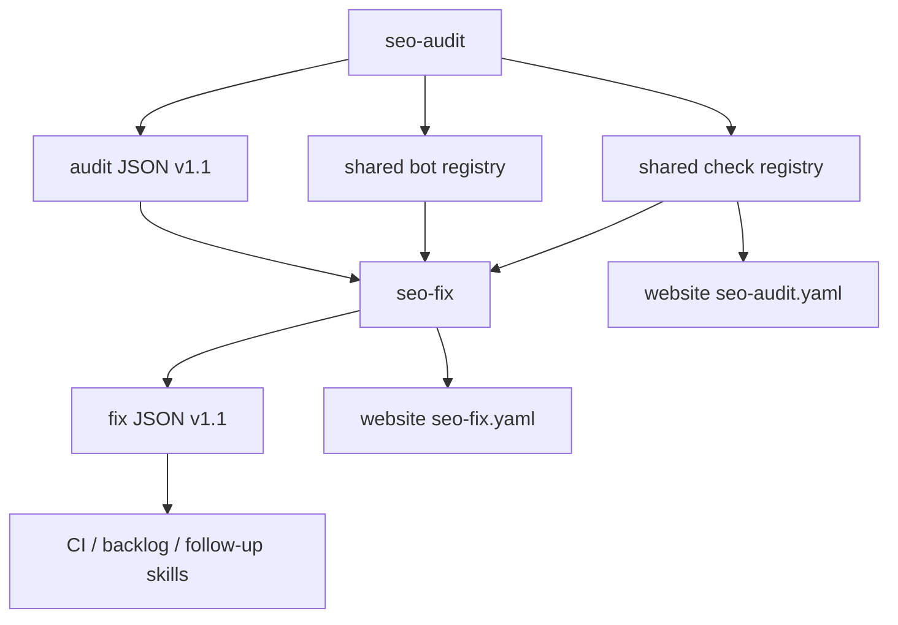

# SEO Skill Suite -- Design Specification

> **spec_id:** 2026-04-05-seo-skill-suite-1442
> **topic:** World-Class SEO Skill Suite
> **status:** Approved
> **created_at:** 2026-04-05T14:42:15Z
> **approved_at:** 2026-04-05T16:19:00Z
> **approval_mode:** async
> **author:** zuvo:brainstorm

## Problem Statement

Zuvo already has the beginnings of a differentiated SEO system: `seo-audit` is code-aware and framework-aware, while `seo-fix` is deterministic and safety-tiered. The current suite is promising, but it is not yet trustworthy enough to claim "best in class." The main gaps are correctness, contract drift, under-specified fix templates, and product overclaim.

Today the suite has three trust failures:

1. Some audit modes are internally inconsistent, so the skill can promise checks it cannot actually execute.
2. Shared registries are not yet strong enough to serve as the canonical contract for checks, fixes, bot policy, and website claims.
3. The product story mixes hard correctness gates, heuristic content advice, GEO best practices, and future-facing visibility intelligence into one surface, which makes results harder to trust.

Competing tools are stronger at crawl scale, historical monitoring, and prompt/citation visibility, but weaker at repo-native evidence, pre-deploy code assurance, and deterministic fix application. This spec is about making Zuvo the best SEO skill suite in the world at the part it can credibly own: engineering-grade SEO/GEO assurance for codebases, with a safe fix pipeline.

If we do nothing, Zuvo will remain impressive but not authoritative: good ideas, strong reports, and clever automation, but still vulnerable to contradictions, false alarms, and marketing claims that outpace the actual contract.

## Design Decisions

### DD1 -- Treat This as a Suite, Not Two Independent Skills

[AUTO-DECISION] The design scope is the `SEO skill suite`: `seo-audit`, `seo-fix`, their shared registries/schemas, and the website metadata that markets them.

Why: the audit and fix layers are already coupled by `fix_type`, stable finding IDs, result semantics, and website claims. Planning them separately would preserve the current drift.

Alternatives considered:
- Redesign only `seo-audit`: rejected, because many user trust issues are created by the audit-to-fix contract.
- Redesign only `seo-fix`: rejected, because many missing inputs originate upstream in `seo-audit`.

### DD2 -- Recommended Approach: Layered Suite, Not a Monolith

[AUTO-DECISION] Use a layered architecture with one shared contract:

- Layer 1: Core Assurance (`blocking`)
- Layer 2: Technical Hygiene (`scored`)
- Layer 3: GEO / Content Readiness (`advisory` or lightly scored)
- Layer 4: Visibility Intelligence (`deferred from this spec`)

Why: this keeps the suite ambitious without weakening trust. Hard correctness stays hard. Heuristics stay useful without masquerading as absolute truth.

Alternatives considered:
- One giant flagship skill with everything merged: rejected, because it maximizes overclaim and ambiguity.
- Split immediately into 4-5 separate public skills: rejected for now, because it would create product sprawl before the core contract is repaired.

### DD3 -- Introduce Explicit Enforcement Classes

[AUTO-DECISION] Every audit check must declare an `enforcement` class:

- `blocking`: can produce overall `FAIL` or `PROVISIONAL`
- `scored`: affects scores, but cannot alone flip the overall result
- `advisory`: informational and prioritized, but excluded from pass/fail logic

Why: this solves the current problem where content/GEO heuristics sometimes feel as authoritative as crawlability or structured-data failures.

Alternatives considered:
- Keep the current PASS/PARTIAL/FAIL-only model: rejected, because it conflates certainty with severity.
- Create many new status enums: rejected, because `enforcement` is a cleaner axis than status inflation.

### DD4 -- Keep Overall Audit Verdicts Simple

[AUTO-DECISION] Preserve overall audit result semantics:

- `PASS`
- `FAIL`
- `PROVISIONAL`

But refine when they are used:

- `FAIL`: only blocking checks with direct evidence fail
- `PROVISIONAL`: blocking checks are inconclusive or tool coverage is degraded
- Heuristic or advisory failures never create `FAIL` or `PROVISIONAL`

Why: simple top-level verdicts are good for CI and user comprehension. The issue is not the number of verdicts; it is what currently feeds them.

### DD5 -- Add a Canonical Bot Policy Registry

[AUTO-DECISION] Add a new shared file: `shared/includes/seo-bot-registry.md`.

It will define:
- bot key
- user-agent tokens
- provider
- class: `training | search | retrieval | user-assisted`
- default policy suggestion
- live-test eligibility
- Cloudflare relevance

Initial scope: 15 bots across the four classes above, including the major OpenAI, Anthropic, Google, Perplexity, Meta, Apple, Amazon, Common Crawl, and ByteDance agents discussed in prior analysis.

Why: both `seo-audit` and `seo-fix` need the same bot taxonomy. Today that logic is duplicated, incomplete, or implied.

### DD6 -- Make `llms.txt` Compliance Separate from AI Content Best Practice

[AUTO-DECISION] Separate two concepts:

- `llms-spec-compliance`: is the site compliant with the minimal proposal?
- `llms-best-practice`: is the file rich enough for high-quality AI consumption?

The suite must not treat absence of `llms-full.txt` as spec non-compliance by itself. Rich companion files remain a Zuvo recommendation, not a standard requirement.

Why: this is necessary to avoid false FAIL / PARTIAL judgments and keep the suite aligned with real-world standards.

### DD7 -- Expand `seo-fix` from Safety Engine to Template Engine

[AUTO-DECISION] `seo-fix` remains deterministic and tiered, but the registry becomes much more explicit about template semantics.

Registry entries must define:
- target files by framework/platform
- required inputs
- validation rules
- network-layer caveats
- manual verification checklist
- estimated time band

Why: the current safety model is strong, but the actual fix recipes are too implicit.

### DD8 -- Add One New Fix Type and Deepen Existing Ones

[AUTO-DECISION] Add `schema-cleanup` as a new `MODERATE` fix type.

Existing fix types that must be significantly deepened:
- `robots-fix`
- `headers-add`
- `json-ld-add`
- `meta-og-add`
- `sitemap-add`

Why: "best in class" requires not just adding missing artifacts, but safely correcting common real-world pathologies like schema spam, edge blocking, stale sitemap metadata, and incorrect `og:type`.

### DD9 -- Keep Content Writing Out of Fix Scope, but Add Scaffolds

[AUTO-DECISION] `seo-fix` will continue to treat content creation as out of scope for auto-mutation, but it may emit structured content scaffolds as advisory artifacts.

Examples:
- recommended section outline
- target word-count bands
- answer-first template
- citation placeholders

Why: this improves actionability without lying about what the system can safely automate.

### DD10 -- Website Claims Must Be Verified by Contract

[AUTO-DECISION] Website YAMLs remain hand-curated for narrative copy, but all numeric/product claims must be CI-verifiable against the shared registries and skill files.

Claims to verify include:
- number of fix types
- frameworks supported
- verdict/status taxonomy
- critical gate counts
- benchmark claims tied to real files

Why: the website is part of the trust surface. Product overclaim is a design bug, not just a docs bug.

## Solution Overview

### Approaches Considered

#### Approach A -- Flagship Monolith

One mega-skill that tries to do code audit, live crawl, GEO advice, visibility intelligence, and fix application in one place.

Trade-off: very marketable, but too hard to keep correct. High trust risk. Rejected.

#### Approach B -- Layered Engineering-First Suite (Recommended)

Keep `seo-audit` and `seo-fix` as separate skills, but rebuild them around one explicit contract, one bot taxonomy, one enforcement model, and one truth source for website claims.

Trade-off: less flashy than a mega-skill, but much stronger in correctness, CI gating, explainability, and trust. Recommended.

#### Approach C -- Immediate Skill Fragmentation

Split into `seo-core`, `seo-geo`, `seo-visibility`, `seo-fix`, and `seo-content`.

Trade-off: theoretically clean, but too much product churn before the existing suite is corrected. Deferred.

### Chosen Approach

[AUTO-DECISION] Choose Approach B.



The core idea is simple:

- `seo-audit` becomes the authoritative detector.
- `seo-fix` becomes the authoritative safe mutator.
- Shared registries become the contract.
- Website files become verified consumers of that contract.

## Detailed Design

### Data Model

#### 1. Extend `seo-check-registry.md`

Add these canonical columns:

| field | purpose |
|------|---------|
| `owner_agent` | which audit agent owns the check |
| `layer` | `core`, `hygiene`, `geo`, `visibility-deferred` |
| `enforcement` | `blocking`, `scored`, `advisory` |
| `evidence_mode` | `code`, `live`, `either`, `proxy` |
| `fix_type` | existing mapping, if fixable |

This removes ambiguity around:
- whether a check can fail the audit
- whether a live fetch is required
- which agent must evaluate it

#### 2. Add `seo-bot-registry.md`

New shared file, used by both audit and fix.

Proposed shape:

```markdown
| bot_key | user_agent_tokens | provider | class | default_policy | live_test | notes |
|---------|-------------------|----------|-------|----------------|-----------|-------|
| gptbot | GPTBot | OpenAI | training | disallow | yes | ... |
| oai-searchbot | OAI-SearchBot | OpenAI | search | allow | yes | ... |
| chatgpt-user | ChatGPT-User | OpenAI | user-assisted | allow | yes | ... |
```

#### 3. Add `seo-page-profile-registry.md`

New shared file, used primarily by `seo-audit` and documented for website copy.

Profiles:
- `marketing`
- `docs`
- `blog`
- `ecommerce`
- `app-shell`

Each profile defines:
- thin-content threshold
- answer-first expectation
- E-E-A-T expectations
- freshness sensitivity
- when D9/D10 checks are `scored`, `advisory`, or `N/A`

Why: the suite must stop treating content heuristics as universal truth across radically different page types.

#### 4. Expand `seo-fix-registry.md`

Each `fix_type` entry must define:
- safety tier
- target platform map
- validation rules
- caveat checklist
- estimated effort band / minutes

New fix types:
- `schema-cleanup` (`MODERATE`)

Expanded existing fix types:
- `robots-fix`
- `headers-add`
- `json-ld-add`
- `meta-og-add`
- `sitemap-add`

#### 5. Audit Output Schema v1.1

Add optional fields, preserving backward compatibility:

```json
{
  "findings": [
    {
      "id": "D5-robots-ai-policy",
      "enforcement": "blocking",
      "layer": "core",
      "confidence_reason": "Cloudflare config absent; robots only",
      "eta_minutes": 20,
      "bot_scope": ["gptbot", "oai-searchbot", "chatgpt-user"]
    }
  ],
  "bot_matrix": [
    {
      "bot_key": "gptbot",
      "status": "BLOCKED",
      "evidence": "robots.txt:12",
      "verification_mode": "code"
    }
  ]
}
```

#### 6. Fix Output Schema v1.1

Add optional fields:
- `eta_minutes`
- `manual_checks`
- `risk_notes`
- `network_override_risk`

Example:

```json
{
  "actions": [
    {
      "finding_id": "D5-robots-ai-policy",
      "fix_type": "robots-fix",
      "status": "NEEDS_REVIEW",
      "verification": "ESTIMATED",
      "manual_checks": [
        "Cloudflare AI bot controls",
        "curl -A 'GPTBot' / -I"
      ],
      "network_override_risk": true
    }
  ]
}
```

### API Surface

#### `seo-audit`

[AUTO-DECISION] Keep existing top-level command names, but refine semantics and add two new optional knobs.

Behavioral changes:
- `--quick`: evaluates only `blocking` checks and only if every blocking owner agent is dispatched
- `--geo`: evaluates GEO-relevant checks across whichever agents own them; it is no longer described as a content-only shortcut

New flags:
- `--content-profile auto|marketing|docs|blog|ecommerce`
- `--live-sample-bots` (enabled implicitly when `--live-url` is provided, but can be disabled)

New live outputs:
- bot status table
- response-vs-render summary
- network-override warnings

New markdown report sections:
- `Strengths`
- `Bot Policy Matrix`
- `Source vs Render Diff`
- `Content Table`
- `Fix Coverage Summary`

#### `seo-fix`

[AUTO-DECISION] Keep existing flags, add richer report semantics instead of many new flags.

Behavioral changes:
- `robots-fix` can return `NEEDS_REVIEW` when edge/network conditions may override file-based fixes
- `json-ld-add` auto-downgrades to `NEEDS_REVIEW` when existing schema density indicates possible spam
- out-of-scope content findings may emit advisory scaffolds

### Integration Points

Files to modify:

- `/Users/greglas/DEV/zuvo-plugin/skills/seo-audit/SKILL.md`
- `/Users/greglas/DEV/zuvo-plugin/skills/seo-audit/agents/seo-technical.md`
- `/Users/greglas/DEV/zuvo-plugin/skills/seo-audit/agents/seo-content.md`
- `/Users/greglas/DEV/zuvo-plugin/skills/seo-audit/agents/seo-assets.md`
- `/Users/greglas/DEV/zuvo-plugin/skills/seo-fix/SKILL.md`
- `/Users/greglas/DEV/zuvo-plugin/shared/includes/seo-check-registry.md`
- `/Users/greglas/DEV/zuvo-plugin/shared/includes/seo-fix-registry.md`
- `/Users/greglas/DEV/zuvo-plugin/shared/includes/audit-output-schema.md`
- `/Users/greglas/DEV/zuvo-plugin/shared/includes/fix-output-schema.md`
- `/Users/greglas/DEV/zuvo-plugin/website/skills/seo-audit.yaml`
- `/Users/greglas/DEV/zuvo-plugin/website/skills/seo-fix.yaml`

Files to create:

- `/Users/greglas/DEV/zuvo-plugin/shared/includes/seo-bot-registry.md`
- `/Users/greglas/DEV/zuvo-plugin/shared/includes/seo-page-profile-registry.md`
- `/Users/greglas/DEV/zuvo-plugin/scripts/validate-seo-skill-contracts.sh`

Cross-file coupling to preserve:
- stable finding IDs
- `fix_type` mappings
- website claim counts
- result semantics (`PASS` / `FAIL` / `PROVISIONAL`)
- fix action statuses (`FIXED`, `NEEDS_REVIEW`, `MANUAL`, etc.)

Website alignment rule:
- website YAML remains hand-authored narrative copy
- numeric counts, status vocabularies, framework support, and benchmark claims must be derived from or validated against shared registries and schemas
- `scripts/validate-seo-skill-contracts.sh` fails when those claims drift

### Edge Cases

#### 1. Tool degradation

- If live tools or browser tools are missing, blocking live-dependent checks become `PROVISIONAL`, not `PASS`.
- The suite must never infer blocking success from missing evidence.

#### 2. Database-backed or CMS-backed content

- If source content is inaccessible in repo analysis, D9/D10 heuristics become `advisory` or `N/A`, not hard failure.

#### 3. Edge/network overrides

- Cloudflare, WAF, CDN, or hosting controls may override `robots.txt`.
- `seo-fix` must surface this as `NEEDS_REVIEW` with manual validation, not silently report `FIXED`.

#### 4. Existing schema spam

- If a page already has too many JSON-LD blocks, duplicate `@type` entries, or obviously dumped content, additive fixes must stop and downgrade.

#### 5. Intentional bot policy

- Users may intentionally allow or disallow training/search bots.
- The suite must validate consciousness and consistency, not enforce one ideology.

#### 6. Unsupported stacks

- Unsupported frameworks should still get reduced audit coverage with explicit reporting.
- The suite must report "coverage degraded" rather than pretend full support.

#### 7. Website claim drift

- Numeric claims can become stale when the registry changes.
- CI or a validation script must detect mismatch before website copy is shipped.

#### 8. Async Codex workflow

- In async mode the suite must be self-explanatory without interactive clarification.
- All high-impact assumptions need visible rationale and safe defaults.

## Acceptance Criteria

1. `seo-audit --quick` and `seo-audit --geo` dispatch only agent sets that can actually evaluate their declared checks.
2. Every check referenced by any audit agent exists in the canonical check registry with an owner agent and enforcement class.
3. Blocking checks are the only checks that can produce overall `FAIL` or `PROVISIONAL`.
4. `llms.txt` proposal compliance is separated from Zuvo AI-consumption best practice in both audit logic and fix guidance.
5. A canonical bot registry exists and is used by both `seo-audit` and `seo-fix`.
6. `seo-audit --live-url` can emit a bot matrix with per-bot evidence and verification mode.
7. `seo-fix` can downgrade `robots-fix` to `NEEDS_REVIEW` when network-layer overrides are plausible.
8. `robots-fix` defines a deterministic policy template plus manual verification checklist, not just "Googlebot must not be blocked."
9. `headers-add` defines an explicit baseline header set and platform-specific targets.
10. `json-ld-add` includes anti-spam validation and `schema-cleanup` exists as a separate `MODERATE` fix type.
11. `meta-og-add` validates `og:type` consistency for homepage, article, and generic pages.
12. `sitemap-add` validates `site` configuration and flags stale or low-quality `lastmod` data as `NEEDS_REVIEW`.
13. `seo-fix` reports include estimated effort/time bands for each fix or verdict.
14. Out-of-scope content findings may emit structured advisory scaffolds without mutating content files.
15. `website/skills/seo-audit.yaml` and `website/skills/seo-fix.yaml` are aligned with actual counts, statuses, and framework support from the registries and schemas.
16. The redesigned suite remains compatible with existing downstream `seo-fix` / CI consumers through schema v1.1 optional fields rather than a breaking schema reset.

## Out of Scope

- Building a full crawl engine to compete with Screaming Frog or Sitebulb on URL scale
- Building a historical AI visibility platform with prompt telemetry, citations, or competitor share tracking
- Backlink intelligence, rank tracking, Search Console ingestion, or CrUX dashboards
- Implementing a separate public `visibility-intel` skill in this phase
- Writing or rewriting production marketing content automatically
- Applying implementation changes in this brainstorm phase

## Open Questions

None. `[AUTO-DECISION]` Visibility-intelligence capabilities are explicitly deferred so the implementation can focus on trust, correctness, and deterministic audit-to-fix behavior first.
