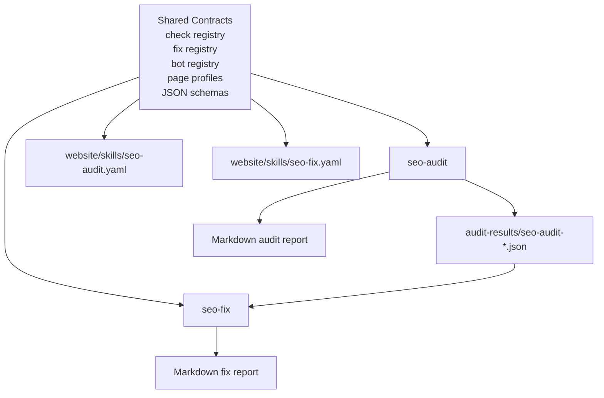

# SEO Skill Suite v2 -- Design Specification

> **spec_id:** 2026-04-05-seo-skill-suite-v2-1442
> **topic:** SEO Skill Suite v2
> **status:** Approved
> **created_at:** 2026-04-05T14:42:58Z
> **approved_at:** 2026-04-05T16:09:34Z
> **approval_mode:** async
> **author:** zuvo:brainstorm

## Problem Statement

The current `seo-audit` and `seo-fix` skills have strong building blocks, but they do not yet form a world-class, trustworthy SEO system. The strongest parts already exist: evidence-driven code inspection, critical gates, structured JSON outputs, safety-tiered fixes, dirty-file checks, and build verification. The weakest parts are correctness drift across skill prompts, registries, schemas, and website claims; under-specified remediation templates; and a capability gap versus best-in-class tools in raw-vs-render verification, AI bot policy modeling, and structured data cleanup.

[AUTO-DECISION] The phrase "best SEO skill in the world" is narrowed to "best repo-native engineering SEO/GEO skill suite for codebases." Rationale: this suite can realistically beat classic crawl tools on code awareness, CI gating, and fix automation, but it should not pretend to replace large-scale SaaS crawling, prompt visibility analytics, or historical monitoring dashboards in this iteration. Alternative considered: design a general all-in-one SEO platform. Rejected because it would create a vague spec and guarantee product overreach.

[AUTO-DECISION] The scope is a single subsystem: the SEO skill suite composed of `seo-audit`, `seo-fix`, their shared registries/schemas, and the website metadata that markets them. Rationale: the two skills are coupled by `fix_type`, stable finding IDs, JSON schema contracts, and overlapping product claims. Alternative considered: spec only `seo-audit` first. Rejected because it would preserve the current audit/fix contract drift.

If nothing changes, the likely outcome is continued erosion of trust: the skills will look sophisticated, but users will hit mismatched modes, incomplete fix behavior, inaccurate marketing claims, and false confidence in audit/fix results.

## Design Decisions

### Approaches Considered

1. **Incremental Patch-In-Place**
   - Keep both skills mostly intact and patch individual inconsistencies.
   - Advantage: lowest implementation cost.
   - Rejected: fixes symptoms but preserves fragmented contracts and weak product differentiation.

2. **Monolithic Super Skill**
   - Merge audit and fix into a single giant SEO workflow.
   - Advantage: single user entrypoint.
   - Rejected: conflates discovery and mutation, weakens safety boundaries, and makes the prompt harder to reason about.

3. **Recommended: Shared-Core SEO Suite**
   - Keep `seo-audit` and `seo-fix` as separate skills, but redesign them around a single shared capability core: bot taxonomy, page-profile heuristics, check/fix registries, output schemas, and aligned website claims.
   - Advantage: preserves current two-step workflow while making the suite coherent, testable, and extensible.

### Chosen Decisions

1. [AUTO-DECISION] Preserve two skills, but introduce a stronger shared contract layer.
   - Rationale: audit and fix are different jobs with different safety models.
   - Alternative: single mega-skill. Rejected as too risky and harder to trust.

2. [AUTO-DECISION] Redesign the suite around four product layers:
   - Layer 1: Launch-Critical Indexability and Rich Results
   - Layer 2: Render, Crawl, and Platform Integrity
   - Layer 3: AI/GEO Policy and Content Extractability
   - Layer 4: Safe Remediation and Verification
   - Rationale: these layers match real user mental models better than the current flat list of dimensions plus scattered advisory rules.

3. [AUTO-DECISION] Introduce a canonical AI bot taxonomy shared by audit and fix.
   - Rationale: `seo-audit` cannot score AI crawler policy rigorously and `seo-fix` cannot remediate it correctly without a shared bot model.
   - Alternative: keep a minimal fixed list of 5 bots. Rejected because it is no longer sufficient.

4. [AUTO-DECISION] Separate `llms.txt` spec compliance from "AI consumption best practice."
   - Rationale: the current design over-penalizes missing companion files and mixes proposal compliance with opinionated content strategy.
   - Alternative: keep current `llms-full.txt` assumptions. Rejected as likely to produce false negatives.

5. [AUTO-DECISION] Replace universal D9/D10 heuristics with site-profile-aware scoring.
   - Profiles: `marketing`, `docs`, `blog`, `ecommerce`, `app-shell`.
   - Rationale: thin-content and answer-first rules should not behave identically across product pages, documentation, and app shells.

6. [AUTO-DECISION] Expand `seo-fix` semantics before expanding its breadth.
   - Rationale: `robots-fix`, `headers-add`, `json-ld-add`, `meta-og-add`, and `sitemap-add` need richer validation and clearer outputs before adding many more fix types.
   - Alternative: add more fix types immediately. Rejected because it increases surface area without increasing trust.

7. [AUTO-DECISION] Website YAML must be treated as a derivative contract, not a marketing-only layer.
   - Rationale: current website claims drift from the actual skill/registry reality.
   - Alternative: keep manual website copy updates. Rejected because this is already a proven failure mode.

## Solution Overview

SEO Skill Suite v2 will remain a two-skill system:

- `seo-audit` becomes the authoritative discovery and scoring engine for repo-native SEO/GEO assurance.
- `seo-fix` becomes the authoritative remediation and verification engine for safe, engineering-grade fixes.

Both skills will read from the same shared contracts. The redesign adds two new shared registries, tightens existing registries, aligns JSON schemas, and reduces claim drift between prompt logic and website presentation.

### High-Level Flow

### Core Principles

- **Correctness before breadth:** eliminate mode, registry, schema, and marketing drift first.
- **Evidence over inference:** raw-vs-render and bot-policy evidence become first-class outputs.
- **Best-in-class where repo-native matters:** beat classic crawlers on code context, CI gating, and safe remediation.
- **Explicit limits elsewhere:** do not promise large-scale crawling, prompt visibility analytics, or SaaS-style historical monitoring in this version.

## Detailed Design

### Data Model

This redesign introduces two new shared contracts and upgrades four existing ones.

#### New Shared Files

1. `shared/includes/seo-bot-registry.md`
   - Canonical bot entries with fields:
     - `bot_slug`
     - `provider`
     - `tier` (`training`, `search`, `retrieval`, `user-proxy`)
     - `user_agent`
     - `default_recommendation`
     - `live_probe_required`
     - `cloudflare_sensitive`
   - Initial coverage includes at least:
     - Training: `GPTBot`, `ClaudeBot`, `Google-Extended`, `CCBot`, `Bytespider`, `Meta-ExternalAgent`, `Applebot-Extended`
     - Search/Retrieval: `OAI-SearchBot`, `Claude-SearchBot`, `PerplexityBot`, `Amazonbot`
     - User-proxy: `ChatGPT-User`, `Claude-User`, `Perplexity-User`

2. `shared/includes/seo-page-profile-registry.md`
   - Canonical site profiles and heuristic rules:
     - `marketing`
     - `docs`
     - `blog`
     - `ecommerce`
     - `app-shell`
   - Per-profile rules:
     - thin-content threshold
     - answer-first expectation
     - E-E-A-T requirements
     - freshness sensitivity
     - when a check is advisory vs scored

#### Existing Files to Upgrade

1. `shared/includes/seo-check-registry.md`
   - Add missing check slugs so agents no longer invent names.
   - Normalize all `seo-audit` findings to registry-defined slugs only.
   - Add new checks for:
     - response-vs-render drift
     - bot matrix completeness
     - Cloudflare override risk
     - sitemap `lastmod` quality
     - robots sub-risks (`js-block`, `pdf-block`, `feed-block`)
     - schema duplication and schema spam
     - OG type consistency

2. `shared/includes/seo-fix-registry.md`
   - Keep `robots-fix` as one fix type but enrich required params:
     - `strategy`
     - `bot_policy_profile`
     - `sub_issues`
     - `platform_overrides`
   - Add new fix type:
     - `schema-cleanup`
   - Expand template semantics for:
     - `headers-add`
     - `json-ld-add`
     - `meta-og-add`
     - `sitemap-add`

3. `shared/includes/audit-output-schema.md`
   - Minor bump to `1.1`.
   - Add optional fields:
     - `site_profile`
     - `strengths`
     - `bot_matrix`
     - `render_diff`
     - `coverage.fixable_ratio`
     - `manual_checks`

4. `shared/includes/fix-output-schema.md`
   - Minor bump to `1.1`.
   - Add optional fields:
     - `estimated_time`
     - `manual_checks`
     - `advisory_scaffolds`
     - `policy_notes`

### API Surface

There is no network API in scope. The public interface is the CLI/prompt interface and the JSON/report outputs.

#### `seo-audit`

- Preserve existing entry modes for backward compatibility.
- Correct mode semantics:
  - `--quick` must dispatch the minimal owners of all six critical gates, including the Assets path for `CG5`.
  - `--geo` must dispatch every owner of its declared dimensions, including Technical for D5.
- Add new optional argument:
  - `--profile <marketing|docs|blog|ecommerce|app-shell>`
- Add auto-detection fallback for `--profile` when omitted.

#### `seo-fix`

- Preserve current modes: default, `--auto`, `--all`, `--dry-run`.
- Preserve current `--finding` / fix-type scoping.
- Add richer per-fix outputs without changing the top-level user command surface.

#### Audit Report Additions

`seo-audit` markdown output gains:

- `Strengths`
- `Bot Policy Matrix`
- `Source vs Render Diff`
- `Content Table`
- `Fix Coverage Summary`

#### Fix Report Additions

`seo-fix` markdown output gains:

- `Estimated Time`
- `Manual Platform Checks`
- `Policy Notes`
- `Advisory Scaffolds` for out-of-scope content findings

### Integration Points

#### Files to Modify

- `skills/seo-audit/SKILL.md`
- `skills/seo-audit/agents/seo-technical.md`
- `skills/seo-audit/agents/seo-content.md`
- `skills/seo-audit/agents/seo-assets.md`
- `skills/seo-fix/SKILL.md`
- `shared/includes/seo-check-registry.md`
- `shared/includes/seo-fix-registry.md`
- `shared/includes/audit-output-schema.md`
- `shared/includes/fix-output-schema.md`
- `website/skills/seo-audit.yaml`
- `website/skills/seo-fix.yaml`

#### Files to Create

- `shared/includes/seo-bot-registry.md`
- `shared/includes/seo-page-profile-registry.md`
- `scripts/validate-seo-skill-contracts.sh` or equivalent lightweight validator

#### Website Contract Alignment

Website YAML will no longer invent counts or category names that are not derivable from skill/registry reality. The redesign requires:

- count alignment for fix types, verdicts, frameworks, and capabilities
- naming alignment for D8/D13 semantics
- comparison tables that reflect actual repo-native differentiation rather than generic "better than all tools" positioning

[AUTO-DECISION] This iteration adds a validation mechanism, not full website generation. A lightweight validator under `scripts/` will derive key counts and vocabularies from the shared registries and fail when `website/skills/seo-audit.yaml` or `website/skills/seo-fix.yaml` drift. Rationale: this closes the trust gap without pulling website generation into the critical path. Alternative considered: generate website YAML entirely from registries. Deferred because it is higher blast radius and not necessary to restore correctness.

### Edge Cases

1. **Code-only audit on non-content sites**
   - Strategy: mark content-heavy checks as `N/A` or advisory based on `site_profile`, not as failures.

2. **Database-backed or CMS-backed content**
   - Strategy: avoid claiming definitive content coverage from file scans alone; lower confidence and recommend live/manual checks.

3. **Cloudflare or edge bot overrides**
   - Strategy: `seo-audit` flags override risk; `seo-fix` emits `NEEDS_REVIEW` with explicit dashboard checks instead of claiming a full fix.

4. **Existing schema clutter**
   - Strategy: `json-ld-add` escalates to `NEEDS_REVIEW` when the page already contains multiple blocks or duplicate types; `schema-cleanup` becomes the dedicated remediation path.

5. **Stale but present sitemap**
   - Strategy: treat as a quality issue, not simply "sitemap exists = pass."

6. **Marketing vs docs vs app-shell heuristics**
   - Strategy: page-profile registry decides thresholds and whether checks are advisory.

7. **Unsupported framework or partial coverage**
   - Strategy: report feature support explicitly; do not silently overclaim fix coverage.

8. **`llms.txt` standard drift**
   - Strategy: score spec compliance separately from AI-consumption best practice so evolving proposals do not invalidate the audit.

9. **Agent dispatch unavailable**
   - Strategy: both skills document sequential fallback behavior instead of assuming native multi-agent dispatch exists everywhere.

10. **Dirty files during fix mode**
    - Strategy: keep current `NEEDS_REVIEW` behavior; never weaken it.

## Acceptance Criteria

1. `seo-audit --quick` evaluates all six critical gates with no orphaned gate owner.
2. `seo-audit --geo` dispatches every owner of every declared GEO dimension.
3. Every audit finding `check` emitted by any SEO audit agent exists in `shared/includes/seo-check-registry.md`.
4. `seo-audit` separates `llms.txt` proposal compliance from optional best-practice companion content; missing `llms-full.txt` or equivalent cannot by itself produce a false standards failure.
5. `seo-audit` outputs a bot matrix with tier, explicit policy, and live-probe result when live mode is enabled.
6. `seo-audit` outputs a source-vs-render summary for key SEO fields at least for canonical, title, meta description, JSON-LD, and indexability markers.
7. `seo-audit` supports site profiles and uses them to downgrade or exclude inappropriate D9/D10 checks.
8. `seo-audit` includes a `Strengths` section and a structured `Content Table` when content analysis is active.
9. `seo-fix` defines explicit remediation semantics for `robots-fix`, `headers-add`, `json-ld-add`, `meta-og-add`, and `sitemap-add` in the shared contract, not only in narrative text.
10. `seo-fix` can emit `NEEDS_REVIEW` platform warnings for Cloudflare or similar edge controls even when file-based fixes are applied successfully.
11. `seo-fix` includes `schema-cleanup` as a first-class fix type with safety and validation rules.
12. `seo-fix` validates OG type consistency and sitemap `lastmod` quality before claiming a fix is complete.
13. `seo-fix` report output maps effort to time and includes manual platform checks where applicable.
14. Both website YAML files match actual skill/registry counts, scopes, verdict vocabularies, and framework support.
15. Audit and fix JSON schemas remain backward compatible via a minor version bump, with existing consumers tolerating missing new optional fields.
16. A contract validation mechanism exists that detects website YAML drift from shared registries before release.
17. Both skills document a sequential fallback path when native agent dispatch is unavailable.

## Out of Scope

- Building a hosted crawler platform
- Multi-million-URL crawl infrastructure
- Search Console, CrUX, or backlink API integrations
- Prompt visibility analytics dashboards
- Competitive citation tracking SaaS features
- Automatic content writing or competitor-based content generation
- Production deployment of fixes

## Open Questions

None. The major uncertainties are product-priority questions, not design ambiguities.
