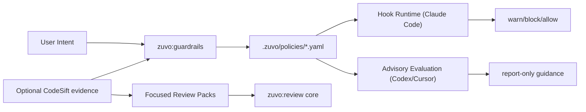

# Zuvo Guardrails and Review Packs -- Design Specification

> **spec_id:** 2026-04-05-zuvo-guardrails-review-packs-2144
> **topic:** Zuvo Guardrails and Review Packs
> **status:** Approved
> **created_at:** 2026-04-05T14:44:00Z
> **approved_at:** 2026-04-05T14:44:00Z
> **approval_mode:** async
> **author:** zuvo:brainstorm

## Problem Statement

Zuvo is strong at prompt-level orchestration, code review, and audit workflows, but it currently lacks a first-class runtime guardrail layer. Today the plugin uses a single `SessionStart` hook to inject the router and relies on skills and instructions to shape behavior, which leaves three gaps:

1. Unsafe or undesired actions can only be discouraged in prompts, not intercepted consistently at runtime.
2. User- or project-specific policies are not modeled as reusable, inspectable artifacts.
3. Review specialization exists as broad workflows (`zuvo:review`, `zuvo:code-audit`, `zuvo:ship`) but not as narrow, high-signal focus packs for specific failure modes such as silent failures, comment drift, or type-invariant regressions.

If nothing changes, Zuvo remains dependent on prompt discipline alone for a class of guardrails that should be explicit, testable, and portable across projects.

## Design Decisions

- **[AUTO-DECISION] Split the Zuvo-side work into three deliverables:** a runtime guardrail engine, a policy authoring skill, and focused review packs.  
  Rationale: this keeps enforcement, authoring, and review ergonomics separate.  
  Alternatives considered: a single monolithic `zuvo:policy` skill; extending only `zuvo:review` without runtime enforcement.

- **[AUTO-DECISION] Keep runtime enforcement in Zuvo and keep CodeSift advisory.**  
  Rationale: Zuvo owns workflow behavior and hook integration, while CodeSift should provide analysis and evidence, not execution control.  
  Alternatives considered: moving policy evaluation into CodeSift; making CodeSift mandatory for guardrails.

- **[AUTO-DECISION] Use a clean-room implementation rule for all new functionality.**  
  Rationale: the reference repo is inspiration for behavior and product shape only. No code, schema, parser, or rule engine logic is copied.  
  Alternatives considered: porting reference implementations or adapting them with minor edits. Rejected explicitly.

- **[AUTO-DECISION] Store project policies in a Zuvo-owned neutral location: `.zuvo/policies/`.**  
  Rationale: `.zuvo/` is cross-platform and not tied to Claude-specific project conventions. Claude Code hooks can still read from it, and Codex/Cursor can consume the same artifacts in advisory mode.  
  Alternatives considered: `.claude/`-scoped storage; `memory/` storage; embedding policies in `CLAUDE.md`.

- **[AUTO-DECISION] Support hard enforcement only where the host platform supports hooks; use advisory mode elsewhere.**  
  Rationale: Claude Code supports hook execution, while Codex and Cursor have different capabilities. The design must degrade safely without pretending equivalent enforcement exists everywhere.  
  Alternatives considered: blocking rollout until full parity exists; creating Codex-only pseudo-hooks in prompt space.

- **[AUTO-DECISION] Add review specialization as focused modes and packs, not a second full review engine.**  
  Rationale: Zuvo already has a mature review core in `skills/review/SKILL.md`. It is lower risk to add `--focus` modes or thin skills over the same backbone than to introduce a competing review orchestrator.  
  Alternatives considered: a brand new `zuvo:pr-review-toolkit` skill family.

## Solution Overview

Zuvo will gain a new policy subsystem that turns project guardrails into explicit artifacts plus a runtime hook adapter on supported platforms.

The design has three layers:

1. **Policy artifacts** in `.zuvo/policies/*.yaml`, which define rules, scope, action, conditions, messaging, and optional CodeSift evidence requirements.
2. **Policy runtime** in the plugin hook layer, which loads policies and evaluates them for supported events such as pre-tool execution, prompt submission, and stop attempts.
3. **Policy and review UX** in the skill layer, where users can create policies from natural language and run focused review packs for specific risk themes.

High-level flow:

## Detailed Design

### Data Model

Zuvo introduces a policy artifact schema stored as YAML documents under `.zuvo/policies/`.

**Policy document fields**

- `id`: stable kebab-case identifier, unique within the project
- `title`: human-readable label
- `enabled`: boolean
- `source`: `manual | generated-by-zuvo`
- `mode`: `enforce | advise`
- `events`: list from `pre_tool_use | post_tool_use | user_prompt_submit | stop`
- `action`: `warn | block | require_confirmation`
- `scope`:
  - `tools`: optional allowlist/matcher
  - `paths`: optional path globs
  - `file_types`: optional extensions
- `conditions`: list of typed predicates
  - `field`
  - `operator`
  - `value`
  - optional `case_sensitive`
- `message`: markdown-safe user-facing guidance
- `evidence`:
  - `provider`: `none | codesift`
  - `require_match`: boolean
  - `query`: optional query or policy pattern name
- `metadata`:
  - `created_by`
  - `created_at`
  - `updated_at`
  - `tags`

**Compiled runtime model**

At runtime, Zuvo loads policies into an in-memory normalized structure:

- `policy_id`
- `event`
- `effective_action`
- `predicate_set`
- `priority`
- `host_capability`: `enforced | advisory`

No generated code or imported parser logic from the reference repo is reused. YAML parsing, normalization, and predicate evaluation are implemented from scratch inside Zuvo.

### API Surface

New and changed Zuvo surfaces:

1. **New skill:** `zuvo:guardrails`
   - Modes:
     - `create <instruction>`
     - `list`
     - `explain <policy-id>`
     - `simulate <policy-id>`
     - `disable <policy-id>`
     - `enable <policy-id>`
   - Primary job: translate human intent into clean-room policy artifacts and explain expected runtime behavior.

2. **Extended review skill:** `zuvo:review --focus <pack>`
   - Initial packs:
     - `errors`
     - `tests`
     - `comments`
     - `types`
     - `simplify`
   - Each pack narrows audit emphasis and report taxonomy, while preserving the existing `zuvo:review` tiering and evidence model.

3. **Optional thin aliases** if UX testing shows they help adoption:
   - `zuvo:review-errors`
   - `zuvo:review-tests`
   - `zuvo:review-types`
   These are wrappers over `zuvo:review --focus ...`, not separate engines.

4. **Hook events to support**
   - `SessionStart` remains unchanged
   - Add design for:
     - `PreToolUse`
     - `UserPromptSubmit`
     - `Stop`
   - `PostToolUse` is deferred unless a concrete feedback-loop use case emerges.

5. **Runtime decision contract**
   - Every policy evaluation returns a normalized decision object:
     - `decision`: `allow | warn | block | require_confirmation`
     - `policy_ids`: ordered list of contributing policies
     - `mode`: `enforced | advisory`
     - `message`: merged user-facing explanation
     - `evidence_status`: `not_requested | matched | unavailable | downgraded`
   - Hook adapters are responsible for translating this object into host-specific output formats.

### Integration Points

Existing Zuvo files/modules that are directly affected:

- `hooks/hooks.json`
  Add new hook registrations for supported runtime events.
- `hooks/run-hook.cmd`
  Extend the cross-platform launcher so new runtime hook scripts can be invoked consistently.
- `hooks/session-start`
  Keep router injection, but ensure coexistence with new hook runtime bootstrap.
- `docs/configuration.md`
  Document policy storage, hook behavior, and platform differences.
- `docs/codesift-integration.md`
  Document optional CodeSift-backed evidence for guardrails and focus packs.
- `README.md`
  Expose `zuvo:guardrails` and focused review packs as product capabilities.
- `skills/review/SKILL.md`
  Add focused review modes, report taxonomy, and routing guidance.
- `skills/ship/SKILL.md`
  Optionally consume `--focus errors/tests` internally when release checks target specific concerns.
- `skills/code-audit/SKILL.md`
  Cross-reference policy packs where project rules overlap with CQ/CAP evaluation.
- `shared/includes/`
  Add a new include for policy runtime conventions and artifact schema reference.

New Zuvo files/modules expected:

- `skills/guardrails/SKILL.md`
- `shared/includes/policy-runtime.md`
- `hooks/pre-tool-use`
- `hooks/user-prompt-submit`
- `hooks/stop`
- policy schema examples under docs or examples
- website skill metadata if Zuvo website pages are kept in sync

### Edge Cases

- **Platform mismatch**
  - Scenario: a policy is created on a project used in Codex or Cursor, where hook enforcement parity does not exist.
  - Risk: users assume blocking enforcement that is only advisory.
  - Handling: policy runtime labels each policy as `enforced` or `advisory` per host; `zuvo:guardrails list` must show the effective mode.

- **CodeSift unavailable**
  - Scenario: policies request CodeSift evidence but MCP tools are unavailable.
  - Risk: false sense of semantic validation.
  - Handling: enforcement falls back to local predicates only; policies that require CodeSift are downgraded to advisory with an explicit warning.

- **Conflicting policies**
  - Scenario: one policy warns while another blocks the same event.
  - Risk: nondeterministic behavior.
  - Handling: deterministic precedence order: `block > require_confirmation > warn`; ties resolved by explicit priority then lexical `id`.

- **Overbroad patterns**
  - Scenario: a generic rule like `console.log` blocks legitimate debugging in non-production files.
  - Risk: user frustration and bypass behavior.
  - Handling: policy generation must require explicit scope fields for risky global patterns and provide a simulation mode before enforcement.

- **Policy drift**
  - Scenario: project conventions change but stale policy files remain enabled.
  - Risk: obsolete blocking rules.
  - Handling: `zuvo:guardrails explain` and `simulate` must surface creation metadata and last-reviewed timestamps; stale policies are advisory by default after a configurable age threshold in a later phase.

- **Secret leakage inside policy artifacts**
  - Scenario: a user writes raw secrets or sensitive examples into policy messages.
  - Risk: security issue in repo artifacts.
  - Handling: policy authoring must reject or redact obvious secret patterns before writing artifacts.

### Acceptance Criteria

1. Zuvo can create, enable, disable, explain, and simulate policy artifacts stored under `.zuvo/policies/` without copying any code from the reference repo.
2. On Claude Code, Zuvo can evaluate project policies on `PreToolUse`, `UserPromptSubmit`, and `Stop` events and produce deterministic `warn/block/require_confirmation` outcomes.
3. On Codex and Cursor, the same policies remain readable and usable in advisory mode, with explicit messaging that hard enforcement is unavailable.
4. `zuvo:review` supports at least five focused packs (`errors`, `tests`, `comments`, `types`, `simplify`) using the existing review core rather than a second orchestration engine.
5. Zuvo documentation clearly distinguishes between runtime enforcement, advisory mode, and optional CodeSift-backed evidence.
6. The implementation plan created later can be executed entirely from Zuvo-owned requirements and schemas without referencing upstream source code from the analyzed repo.

## Out of Scope

- Importing, porting, or adapting any source code from the analyzed reference repository
- A generic plugin-authoring suite inside Zuvo
- Full cross-platform hook parity between Claude Code, Codex, and Cursor
- Visual configuration UI for policies
- Automatic migration of existing user rules from `.claude/` or other third-party formats
- PostToolUse automation flows unless a concrete production use case is identified after initial rollout

## Open Questions

None. Naming (`zuvo:guardrails`) and storage location (`.zuvo/policies/`) are fixed for this spec. Any later renaming is a product decision, not an implementation blocker.
