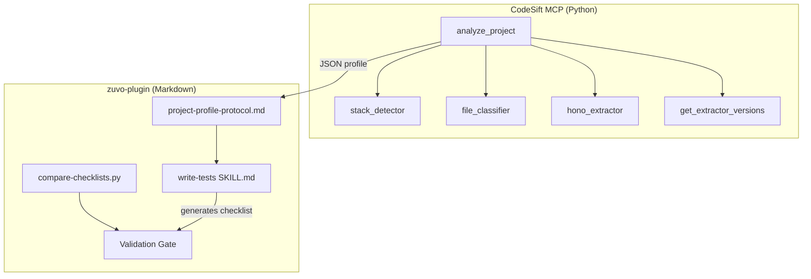

# Implementation Plan: Project Profile — Deterministic Convention Analysis

**Spec:** docs/specs/2026-04-09-project-profile-spec.md
**spec_id:** 2026-04-09-project-profile-1507
**planning_mode:** spec-driven
**plan_revision:** 1
**status:** Approved
**Created:** 2026-04-09
**Tasks:** 13
**Estimated complexity:** 10 standard + 3 complex

## Architecture Summary

This project spans **two repositories**:

1. **CodeSift MCP Server** (Python) — new `analyze_project()` tool with stack detection, file classification, and Hono convention extraction. Produces JSON profile conforming to schema v1.0.
2. **zuvo-plugin** (this repo, markdown) — new shared protocol for loading profiles, modification to `write-tests` skill, and Day 0 validation script.



**Data flow:** Skill Phase 0 → protocol reads `.zuvo/project-profile.json` → if missing, calls CodeSift `analyze_project()` → writes profile → skill uses conventions for test planning.

**Component boundaries:**
- `stack_detector.py` — reads config files, zero framework-specific logic
- `file_classifier.py` — uses import graph + path heuristics, framework-agnostic
- `hono_extractor.py` — Hono-specific AST parsing for middleware/routes/rate-limits/auth
- `analyze_project()` — orchestrator that dispatches detector + classifier + extractor
- `project-profile-protocol.md` — loading/caching protocol consumed by skills
- `write-tests/SKILL.md` — first consumer, adds profile-based ORCHESTRATOR checklist generation

## Technical Decisions

- **No new dependencies** in either repo. CodeSift already has AST parsing (tree-sitter). Validation script uses only Python stdlib (`json`, `re`, `sys`).
- **Pattern: detector → extractor → assembler.** Stack detector runs first (identifies framework), then dispatches framework-specific extractor, then assembler combines all results into profile JSON.
- **Profile schema is versioned.** `version: "1.0"` and `compatible_with: ">=1.0, <2.0"` enable future schema evolution without breaking consumers.
- **CodeSift tasks are in a separate repo.** Tasks 3-10 target the CodeSift codebase. The plan specifies interfaces and test expectations; the implementer navigates CodeSift internals.
- **Markdown tasks skip TDD.** Tasks 11-12 create/edit markdown files — verified by running the skill on a real project, not by unit tests.

## Quality Strategy

- **Primary quality gate:** Day 0 validation script (`compare-checklists.py`) with 30+ REQUIRED_INVARIANTS. Phase 1A success = score >= 80%.
- **CQ gates activated:** CQ14 (no duplication — protocol replaces inline detection, does not duplicate it), CQ25 (pattern consistency — protocol follows existing `.zuvo/` conventions from session-state.md).
- **Risk areas:**
  1. **Hono extractor accuracy** (HIGH) — must correctly parse middleware chains, rate limits with path bindings. Mitigated by Day 0 invariant validation.
  2. **Cross-file resolution** (MEDIUM) — rate limit path binding requires matching `rateLimit()` call context to route path. Mitigated by evidence field requiring `file:line`.
  3. **Profile-to-checklist translation** (MEDIUM) — LLM must correctly interpret JSON facts into test invariants. Mitigated by quality AC #21 (>= 80% invariant coverage).

## Task Breakdown

---

### Task 1: Define REQUIRED_INVARIANTS for tgmcontest ORCHESTRATOR
**Repo:** zuvo-plugin
**Files:** `validation/invariants/tgmcontest_orchestrator.json` (new)
**Complexity:** standard
**Dependencies:** none
**Execution routing:** default

This is a data file, not code. Define the 30+ regex patterns that constitute "correct" ORCHESTRATOR test output for tgmcontest `app.ts`.

- [ ] RED: N/A (data file, no production code)
- [ ] GREEN: Create JSON file with invariant definitions organized by category:
  - `middleware_order` (4 patterns: one per route group verifying callOrder)
  - `route_mounting` (1 per route module, ~13 patterns)
  - `rate_limit_factory` (6 patterns: one per registration)
  - `rate_limit_path_binding` (6 patterns: request→path→callOrder check)
  - `auth_boundary_positive` (2 patterns: admin clerkAuth, public publicTenantResolver)
  - `auth_boundary_negative` (3 patterns: public/webhook/health no clerkAuth)
  - `error_handling` (1: 404 unknown path)
  - `health` (1: health endpoint returns 200)
  Each entry: `{"id": "...", "category": "...", "pattern": "regex", "description": "..."}`
- [ ] Verify: `python -c "import json; d=json.load(open('validation/invariants/tgmcontest_orchestrator.json')); print(f'{len(d)} invariants'); assert len(d) >= 30"`
  Expected: `32 invariants` (or similar >= 30)
- [ ] Acceptance: Spec Day 0, AC #21 (defines the invariant list)
- [ ] Commit: `feat: define 30+ REQUIRED_INVARIANTS for tgmcontest ORCHESTRATOR validation`

---

### Task 2: Write compare-checklists.py validation script
**Repo:** zuvo-plugin
**Files:** `validation/compare-checklists.py` (new), `validation/test_compare_checklists.py` (new)
**Complexity:** standard
**Dependencies:** Task 1
**Execution routing:** default

- [ ] RED: Write `validation/test_compare_checklists.py`:
  - Test 1: `test_perfect_score` — checklist containing ALL invariant patterns → score 1.0, pass=true
  - Test 2: `test_partial_score` — checklist missing 5 patterns → score < 1.0, pass depends on threshold
  - Test 3: `test_below_threshold` — checklist with < 80% matches → pass=false, exit code 1
  - Test 4: `test_empty_checklist` — empty file → score 0.0, pass=false
  - Test 5: `test_json_output_format` — output has required keys: total_required, matched, unmatched, score, pass
- [ ] GREEN: Write `validation/compare-checklists.py`:
  - Accepts `<checklist_file>` as CLI argument
  - Loads invariants from `validation/invariants/tgmcontest_orchestrator.json`
  - For each invariant, `re.search(pattern, checklist_content)`
  - Outputs JSON to stdout: `{total_required, matched, unmatched, extra_invariants, score, pass}`
  - Exit code 0 if score >= 0.80, exit code 1 otherwise
  - ~60 lines, Python stdlib only (json, re, sys, pathlib)
- [ ] Verify: `cd validation && python -m pytest test_compare_checklists.py -v`
  Expected: `5 passed`
- [ ] Acceptance: Spec Day 0, AC #21
- [ ] Commit: `feat: add compare-checklists.py validation script with invariant scoring`

---

### Task 3: Implement stack detector
**Repo:** CodeSift (separate repo)
**Files:** `src/analyzers/stack_detector.py` (new), `tests/analyzers/test_stack_detector.py` (new)
**Complexity:** standard
**Dependencies:** none
**Execution routing:** default

- [ ] RED: Tests for stack detection:
  - Test 1: Hono project (package.json with `hono` dep) → `{framework: "hono", framework_version: "4.x"}`
  - Test 2: NestJS project → `{framework: "nestjs"}`
  - Test 3: React project → `{framework: "react"}`
  - Test 4: No framework detected → `{framework: null}`
  - Test 5: Monorepo detection (workspaces in package.json) → `{monorepo: {tool: "turborepo", workspaces: [...]}}`
  - Test 6: Test runner detection (vitest in devDependencies) → `{test_runner: "vitest"}`
  - Test 7: Package manager detection (pnpm-lock.yaml exists) → `{package_manager: "pnpm"}`
  Use fixture directories with minimal config files.
- [ ] GREEN: Implement `detect_stack(project_root: str) -> dict`:
  - Define `__version__ = "1.0.0"` at module top (required by Task 9's `get_extractor_versions()`)
  - Read `package.json` → extract dependencies for framework, devDependencies for test runner
  - Read `tsconfig.json` → detect TypeScript + version
  - Check lock files → detect package manager (pnpm-lock.yaml, yarn.lock, package-lock.json)
  - Check workspace config → detect monorepo tool
  - Each detection includes `detected_from` field (e.g., `"package.json:dependencies.hono"`)
- [ ] Verify: `pytest tests/analyzers/test_stack_detector.py -v`
  Expected: `7 passed`
- [ ] Acceptance: AC #1
- [ ] Commit: `feat: add stack detector — framework, language, test runner, package manager from config files`

---

### Task 4: Implement tiered file classifier
**Repo:** CodeSift (separate repo)
**Files:** `src/analyzers/file_classifier.py` (new), `tests/analyzers/test_file_classifier.py` (new)
**Complexity:** complex
**Dependencies:** none (uses existing CodeSift index/symbol data)
**Execution routing:** deep

- [ ] RED: Tests for file classification:
  - Test 1: `app.ts` at app root → critical tier, code_type ORCHESTRATOR
  - Test 2: `middleware/auth.ts` → critical tier, reason "security boundary"
  - Test 3: `services/contest.service.ts` → important tier, code_type SERVICE
  - Test 4: `utils/constants.ts` → routine tier
  - Test 5: Hub detection — file with >5 importers → critical tier, `dependents_count` populated
  - Test 6: Aggregate counts for routine tier → `{count: N, by_type: {PURE: X, TYPE_DEF: Y}}`
  - Test 7: `has_tests` flag — file with matching `*.test.*` → true
  Use CodeSift's existing test infrastructure with indexed fixture repos.
- [ ] GREEN: Implement `classify_files(repo_id: str) -> dict`:
  - Define `__version__ = "1.0.0"` at module top (required by Task 9)
  - Walk indexed files from CodeSift's symbol store
  - Apply tier heuristics from spec (entry points → critical, services → important, utils → routine)
  - For critical/important: compute `dependents_count` from import graph (CodeSift already tracks this)
  - For routine: aggregate counts by code_type only
  - Code type classification reuses logic from existing `classify_roles` if available
  - ~200 lines
- [ ] Verify: `pytest tests/analyzers/test_file_classifier.py -v`
  Expected: `7 passed`
- [ ] Acceptance: AC #2
- [ ] Commit: `feat: add tiered file classifier — critical/important/routine with dependents tracking`

---

### Task 5: Implement Hono middleware chain extractor
**Repo:** CodeSift (separate repo)
**Files:** `src/extractors/hono_extractor.py` (new), `tests/extractors/test_hono_extractor.py` (new)
**Complexity:** complex
**Dependencies:** none
**Execution routing:** deep

- [ ] RED: Tests for middleware extraction:
  - Test 1: `app.use("*", mw)` → global middleware with correct order numbers
  - Test 2: Multiple `app.use()` calls → chain preserves source order with `file:line` evidence
  - Test 3: Scoped middleware `app.use("/admin/*", clerkAuth)` → scope: "admin"
  - Test 4: Route-group-specific middleware → separate chain per scope
  - Test 5: No middleware calls → empty `middleware_chains` array
  Use fixture `.ts` files with realistic Hono app patterns.
- [ ] GREEN: Implement `extract_hono_conventions(repo_id: str, app_file: str) -> dict`:
  - Define `__version__ = "1.0.0"` at module top (required by Task 9)
  - Parse app file AST (tree-sitter TypeScript)
  - Find all `app.use()` / `<var>.use()` calls
  - Extract: middleware name (from import or inline), path pattern, source line
  - Determine scope from path pattern (`"*"` = global, `"/admin/*"` = admin, etc.)
  - Order by source position
  - Return `{"middleware_chains": [...]}`  with `file:line` evidence per entry
  - ~150 lines
- [ ] Verify: `pytest tests/extractors/test_hono_extractor.py -v`
  Expected: `5 passed`
- [ ] Acceptance: AC #3
- [ ] Commit: `feat: add Hono middleware chain extractor with scope detection and ordering`

---

### Task 6: Add rate limit and route mount extraction to Hono extractor
**Repo:** CodeSift (separate repo)
**Files:** `src/extractors/hono_extractor.py` (modify), `tests/extractors/test_hono_extractor.py` (modify)
**Complexity:** standard
**Dependencies:** Task 5
**Execution routing:** default

- [ ] RED: Additional tests:
  - Test 6: `rateLimit(3, 3600)` call → `{max: 3, window: 3600, file: "...", line: N}`
  - Test 7: Rate limit applied to specific POST path → `applied_to_path` resolved from context, `method: "POST"`
  - Test 8: `app.route("/api/admin/contests", contestRoutes)` → `{mount_path, imported_from, exported_as}`
  - Test 9: Multiple route mounts → all captured with correct paths
  - Test 10: Rate limit without clear path context → `applied_to_path: null, method: null` (partial data, not crash)
- [ ] GREEN: Extend `extract_hono_conventions()`:
  - Find `rateLimit()` / `rateLimiter()` calls → extract max, window args
  - Resolve path context: check parent `.use()` or `.route()` call for path binding
  - Resolve HTTP method from context: check parent `.post()`, `.get()`, etc. or default to null
  - Find `app.route()` calls → extract mount_path, imported module, export name
  - Add to return dict: `rate_limits`, `route_mounts` arrays
  - ~80 additional lines
- [ ] Verify: `pytest tests/extractors/test_hono_extractor.py -v`
  Expected: `10 passed`
- [ ] Acceptance: AC #4, AC #5
- [ ] Commit: `feat: add rate limit and route mount extraction to Hono extractor`

---

### Task 7: Add auth boundary detection to Hono extractor
**Repo:** CodeSift (separate repo)
**Files:** `src/extractors/hono_extractor.py` (modify), `tests/extractors/test_hono_extractor.py` (modify)
**Complexity:** standard
**Dependencies:** Task 5, Task 6 (both modify same files — must be sequential)
**Execution routing:** default

- [ ] RED: Additional tests:
  - Test 11: Auth middleware on admin routes → `groups.admin.requires_auth: true, middleware: ["clerkAuth", "tenantResolver"]`
  - Test 12: No auth on public routes → `groups.public.requires_auth: false`
  - Test 13: Mixed groups → complete auth boundary matrix
  - Test 14: Single auth middleware → `auth_middleware` field identifies it
- [ ] GREEN: Extend `extract_hono_conventions()`:
  - Identify auth middleware by name pattern (contains "auth", "clerk", "jwt", "session")
  - Group routes by mount prefix
  - For each group: determine which middleware applies (from scope-specific `.use()` calls)
  - Build auth pattern: `{auth_middleware, groups: {<name>: {requires_auth, middleware: [...]}}}`
  - ~60 additional lines
- [ ] Verify: `pytest tests/extractors/test_hono_extractor.py -v`
  Expected: `14 passed`
- [ ] Acceptance: AC #6
- [ ] Commit: `feat: add auth boundary detection to Hono extractor — route group × middleware matrix`

---

### Task 8: Wire analyze_project() MCP tool
**Repo:** CodeSift (separate repo)
**Files:** `src/tools/analyze_project.py` (new), `tests/tools/test_analyze_project.py` (new)
**Complexity:** standard
**Dependencies:** Tasks 3, 4, 5, 6, 7
**Execution routing:** default

- [ ] RED: Integration tests:
  - Test 1: Full analysis on Hono fixture repo → returns dict with `status: "complete"`, Phase 1A sections present (`version`, `generated_at`, `generated_by`, `compatible_with`, `status`, `stack`, `file_classifications`, `conventions`, `generation_metadata`)
  - Test 2: Fixture repo with no recognized framework → `status: "partial"`, `stack.framework: null`, `conventions` section absent
  - Test 3: `force=True` → ignores any cached result
  - Test 4: Response includes `generation_metadata` with `files_analyzed > 0`, `duration_ms > 0`
  - Test 5: Schema validation — response matches expected Phase 1A top-level keys
  - Test 6: Invalid `repo_id` → raises MCP error (exception, not dict). Assert: `with pytest.raises(MCPError):`
  - Test 7: Extractor crashes mid-execution (mock `extract_hono_conventions` to raise) → `status: "partial"`, `stack` and `file_classifications` still present, `conventions` absent
- [ ] GREEN: Implement `analyze_project(repo_id, force=False)`:
  - Call `detect_stack()` → determines framework
  - Call `classify_files()` → tiered classification
  - If framework == "hono": call `extract_hono_conventions()` — discover `app_file` from `classify_files()` output (file with `code_type == "ORCHESTRATOR"` in critical tier)
  - Else: skip conventions, set `status: "partial"` (no convention data available)
  - If any extractor raises an exception: catch, set `status: "partial"`, include successfully-extracted sections, omit failed section
  - Assemble profile JSON with schema v1.0 fields
  - Add `generation_metadata`: files_analyzed, duration_ms, skip_reasons
  - Set status: "complete" if all succeeded, "partial" if any extractor failed, "failed" if stack detection failed
  - Invalid repo_id or crash → raise MCP error (not a dict return)
  - Register as MCP tool
  - ~100 lines
- [ ] Verify: `pytest tests/tools/test_analyze_project.py -v`
  Expected: `7 passed`
- [ ] Acceptance: AC #1, AC #7, AC #16, AC #17
- [ ] Commit: `feat: wire analyze_project() MCP tool — orchestrates detection + classification + extraction`

---

### Task 9: Add get_extractor_versions() MCP tool
**Repo:** CodeSift (separate repo)
**Files:** `src/tools/analyze_project.py` (modify), `tests/tools/test_analyze_project.py` (modify)
**Complexity:** standard
**Dependencies:** Task 8
**Execution routing:** default

- [ ] RED: Test:
  - Test 7: `get_extractor_versions()` returns dict with `hono`, `stack_detector`, `file_classifier` keys
  - Test 8: All values are semver strings
- [ ] GREEN: Implement `get_extractor_versions()`:
  - Each extractor module defines `__version__` constant
  - Tool collects all extractor versions into a dict
  - Register as MCP tool
  - ~20 lines
- [ ] Verify: `pytest tests/tools/test_analyze_project.py -v`
  Expected: `8 passed`
- [ ] Acceptance: Spec cache invalidation trigger #5
- [ ] Commit: `feat: add get_extractor_versions() tool for cache invalidation`

---

### Task 10: Schema validation and profile assembly tests
**Repo:** CodeSift (separate repo)
**Files:** `tests/tools/test_profile_schema.py` (new)
**Complexity:** standard
**Dependencies:** Task 8
**Execution routing:** default

- [ ] RED: Schema conformance tests:
  - Test 1: Complete Phase 1A profile has the 4 core sections (`stack`, `file_classifications`, `conventions`, `generation_metadata`) plus version fields (`version`, `generated_at`, `generated_by`, `compatible_with`, `status`). Note: `identity`, `dependency_graph`, `test_conventions`, `known_gotchas` are Phase 1B additions — not validated here.
  - Test 2: `version` is "1.0", `compatible_with` is ">=1.0, <2.0"
  - Test 3: Convention-level facts have `file` and `line` fields (evidence)
  - Test 4: Stack-level facts have `detected_from` (not `line`)
  - Test 5: Partial profile (failed extractor) → missing sections are absent, not null
  - Test 6: Failed profile → only metadata sections present
- [ ] GREEN: N/A — tests validate existing Task 8 output. If any fail, fix in analyze_project.
- [ ] Verify: `pytest tests/tools/test_profile_schema.py -v`
  Expected: `6 passed`
- [ ] Acceptance: AC #7, AC #16, AC #17
- [ ] Commit: `test: add schema conformance tests for project profile v1.0`

---

### Task 11: Write project-profile-protocol.md (Phase 1A version)
**Repo:** zuvo-plugin (this repo)
**Files:** `shared/includes/project-profile-protocol.md` (new)
**Complexity:** standard
**Dependencies:** none (consumes CodeSift tools but defines the protocol independently)
**Execution routing:** default

- [ ] RED: N/A (markdown file — no TDD)
- [ ] GREEN: Create `shared/includes/project-profile-protocol.md` with:
  - Header: purpose, version, compatible skills
  - Phase 1A protocol (4 steps from spec):
    - Step 0: Check `ZUVO_USE_PROFILE` env var → if "false", skip to Step 3
    - Step 1: Read `.zuvo/project-profile.json` → parse, check mtime of package.json + entry point vs `generated_at`
    - Step 2: If missing/stale → call CodeSift `analyze_project()` → write profile
    - Step 3: Fallback to inline stack detection
  - `--no-cache` flag behavior
  - Degraded mode description
  - Placeholder section: "## Phase 1B Extensions" noting future additions (locking, sanity, overrides)
  - Include `.gitignore` verification instruction: "Before writing profile, verify `.zuvo/` is in `.gitignore`. If absent, append it." (per spec Backward Compatibility)
  - ~85 lines
- [ ] Verify: `test -f shared/includes/project-profile-protocol.md && grep -q "gitignore" shared/includes/project-profile-protocol.md && wc -l shared/includes/project-profile-protocol.md`
  Expected: file exists, contains gitignore instruction, ~85 lines
- [ ] Acceptance: Spec Integration Points §1
- [ ] Commit: `feat: add project-profile-protocol.md — Phase 1A loading protocol for .zuvo/project-profile.json`

---

### Task 12: Integrate profile loading into write-tests SKILL.md
**Repo:** zuvo-plugin (this repo)
**Files:** `skills/write-tests/SKILL.md` (modify)
**Complexity:** standard
**Dependencies:** Task 11
**Execution routing:** default

- [ ] RED: N/A (markdown modification — no TDD)
- [ ] GREEN: Modify `skills/write-tests/SKILL.md`:
  - Add `project-profile-protocol.md` to Mandatory File Loading checklist (item 8.5, between quality-gates and run-logger)
  - Modify Phase 0 Step 2 ("Stack detection") to:
    1. Load project profile per `project-profile-protocol.md`
    2. If profile.conventions exists for this file's framework → use convention values for ORCHESTRATOR test planning
    3. If profile unavailable or partial → use generic `test-code-types.md` patterns (current behavior)
  - Add `--no-cache` to Argument Parsing table
  - ~15 lines changed
- [ ] Verify: `grep -c "project-profile-protocol" skills/write-tests/SKILL.md`
  Expected: `2` (one in file loading, one in Phase 0 reference)
- [ ] Acceptance: AC #8, AC #11
- [ ] Commit: `feat: integrate project profile loading into write-tests Phase 0`

---

### Task 13: End-to-end validation on tgmcontest
**Repo:** both (cross-repo integration test)
**Files:** none created — this is a validation task
**Complexity:** complex (spans two repos + external fixture project)
**Dependencies:** Tasks 1-12
**Execution routing:** default

- [ ] RED: N/A (validation, not code)
- [ ] GREEN: Execute the full pipeline:
  1. Run `analyze_project()` on tgmcontest repo → generates `.zuvo/project-profile.json`
  2. Verify profile contains: correct stack (Hono + TypeScript + Vitest + pnpm), app.ts in critical tier, middleware chains with 4 global + 2 admin, 6 rate limits, route mounts, auth boundary matrix
  3. Run `zuvo:write-tests apps/api/src/app.ts` on tgmcontest → generates ORCHESTRATOR test
  4. Extract generated checklist/test content
  5. Run `python validation/compare-checklists.py <generated_test_file>`
  6. Verify score >= 0.80
- [ ] Verify: `python validation/compare-checklists.py <generated_test_file>`
  Expected: `{"score": 0.8+, "pass": true, ...}` with exit code 0
- [ ] Acceptance: AC #1-8, AC #21 (primary validation gate for Phase 1A)
- [ ] Commit: N/A (no code changes — validation only)

---

## Dependency Graph

```
Task 1  ←── Task 2 (validation script needs invariants)
Task 3  ─┐
Task 4  ─┤
Task 5  ←── Task 6 (extend Hono extractor: rate limits + routes)
Task 6  ←── Task 7 (extend Hono extractor: auth boundaries — same files, must be sequential)
Task 3  ─┐
Task 4  ─┤
Task 7  ─┼── Task 8 (analyze_project wires all together)
Task 8  ←── Task 9 (extends analyze_project module)
Task 8  ←── Task 10 (schema tests validate Task 8 output)
Task 11 ←── Task 12 (write-tests references protocol)
Tasks 1-12 ←── Task 13 (end-to-end validation)
```

**Parallelizable groups:**
- Tasks 1, 3, 4, 5, 11 can all start in parallel (no dependencies)
- Tasks 6 → 7 are sequential (both modify same file), then both must complete before Task 8
- Tasks 2, 9, 10, 12 have sequential dependencies

## Acceptance Criteria Coverage

| Spec AC | Task(s) |
|---------|---------|
| AC #1 (detect stack) | Task 3, Task 8, Task 13 |
| AC #2 (tiered classification) | Task 4 |
| AC #3 (middleware chains) | Task 5 |
| AC #4 (rate limits) | Task 6 |
| AC #5 (route mounts) | Task 6 |
| AC #6 (auth boundaries) | Task 7 |
| AC #7 (valid schema) | Task 8, Task 10 |
| AC #8 (write-tests loads profile) | Task 12 |
| AC #9 (regenerate on package.json change) | Task 11 (protocol) |
| AC #10 (regenerate on entry point change) | Task 11 (protocol) |
| AC #11 (degraded mode) | Task 11, Task 12 |
| AC #16 (generation metadata) | Task 8, Task 10 |
| AC #17 (partial status) | Task 8, Task 10 |
| AC #21 (invariant coverage >= 80%) | Task 1, Task 2, Task 13 |

**ACs deferred to Phase 1B (behavioral validation):** AC #12 (lock file), AC #13 (corrupted JSON recovery), AC #15 (overrides merge). These require Phase 1B infrastructure.

**ACs documented in Phase 1A but behavioral validation deferred:** AC #14 (`--no-cache` flag) and AC #23 (`ZUVO_USE_PROFILE` rollback) are documented in the protocol markdown (Task 11) so users can see the intended behavior. Behavioral testing of these flags is deferred to Phase 1B when the full 12-step protocol is implemented. Phase 1A protocol includes the env var check (Step 0) and `--no-cache` documentation but these are not E2E validated in Task 13.

## Notes

- **Cross-repo execution:** Tasks 3-10 target the CodeSift repo. The implementer must `cd` to the CodeSift project for those tasks and return to zuvo-plugin for Tasks 1-2, 11-13.
- **Hono fixture repo:** Tasks 3-10 need a fixture directory with realistic Hono project structure (package.json, app.ts with middleware, routes, rate limits). Creating this fixture is part of the RED step for each CodeSift task.
- **Phase 1A scope:** This plan covers Day 0 + Phase 1A only. Phase 1B (hardening), Phase 2 (ecosystem), and Phase 3 (full coverage) are separate planning efforts after Phase 1A validation.
- **Shared Hono fixture:** Tasks 3-7 should use a single canonical Hono fixture repo (with middleware, rate limits, routes, auth groups) rather than independent fixtures per task. This prevents subtle fixture divergence. Create the fixture as a prerequisite of Task 3.
- **Cross-repo schema validation:** Task 10 should spot-check that field names in `analyze_project()` output match the field names referenced in `project-profile-protocol.md` (Task 11). This catches naming mismatches before Task 13 E2E.
- **Markdown verification is shallow:** Tasks 11-12 use grep/wc verification. Behavioral validation (mtime invalidation, degraded mode fallback) happens at Task 13 E2E. If behavioral issues are found at Task 13, they trace back to Task 11 protocol logic.
- **tgmcontest dependency:** Task 13 requires the tgmcontest repo to be available locally. This is an existing project on the developer's machine, not a new fixture — no provisioning needed.
