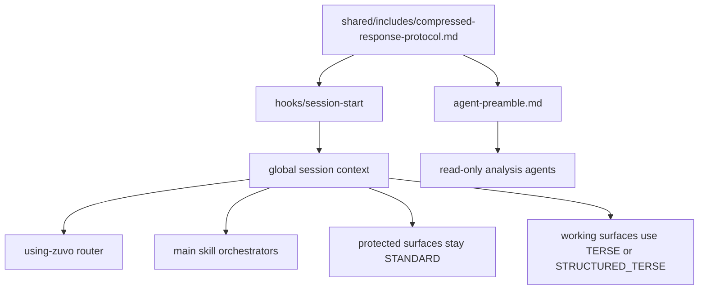

# Zuvo Compressed Response Protocol -- Design Specification

> **spec_id:** 2026-04-11-compressed-response-protocol-1447
> **topic:** Zuvo Compressed Response Protocol
> **status:** Approved
> **created_at:** 2026-04-11T14:47:34Z
> **approved_at:** 2026-04-11T15:06:20Z
> **approval_mode:** async
> **author:** zuvo:brainstorm

## Problem Statement

Zuvo already has strong structure for what it does, but not for how it speaks while doing it.

Today the repo has three useful but disconnected patterns:

1. Cross-cutting text constraints already exist in `shared/includes/` for specific domains, for example `shared/includes/humanization-rules.md` and `shared/includes/banned-vocabulary.md`.
2. Session-start routing is centralized in `hooks/session-start`, which already injects `skills/using-zuvo/SKILL.md` into Claude, Codex, Cursor, and other compatible session types.
3. Read-only agents already share one output contract via `shared/includes/agent-preamble.md`.

What is missing is a single repo-native contract for response compression outside final artifacts.

That gap creates four practical problems:

- Working-mode responses are inconsistent across skills and environments. Some are sharp and scan-friendly; some are verbose by default.
- Token usage is higher than it needs to be for progress updates, review summaries, clarifying questions, and intermediate reasoning made visible to the user.
- There is pressure to adopt meme-level compression such as "caveman mode", but a raw persona switch would risk losing calibration, confidence signaling, and professional UX.
- Final artifacts and working chatter are not clearly separated as response surfaces, so any global brevity tweak risks leaking into specs, docs, articles, and other user-facing deliverables.

External signal supports the direction but not the naive implementation. The `caveman` project shows that aggressive output compression can materially reduce output tokens and improve scanability, while the March 2026 paper "Brevity Constraints Reverse Performance Hierarchies in Language Models" suggests that shorter responses can improve correctness on some tasks. But neither result justifies turning Zuvo into a meme persona or inventing an opaque pseudo-language.

If we do nothing, Zuvo remains structurally strong but interactionally uneven: too wordy on low-risk operational output, too tempting to "solve" with one global persona prompt, and too fragile to optimize safely across all skill classes.

## Design Decisions

### DD1 -- Treat This as a Protocol, Not a New Language

[AUTO-DECISION] Zuvo should not invent a new language. It should define a controlled compressed response protocol for selected surfaces.

Chosen:

- Keep natural language grammar
- Compress for density, not novelty
- Preserve technical literals exactly
- Preserve uncertainty explicitly

Rejected:

- Global "caveman" persona as the default voice
- A custom shorthand syntax that humans must learn before they can read the tool
- Per-skill ad hoc brevity prompts with no shared contract

Why: the goal is lower verbosity, not identity theater. A protocol is easier to reason about, easier to document, and easier to disable.

### DD2 -- Make Compression Surface-Based

[AUTO-DECISION] Response mode is determined by output surface, not by skill name alone.

Working surfaces that default to compression:

- progress updates
- clarifying questions
- design option summaries
- review findings
- audit summaries
- operational checklists
- agent-to-orchestrator reports

Protected surfaces that stay standard by default:

- named final output blocks such as `BUILD COMPLETE` or `REVIEW COMPLETE`
- repo artifacts written by skills: specs, plans, docs, presentations, articles
- long-form user-facing explanations requested explicitly by the user
- code blocks, commands, paths, URLs, JSON/YAML/TOML, markdown tables, quoted error messages

Why: the user specifically wants "everything except final reports" compressed. Surface-based policy matches that intent without forcing artifact writers to fight a global terse persona.

### DD3 -- Use Three Modes, Not One

[AUTO-DECISION] The protocol will define three modes:

- `STANDARD` -- normal professional prose for final artifacts and deep explanations
- `TERSE` -- short natural-language responses with filler removed
- `STRUCTURED_TERSE` -- compact labeled output for findings, status, and decisions

Rejected:

- one universal mode for all surfaces
- an `ULTRA` mode in v1

Why: one mode is too blunt, while `ULTRA` would optimize for token count before trust and readability are stable.

**Resolved v1 rule:** named final output blocks remain `STANDARD`. `STRUCTURED_TERSE` is for working surfaces and agent reports only.

### DD4 -- Preserve Technical Literals and Confidence

[AUTO-DECISION] Compression may rewrite prose around technical material, but it may not rewrite technical material itself.

Protected literals:

- code
- commands
- file paths
- URLs
- environment variables
- API symbols
- schema keys
- dates
- version numbers
- quoted error strings

Confidence markers are mandatory when uncertainty exists. Compression must shorten uncertainty, not erase it:

- `confirmed`
- `likely`
- `unclear`

Why: the biggest failure mode of meme compression is false confidence. Zuvo cannot trade nuance for punchlines.

### DD5 -- Inject the Contract Centrally

[AUTO-DECISION] V1 should be centered on one shared include plus one session-start injection path for hook-enabled main assistant responses, not 51 manual skill rewrites.

Core changes:

- add `shared/includes/compressed-response-protocol.md`
- update `hooks/session-start` to inject the protocol alongside the router
- update `skills/using-zuvo/SKILL.md` to name the response surfaces and override rules
- add validation scripts plus a fixed fixture corpus so mode selection is testable, not purely interpretive

Why: the repo already has a proven central injection point in `hooks/session-start`, and the build/install pipeline already copies shared includes and hooks into downstream environments. Read-only agent adoption is deferred so rollback remains runtime-scoped in v1.

### DD6 -- Prefer Explicit Protected Classes Over New Frontmatter

[AUTO-DECISION] V1 should not add new SKILL frontmatter keys such as `response_mode`.

Chosen:

- use one shared protocol file
- define protected skill classes in prose
- use explicit "user request overrides protocol" rule

Rejected:

- new frontmatter metadata per skill
- build-time parsing of skill metadata to inject mode rules

Why: the existing Codex/Cursor build transforms keep only a small frontmatter subset. New metadata would expand the blast radius immediately and require build-script parser work before the protocol itself is proven.

## Solution Overview

### Approaches Considered

#### Approach A -- Caveman Everywhere

Adopt a meme-style compressed persona for all non-code output.

Trade-offs: highest token savings, worst calibration risk, worst fit for Zuvo's brand and artifact quality. Rejected.

#### Approach B -- Controlled Compressed Response Protocol (Recommended)

Define a shared protocol with three modes, protect final artifacts, inject it centrally at session start, and tighten agent output formatting through the existing preamble.

Trade-offs: slightly less token reduction than a meme persona, much better trust, much lower migration risk, and strong compatibility with current Zuvo architecture. Recommended.

#### Approach C -- Per-Skill Manual Tuning

Hand-edit many skill files to add local brevity rules.

Trade-offs: flexible, but inconsistent and expensive to maintain. Rejected for v1.

### Chosen Approach

[AUTO-DECISION] Choose Approach B.

The protocol becomes a global behavior contract, not a per-skill style hack. Final artifacts remain standard unless the user explicitly asks otherwise.

## Detailed Design

### Data Model

The protocol contract lives in `shared/includes/compressed-response-protocol.md`.

It defines:

| Field | Meaning |
|------|---------|
| `mode` | `STANDARD`, `TERSE`, or `STRUCTURED_TERSE` |
| `surface` | working, protected, or user-overridden |
| `confidence` | `confirmed`, `likely`, or `unclear` when applicable |
| `protected_literals` | list of exact-token classes that must pass through untouched |
| `override_order` | user request > protected surface > default mode |
| `protected_markers` | default heuristics for protected surfaces |
| `fixture_manifest` | per-sample expected surface and mode labels used by eval scripts |

#### Mode Semantics

**`STANDARD`**

- full professional prose
- normal transitions allowed
- default for final output blocks and repo-written artifacts

**`TERSE`**

- 1-3 short sentences or flat bullets
- remove pleasantries and filler
- keep direct subject matter wording
- no meme grammar

**`STRUCTURED_TERSE`**

- evidence-first, label-first
- preferred labels: `fact`, `cause`, `risk`, `next`, `conf`
- allow subsets of labels when not all are needed
- flat list only; no nested bullets
- `conf` values are restricted to `confirmed`, `likely`, or `unclear`

#### Surface-to-Mode Mapping

| Surface | Default Mode |
|---------|--------------|
| progress updates | `TERSE` |
| clarifying questions | `TERSE` |
| design option summaries | `TERSE` |
| audit summaries | `TERSE` |
| review findings | `STRUCTURED_TERSE` |
| operational checklists | `STRUCTURED_TERSE` |
| agent-to-orchestrator reports | deferred from v1 |

#### Protected Literal Rules

The protocol states:

- Do not rewrite code blocks
- Do not paraphrase commands or error strings inside quotes
- Do not shorten paths or URLs in ways that change meaning
- Do not rename symbols for style reasons
- Do not drop dates, versions, or explicit scope qualifiers

#### Protected Surface Markers

V1 uses default heuristics plus fixture labels instead of new frontmatter metadata.

Protected-surface heuristics:

- markdown headings matching `^## [A-Z0-9 :_-]+ COMPLETE$`
- repo-written artifact paths under `docs/`, `memory/`, or `.interface-design/`

User-intent overrides are **not** protected markers. They live only in `override_order`.

Live heuristic for v1:

1. If the user explicitly asks for depth or verbosity, classify as `user-request -> STANDARD`.
2. Else if output is a repo-written artifact path, classify as `protected -> STANDARD`.
3. Else if output block header matches `^## [A-Z0-9 :_-]+ COMPLETE$`, classify as `protected -> STANDARD`.
4. Else classify as `working -> TERSE` or `STRUCTURED_TERSE` depending on surface type.

Release validation does **not** attempt to infer all live classifications from shell rules. Instead, `tests/fixtures/response-protocol/manifest.json` declares `expected_surface` and `expected_mode` per sample, and the eval scripts compare outputs against that manifest.

### API Surface

This repo is markdown-first, so the interface is instruction-level rather than runtime API-level.

Files that define or consume the protocol:

- `shared/includes/compressed-response-protocol.md` -- canonical contract
- `hooks/session-start` -- global injection point
- `skills/using-zuvo/SKILL.md` -- top-level routing and surface policy summary
- `docs/configuration.md` -- operator-facing explanation
- `docs/getting-started.md` -- user-facing explanation

There are no new external endpoints, event contracts, or schema migrations.

### Integration Points

**`hooks/session-start`**

- currently injects the router and optional project profile
- will also inject the compressed-response protocol into the same payload
- release-gated coverage in v1 is Claude, Codex, and Cursor
- other compatible branches are best-effort and non-blocking in v1
- the injected protocol includes the live heuristic above so mode selection is anchored to one contract

**`skills/using-zuvo/SKILL.md`**

- gains a short "response surface policy" section
- declares that final reports stay `STANDARD`
- declares that operational chatter defaults to `TERSE` or `STRUCTURED_TERSE`
- states that explicit user requests for depth or verbosity override the protocol
- documents that v1 scope is hook-enabled main assistant behavior, not full sub-agent rollout

**Existing content-writing includes**

- `shared/includes/humanization-rules.md`
- `shared/includes/banned-vocabulary.md`

These remain isolated to content-generation skills. They do not become the global response protocol.

### Edge Cases

| Edge Case | Handling |
|----------|----------|
| User explicitly asks for a detailed explanation | Force `STANDARD` for that response |
| One message mixes code and explanation | Keep code exact; compress only surrounding prose |
| Skill writes a repo artifact and also speaks to the user | Artifact body uses `STANDARD`; live status updates may use compressed mode |
| Review finding includes uncertainty | Must include `conf: likely` or `conf: unclear` rather than sounding certain |
| Polish or mixed-language conversation | Protocol is language-agnostic; compression rules apply without introducing synthetic slang |
| Async Codex skills already using `[AUTO-DECISION]` | Marker remains exact; surrounding explanation may be compressed |
| Session runs without a working session-start hook | Treat as degraded mode in v1; explicit skill invocation still works, but global compression defaults are not guaranteed |
| Message mentions a `docs/...` path but does not write an artifact | Path mention stays literal, but the response is still classified by the normal surface rules |
| User asks for "caveman mode" explicitly | Defer to user request for that session only; do not make it repo default |
| Protected literal is very long (stack trace, generated JSON, huge log excerpt) | Allow exact excerpt plus explicit `[...truncated...]` marker rather than forcing full verbatim inclusion |
| Generated markdown tables or JSON examples | Remain exact and standard; protocol does not rephrase inside structured literals |

### Failure Modes

#### Session-start protocol injection

| Scenario | Detection | Impact Radius | User Symptom | Recovery | Data Consistency | Detection Lag |
|----------|-----------|---------------|--------------|----------|------------------|---------------|
| `hooks/session-start` forgets to load the new include | `rg -n "compressed-response-protocol" hooks/session-start` fails | all platforms using session-start | behavior unchanged; protocol appears "not working" | fall back to skill-local instructions, fix hook | None | Immediate |
| Payload exceeds comfortable context budget due to verbose protocol text | token diff on startup fixture spikes beyond threshold | all startup sessions | slower startup, diluted router signal | shorten protocol to one concise contract block | None | Immediate in fixture eval |
| Codex install copies skills but misses hook update in plugin cache | install smoke test shows old hook content in `~/.codex/.tmp/plugins/plugins/zuvo/` | Codex local plugin sessions only | Claude path works, Codex path does not | reinstall via `./scripts/install.sh codex`; verify hook copy | None | Minutes |
| User invokes a skill directly in an environment where hooks are unavailable | fixture scenario with hook disabled shows no global policy in initial context | direct-skill degraded path only | some sessions stay verbose despite correct repo changes | document degraded behavior for v1 and consider selective skill-local references in v2 | None | Immediate |

**Cost-benefit:** Frequency: occasional x Severity: medium vs Mitigation cost: low -> **Decision: Mitigate**

#### Surface classification

| Scenario | Detection | Impact Radius | User Symptom | Recovery | Data Consistency | Detection Lag |
|----------|-----------|---------------|--------------|----------|------------------|---------------|
| Fixture corpus misses a legacy final-block shape used by a real skill | review of `tests/fixtures/response-protocol/manifest.json` vs current skill examples finds uncovered pattern | protected-surface validation only | release passes while one real final block still drifts | add representative fixture and manifest entry before ship | None | Immediate |
| Final output block is accidentally compressed despite protected-surface heuristics | fixture sample marked `expected_mode=STANDARD` renders terse labels | hook-enabled main assistant outputs | final report feels abrupt or under-explained | manifest-based eval blocks release | None | Immediate in fixture eval |
| Hook-enabled main responses compress correctly, but direct-skill sessions stay verbose | manual degraded-mode scenario shows mixed adoption | hookless/direct sessions only | behavior differs by install path | document v1 scope clearly and defer direct-skill adoption | None | Immediate |
| Explicit user request for depth is ignored by protocol | manual conversational test with "explain in detail" still returns terse output | any skill | user feels overridden by tooling | user request wins in override order | None | Immediate |

**Cost-benefit:** Frequency: likely x Severity: high vs Mitigation cost: low -> **Decision: Mitigate**

#### Literal preservation and confidence signaling

| Scenario | Detection | Impact Radius | User Symptom | Recovery | Data Consistency | Detection Lag |
|----------|-----------|---------------|--------------|----------|------------------|---------------|
| Compression paraphrases a quoted error message | fixture diff between baseline and protocol output changes quoted error text | debug, review, support-style outputs | user cannot match explanation to real runtime error | protected-literal list forbids rewriting quoted errors | None | Immediate |
| Confidence markers disappear under compression | sample outputs contain diagnosis claims without `confirmed/likely/unclear` where evidence is partial | review, debug, brainstorm | overconfident wording, higher trust risk | require short confidence vocabulary in protocol examples | None | Immediate |
| Path or command is shortened in prose and becomes ambiguous | literal-preservation fixture fails exact match on commands/paths | build, debug, docs support output | user runs wrong command or opens wrong file | forbid path/command rewriting; add static fixtures | None | Immediate |

**Cost-benefit:** Frequency: likely x Severity: high vs Mitigation cost: low -> **Decision: Mitigate**

## Acceptance Criteria

**Ship criteria**

1. `shared/includes/compressed-response-protocol.md` exists and defines modes, surface mapping, protected literals, and override order.
2. `hooks/session-start` injects the new protocol alongside the router for all currently supported platform branches in that script.
3. `skills/using-zuvo/SKILL.md` contains a response-surface policy that explicitly protects final reports and repo-written artifacts.
4. `docs/configuration.md` and `docs/getting-started.md` explain the protocol, the hook-enabled scope, and the degraded-mode limitation.
5. The protocol does not require new frontmatter keys or mandatory rewrites across all skills in v1.
6. The protocol explicitly preserves technical literals, confidence markers, and the `[...truncated...]` escape hatch for oversized literals.
7. `hooks/session-start` honors `ZUVO_RESPONSE_PROTOCOL=off` and skips protocol injection when set.
8. `bash scripts/validate-response-protocol.sh` exists and validates hook wiring, docs wiring, and kill-switch behavior.
9. `bash scripts/eval-response-protocol.sh` exists with a fixed corpus under `tests/fixtures/response-protocol/`.
10. `tests/fixtures/response-protocol/manifest.json` exists and labels representative samples with `expected_surface` and `expected_mode`, including protected final-block examples from current skills.

**Success criteria**

1. On a fixed response corpus covering review, debug, brainstorm, and status-update prompts, working-surface output tokens drop by at least 25 percent versus baseline while protected literals remain exact.
2. In the same corpus, final output block snapshots preserve canonical block headings, mandatory fields, and exact protected literals, and remain classified as `STANDARD`.
3. At least 9 of 10 sampled outputs score `clearer` or `same` under the two-rater readability rubric, with zero failures caused by missing confidence or altered literals.

## Validation Methodology

Implementation must include three concrete validation paths:

1. **Static contract validation**
   - Command: `bash scripts/validate-response-protocol.sh`
   - Checks:
     - protocol file exists
     - `hooks/session-start` references it
     - router mentions the policy and v1 scope
     - docs mention protected surfaces
   - Output: pass/fail with named missing files or missing grep matches

2. **Behavioral compression eval**
   - Command: `bash scripts/eval-response-protocol.sh`
   - Inputs:
     - fixed prompt corpus in `tests/fixtures/response-protocol/`
     - `tests/fixtures/response-protocol/manifest.json`
     - baseline snapshots
     - protocol-enabled snapshots
     - pinned release-gate provider/model pair: Codex + `gpt-5.4`
     - 3 runs per sample; median token count is authoritative
     - platform smoke set for Claude and Cursor with reduced corpus
   - Checks:
     - output token delta for working surfaces
     - exact-match preservation for protected literals
     - final-output-block mode classification
     - Claude and Cursor smoke checks for classifier correctness plus literal preservation
   - Output:
     - per-sample token counts
     - preserved-literal pass/fail
     - summary table with baseline vs protocol metrics

3. **Manual override sanity check**
   - Command: `bash scripts/eval-response-protocol.sh --scenario verbose-override`
   - Checks that explicit "explain in detail" prompts force `STANDARD`.

4. **Readability review sheet**
   - Command: `bash scripts/eval-response-protocol.sh --scenario readability-sheet`
   - Output:
      - markdown review sheet for 10 fixed samples
      - side-by-side baseline vs protocol excerpts
      - scorer fields: `clearer`, `same`, `worse`, `confidence-ok`, `literals-ok`, plus notes
   - Passing rubric:
     - each sample is scored by 2 raters
     - sample passes if both raters mark `clearer` or `same`, and both `confidence-ok=yes` and `literals-ok=yes`
     - release gate passes if at least 9 of 10 samples pass

Success criteria traceability:

- Success criterion 1 -> behavioral compression eval token summary
- Success criterion 2 -> final-output-block snapshot comparison
- Success criterion 3 -> readability review sheet produced from the same eval corpus

## Rollback Strategy

Rollback must be cheap and reversible.

- **Kill switch:** `ZUVO_RESPONSE_PROTOCOL=off` environment variable checked inside `hooks/session-start`
- **Fallback behavior:** when disabled, only the router and project profile are injected; no compression contract is added
- **Scope of rollback:** disable the protocol without removing the new include file or docs
- **Data preservation:** no persistent user data is transformed by this feature, so rollback only affects session behavior

If the protocol causes confusion in production use, rollback for hook-enabled sessions is one environment-variable flip plus reinstall or restart. Direct skill invocation without hooks remains degraded behavior in v1 and is not covered by the kill switch.

## Backward Compatibility

Existing state affected:

- session-start context payload
- router guidance
- user expectations for working-mode verbosity

Compatibility rules:

- explicit user request has highest precedence
- protected surfaces keep current behavior unless a user explicitly asks otherwise
- existing skill names, output block names, and artifact locations do not change
- old sessions without the protocol continue to function

There is no schema migration. Old and new behavior can coexist across sessions because the protocol is injected at runtime, not stored in repo state.

## Out of Scope

### Deferred to v2

- a fourth `ULTRA` mode for one-line ephemeral updates
- per-project persisted response preferences
- provider-wide benchmark matrix across Claude, Codex, Cursor, and Gemini
- sub-agent / `agent-preamble.md` adoption
- per-skill metadata for fine-grained response modes

### Permanently out of scope

- forcing a caveman persona as Zuvo's default brand voice
- rewriting code, commands, or technical literals for stylistic reasons
- using compression to suppress uncertainty or remove evidence requirements

## Open Questions

None. Commit-specific terseness is deferred to v2 so v1 can keep the protected-surface rule unambiguous.
