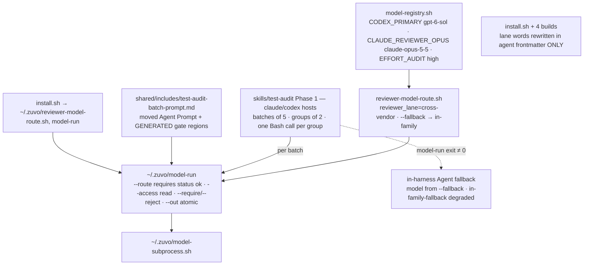

# Implementation Plan: Cross-vendor reviewer routing + test-audit on the routed auditor (Plan C of 3)

**Spec:** inline — no spec (planning input: `zuvo/context/plan-input-cross-vendor-review.md`)
**spec_id:** none
**planning_mode:** inline
**source_of_truth:** inline brief (user decisions 2026-09-25: "use Codex instead of Sonnet and vice versa — when Codex writes, use Opus 5.5"; "2. ok" — test-audit uses the routed reviewer) + Phase 1 reports `zuvo/context/plan-{architect,techlead}-report.md`
**plan_revision:** 5
**status:** Reviewed
**Created:** 2026-09-25
**Tasks:** 10
**Estimated complexity:** 5 complex, 5 standard
**Series:** Plan A `2026-09-25-reviewer-subprocess-foundation-plan.md` → Plan B `2026-09-25-blind-audit-panel-plan.md` → Plan C (this). **Both A and B must be merged to `main` first** (this plan uses `model-subprocess.sh`, the `ZUVO_*_BIN` seams, Plan A's preflight test, and Plan B's panel-based Step 3.5). The router's meaning changes LAST on purpose: until Plan B decoupled Step 3.5 from `routing_status`, an honest "unknown writer" would have made every Claude write-tests run degraded.

**Concurrency warning:** another session commits to `main`; `01c1727e` (2026-09-25) rewrote the router's Codex branches and the Codex build maps to hardcoded `gpt-6-sol`/`gpt-6-luna`. Re-read those regions before editing — this plan replaces the literals with registry reads and must not reintroduce old ids.

## Architecture Summary

Today `scripts/reviewer-model-route.sh` flips Opus↔Sonnet on a Claude host and assumes the writer is Sonnet when `CLAUDE_MODEL` is unset (`:96`) — so an Opus 5.5 session gets `reviewer=opus, routing_status=ok`: Opus reviewing Opus, reported as cross-model (measured live 2026-09-25). `skills/test-audit/SKILL.md` dispatches its batch auditors as in-harness Agents with a hardcoded `model: "sonnet"` (`:228`, `:679`), added in `199cdbe2` only to stop sub-agents inheriting the 1M context.

User decision: **a Claude writer is reviewed by Codex `gpt-6-sol`; a Codex writer is reviewed by Opus 5.5 (`claude-opus-5-5`).** Claude Code's Agent tool runs only Claude models, so the cross-vendor reviewer is an external CLI subprocess — Plan A's runner, wrapped in a small CLI `~/.zuvo/model-run`.



## Technical Decisions

- **Router contract stays six keys** (preflight parser `reviewer-preflight.sh:~88-95`, `env-compat.md` "only those six keys"). New lane value `cross-vendor`; the client is derived from the vendor-named model id by `zms_client_for_model`.
- **Claude host:** codex available (`zms_client_available codex` — `command -v`/`-x` only, never executing it) → `reviewer_lane=cross-vendor reviewer_model=$ZUVO_MODEL_CODEX_PRIMARY routing_status=ok` for ANY writer incl. unknown (the platform identifies the vendor). Codex missing → in-family row with status `cross-vendor-unavailable` (writer opus → sonnet; sonnet/haiku → opus); codex missing AND writer unknown → `unknown-writer-model`.
- **Codex host:** claude available → `cross-vendor` / `$ZUVO_MODEL_CLAUDE_REVIEWER_OPUS` / `ok` (only if probe P5 proves a nested `claude -p` works from inside Codex; if it does not, the Codex-host route reports `cross-vendor-unavailable` whenever that condition is detected). Claude missing → in-family GPT-6 pair from the registry with `cross-vendor-unavailable`.
- **Writer default is `unknown`**, never `sonnet`/`gpt-5.5`: Claude `${CLAUDE_MODEL:-unknown}`; Codex `ZUVO_CODEX_MODEL` → `CODEX_MODEL` → top-level `config.toml` model (`zms_codex_host_model`) → `unknown`.
- **`--fallback`** (runtime flag, NOT gated by `ZUVO_ALLOW_REVIEWER_ROUTE_OVERRIDE` — it selects policy, not a faked environment) → the in-family row with status `in-family-fallback`. With an UNKNOWN writer (the normal Claude Code case — `CLAUDE_MODEL` is unset) it returns a fully defined row using the same assumption the driver's `claude_reviewer_model` makes: Claude host → `reviewer_lane=review-alt reviewer_model=sonnet routing_status=unknown-writer-model` (writer assumed Opus); Codex host → `review-alt` / `$ZUVO_MODEL_CODEX_REVIEW_ALT` (writer assumed the registry primary) / `unknown-writer-model`. `reviewer_model` is never `unknown`. Callers never invent their own mapping.
- Cursor, Antigravity, Kimi arms unchanged. `routing_status=ok` still requires `reviewer_model != writer_model`.
- **Reviewer ids come from the registry** (`zms_source_registry`); `01c1727e`'s literals are replaced. The Codex build's `map_model` and TOML checks read `$ZUVO_MODEL_CODEX_PRIMARY`/`$ZUVO_MODEL_CODEX_ALT` too.
- **Consumer decisions** (the planning input asks for one per consumer):

| Consumer | Decision |
|---|---|
| write-tests Step 3.5 blind audit | panel from Plan B, strictness from `Audit panel:`; ONLY its fallback sentence changes: on driver exit 1/2 the in-harness `blind-coverage-auditor(-alt)` is chosen via `reviewer-model-route.sh --fallback` (Plan B's "current router lanes" would map `cross-vendor` to no agent) |
| write-tests Step 4 fallback-local | runs only when the adversarial driver has no provider; agent chosen from `reviewer-model-route.sh --fallback`; accepts `in-family-fallback`, `cross-vendor-unavailable` AND `unknown-writer-model` as DEGRADED — recorded `<n> findings:fallback-local` (plus `possibly-same-model` for `unknown-writer-model`), never `cross-provider` |
| test-audit Phase 1 | `model-run --route` on **claude and codex platforms only**; Cursor/Antigravity/Kimi keep today's in-harness Agent dispatch unchanged; the in-harness fallback takes its model from `--fallback` (defined for an unknown writer too) and labels `in-family-fallback (degraded)` or, for `unknown-writer-model`, `in-family-fallback (degraded, writer unknown)` |
| test-audit Phase 3b | unchanged (`adversarial-review --mode tests`) |
| reviewer-preflight | probes the routed cross-vendor client first; any non-`ok` status still maps to `degraded-routing` (unchanged mapping) |
| execute telemetry `reviewer-route` (`execute/SKILL.md:~348`), `session-state.md:~189` enum, retro tally (`retro/SKILL.md:~229`) | enum becomes `cross-vendor \| review-primary \| review-alt \| in-family-fallback \| same-model-fallback \| routing-failed` everywhere; retro counts the new values |
| build scripts / `install.sh` | lane words rewritten only in agent frontmatter |

- **Lane materialisation (architect defect 1):** `install.sh:~275-311` and the four builds rewrite `review-primary`/`review-alt` in EVERY `.md`, so installed docs disagree with the router's output. Limit the rewrite to agent frontmatter `model:` lines; narrow each leftover-token check to frontmatter.
- **In-harness agents** `blind-coverage-auditor(-alt)`, `adversarial-test-reviewer(-alt)` stay — as the DEGRADED fallback only.
- **`~/.zuvo/model-run`** (`scripts/zuvo-home/model-run`, installed by the generic loop `install.sh:~656`): `--route | --model <id>`, `--mode audit`, `--access none|read`, `--read-root <dir>`, `--prompt-file`, `--append-file` (repeatable), `--require <ERE>`, `--reject <ERE>`, `--out <file>` (atomic tmp+mv, only on exit 0), `--timeout` (default 480). **`--route` requires `routing_status=ok`**; any other status → exit 1, `status=unavailable route=<status>` (the caller then takes its labelled fallback — model-run never runs a same-vendor reviewer and calls it ok). Router lookup: `$dir/reviewer-model-route.sh` → `$dir/../reviewer-model-route.sh` (repo layout) → `$HOME/.zuvo/reviewer-model-route.sh` (installed next to it by `install.sh`, `cmp`-verified). Exit: 0 ok, 1 unavailable, 2 usage, 3 no usable answer (empty/auth/`--require` miss/`--reject` hit), 4 client error, 124 timeout. One stderr line: `model-run: status=<ok|unavailable|invalid|empty|auth|timeout|error> client= model= effort= route=`. Effort for `--mode audit`: codex `ZUVO_CODEX_EFFORT_AUDIT`; claude `ZUVO_CLAUDE_REVIEWER_OPUS_EFFORT`.
- **Anti-echo for test-audit:** the batch prompt itself contains `Tier: [A/B/C/D]` and the AUTO TIER-D template line `Red flags: [AP13/AP14/AP16] -> AUTO TIER-D` (`SKILL.md:~389-395,~410`), so a naive `--require` would accept an echo. A legitimate batch may consist ONLY of AUTO TIER-D files (short format, no `Tier:` line). Use `--require '^Tier: [ABCD]( |$)|^Red flags: .*-> AUTO TIER-D'` and `--reject 'Tier: \[A/B/C/D\]|Red flags: \[AP13/AP14/AP16\]'` (any echo of the prompt contains at least one of the two template lines).
- **test-audit Phase 1:** the ~13.5 KB Agent Prompt (`SKILL.md:234-441`, with GENERATED regions `kind=q-prompt` and `kind=ap-list`) moves verbatim to `shared/includes/test-audit-batch-prompt.md`; two wording changes: "Write complete output to …" → "Return the report as your final message; the orchestrator saves it", plus a "Verification context" field. Per batch (claude/codex platforms): `~/.zuvo/model-run --route --mode audit --access read --read-root "<repo>" --prompt-file "$ZUVO_BASE/shared/includes/test-audit-batch-prompt.md" --append-file batch-N.files --require '^Tier: [ABCD]( |$)|^Red flags: .*-> AUTO TIER-D' --reject 'Tier: \[A/B/C/D\]|Red flags: \[AP13/AP14/AP16\]' --timeout 480 --out zuvo/audits/.test-audit-batch/batch-N.md`. Batch size 5 on this route; groups of `ZUVO_TEST_AUDIT_PARALLEL` (default **2**) background jobs + `wait`, **one Bash call (`timeout: 600000`) per group** (two 480 s batches in one call would exceed 600 s). A failed batch is re-dispatched as the in-harness Agent with the model from `reviewer-model-route.sh --fallback`, labelled `in-family-fallback (degraded)`; if that fails, the batch is INCOMPLETE (`:449-450` rule). Report header: `Batch auditor: <client>/<model> route=<lane> status=<…>`.
- **File-size note:** `model-run` ≤ ~250 lines (a CLI wrapper, above the 100-line utility default by design: argument parsing + exit contract).
- Out of scope (backlog, Task 9): the other 7 skills from `199cdbe2`; Codex `map_model` `sonnet`→`gpt-5.4` (refused; whole Codex dist incl. this plan's fallback there); cursor lane model label (defect 6); driver's `~/.zuvo`-first registry lookup; adversarial claude/codex lanes in `agent` mode without `--safe-mode`; blind-audit top-up round; `model-run` fan-out; the stall watchdog's false RESUME while a skill waits on a background agent.

## Quality Strategy

- **How to run (IMPORTANT):** local hook `farm-no-local-tests.sh` → every test script runs as its own `TF_ALLOW_LOCAL=1 bash tests/…` call (no `;`, `&`, `|`, `$(`); testing.md §5 forbids `rt` for hook tests. Verify lines are lists of separate commands, each must exit 0. Acceptance Proofs are bare commands whose own exit code is the verdict.
- **Hermeticity** as in Plans A/B (`HOME=tmp`, fixture `CODEX_HOME`, own `ZUVO_HOME`, `ZUVO_CODEX_APP_BIN=/nonexistent`, every host signal cleared, explicit PATH whose first entry is a shim dir with symlinks to the real `timeout`/`gtimeout`/`jq` resolved before narrowing — `zms_run_*` and the driver need GNU `timeout`, which macOS `/usr/bin:/bin` lacks). Router tests use `ZUVO_CODEX_BIN` / `ZUVO_CLAUDE_BIN` pointing at a SENTINEL fake (touches `$T/invoked` if executed) or `/nonexistent`; every router case asserts the sentinel was never executed and the run finished within 5 s (preflight budget; the router must keep working under `PATH=/nonexistent /bin/bash`).
- **Distribution assertions** run on BUILT output via `tests/lib/dist-build.sh` + an own `ZUVO_DIST_ROOT` sandbox (copy the guarded `setup_file`/`teardown_file` of `reviewer-model-builds.bats:14-54`); any build with a swapped registry value runs with `env -u ZUVO_DIST_CACHE` and its OWN `ZUVO_DIST_ROOT` (the per-platform cache would otherwise replay or poison other tests). Build regex transforms fail silently — assert on the dist, never on the build script.
- New tests in `tests/hooks/test-*.sh` and `tests/skill-suite/`; bats edited in place; smoke runner `tests/hooks/smoke-cross-vendor.sh` (not globbed by run-all).
- **CQ gates:** CQ3, CQ4/CQ5 (auth copies via the library; no answer text or tokens in logs beyond the status line), CQ8, CQ11, CQ14 (router is the ONLY mapping; `model-run` never re-implements routing or isolation), CQ19 (six-key contract incl. new lane/status tokens; `env-compat.md`, `session-state.md`, `execute`, `retro` and `test-task-telemetry-contract.sh` agree — Task 2), CQ21 (atomic `--out`; parallel batch files), CQ22 (`wait` on every batch job).
- **Live evidence:** P5 (nested `claude -p` from inside `codex exec`) in Task 1 BEFORE the route is committed; one measured real test-audit batch in Task 8.

## Coverage Matrix

| Row ID | Authority item | Type | Primary task(s) | Notes |
|--------|----------------|------|-----------------|-------|
| G1 | Claude writer → reviewer Codex `gpt-6-sol` (not Sonnet/Opus) | requirement | Task 1, Task 5, Task 8 | |
| G2 | Codex writer → reviewer Opus 5.5 `claude-opus-5-5` via `claude -p` | requirement | Task 1, Task 5 | P5 probe in Task 1 |
| G3 | test-audit batch auditor uses the routed reviewer, no hardcoded Sonnet on the main path | requirement | Task 7, Task 8 | |
| K2 | Audit effort `high` on Codex | constraint | Task 5 | `ZUVO_CODEX_EFFORT_AUDIT` (Plan A) |
| K3 | Fallback defined; labelled degraded; never reported as cross-vendor ok | requirement | Task 1, Task 2, Task 5, Task 8 | `--fallback`, model-run exit 1 on non-ok route |
| K4 | Honest writer detection — unset `CLAUDE_MODEL` is `unknown`, never `sonnet` | requirement | Task 1 | the measured lie |
| K10 | Reviewer ids from the registry, not literals | constraint | Task 1, Task 3 | replaces `01c1727e` literals |
| K11 | Codex/Cursor/Antigravity/Kimi builds and `install.sh` keep passing; lane words consistent between router output and installed docs | constraint | Task 3, Task 4, Task 8 | architect defect 1 |
| K12 | New behaviour tested in the default suite | constraint | Tasks 1-8, Task 10 | |
| K13 | Other 7 skills from `199cdbe2` NOT changed — recorded as follow-up | constraint | Task 9 | |
| X2 | Preflight probes the routed cross-vendor client first | requirement (derived, defect 8) | Task 6 | |
| X7 | Other hosts (Cursor/Antigravity/Kimi) keep current routing and test-audit behaviour | constraint (input) | Task 1, Task 8 | |
| X8 | test-audit Phase 3b adversarial review preserved | constraint (input) | Task 8 | |
| X9 | Every consumer of the router/lane tokens has an explicit decision | requirement (input: "decide per consumer") | Task 2 | consumer table above |

## Review Trail
- Phase 1: full fan-out (shared with Plans A/B; reports in `zuvo/context/`)
- Plan reviewer: revision 1 → ISSUES FOUND (1 critical: installed `~/.zuvo/model-run` could not find the router; warnings: Task 1 left `reviewer-model-builds.bats` red, dist-cache poisoning, echo passes `--require`, non-ok route undefined in model-run, per-consumer decisions missing, test-audit regressions on other hosts, 600 s budget across groups, K12 unproven, backlog Verify vacuous + rule 21, P5 too late; infos: file list, deps/order, smoke preconditions) + cross-plan items — all applied in revision 2 (router docs split into Task 2; model-run + router install = Task 5; preflight = Task 6; backlog before smoke)
- Plan reviewer: revision 2 → ISSUES FOUND (0 critical: `--require` rejected an all-AUTO-TIER-D batch; `--fallback` row for an unknown writer undefined — still open from rev 1; Task 9 note check vacuous; Step 3.5 fallback broken by `cross-vendor`; gate-consistency command unprefixed; `timeout` shim) — applied in revision 3 (AUTO TIER-D require/reject branch + RED, defined unknown-writer `--fallback` row + per-host RED + consumer rows, `[xv-followup-note]` tag, Step 3.5 fallback sentence moved into Task 2, prefix, shim)
- Plan reviewer: revision 3 → only finding (SMOKE-C1 `/nonexistent` variant) resolved by Plan A revision 4 option (a) — no edit needed here → APPROVED
- Revision 4 (consistency with Plans A r5 / B r4): Plan B's Step 3.5 fallback sentence is now written by Plan B **Task 9** (was Task 7); full-suite attribution rule aligned with Plans A/B.
- Cross-model validation: SKIPPED — plan-review budget exhausted (`PLAN REVIEW BUDGET EXHAUSTED`, exit 7). Three passes were burned by the installed driver crashing on the `claude` lane (`claude_reviewer_model: command not found`, commit `7907fe70`) before `--exclude claude` was used; per the skill the budget is not bypassed. **Run `~/.zuvo/adversarial-review --mode plan --exclude claude --files docs/specs/2026-09-25-cross-vendor-reviewer-routing-plan.md` once before Plan C's execution starts** (Plans A and B must land first anyway).
- Plan reviewer (post-adversarial re-review of revision 4): APPROVED (info: make the skipped cross-model pass an always-run gate) — applied in revision 5 as the first step of Task 1.
- Status gate: Reviewed (awaiting user approval)

## Task Breakdown

### Task 1: Router — `cross-vendor` lane, honest writer default, `--fallback`, registry ids
**Files:** `scripts/reviewer-model-route.sh`, `scripts/tests/reviewer-model-route.bats`, `scripts/tests/reviewer-model-builds.bats`, `tests/hooks/test-reviewer-route-cross-vendor.sh` (new)
**Surface:** backend-logic
**Complexity:** complex
**Dependencies:** none
**Failure:** halt
**Execution routing:** deep implementation tier

- [ ] Gate (always runs, FIRST): cross-model validation of THIS plan, which was skipped at planning time — `~/.zuvo/adversarial-review --mode plan --files docs/specs/2026-09-25-cross-vendor-reviewer-routing-plan.md --json > zuvo/context/adversarial-plan-c.json` (timeout 600). Print `[DECISION: plan-c-cross-model] → clean` or `→ findings (N critical, M warning)`; any CRITICAL or execution-changing WARNING → STOP and revise the plan with the user before continuing.
- [ ] Live probe **P5** BEFORE GREEN (one call; decides the Codex-host arm): from inside `codex exec` (isolated `CODEX_HOME`, via `zms_run_codex --access agent` so the shell tool is available), run `claude -p --model claude-opus-5-5 --safe-mode --tools "" --strict-mcp-config --mcp-config <empty>` with the "product of 6 and 7" prompt → `42`. Record transcript + commit-message line. If it fails (sandbox/network/keychain), identify the condition and make the Codex-host route report `cross-vendor-unavailable` under it (RED case below).
- [ ] RED: `tests/hooks/test-reviewer-route-cross-vendor.sh` (plain bash + `/bin/bash`), one case per row; each asserts exactly six unique keys, the sentinel never executed, finish within 5 s:
  - Claude host (`CLAUDECODE=1`), `ZUVO_CODEX_BIN=<sentinel>`, `CLAUDE_MODEL` ∈ {opus, sonnet, unset} → `reviewer_lane=cross-vendor`, `reviewer_model=` the value of `$ZUVO_MODEL_CODEX_PRIMARY` sourced from the registry in the test, `routing_status=ok`; unset → `writer_model=unknown` (FAILS today: `sonnet`);
  - Claude host, `ZUVO_CODEX_BIN=/nonexistent`, codex off PATH: opus → `review-alt`/`sonnet`/`cross-vendor-unavailable`; sonnet → `review-primary`/`opus`/`cross-vendor-unavailable`; unset → `unknown-writer-model`;
  - Codex host (each signal), `ZUVO_CLAUDE_BIN=<sentinel>`, writer `gpt-6-sol`/`gpt-6-luna`/unknown → `cross-vendor`/`claude-opus-5-5` (== `$ZUVO_MODEL_CLAUDE_REVIEWER_OPUS`)/`ok`; claude missing → in-family GPT-6 pair from the registry with `cross-vendor-unavailable`; (+ the P5 failure condition case if P5 failed);
  - `--fallback` on each host → in-family row, status `in-family-fallback`;
  - `--fallback` with an UNKNOWN writer: Claude host, `CLAUDE_MODEL` unset → `reviewer_lane=review-alt`, `reviewer_model=sonnet`, `routing_status=unknown-writer-model`; Codex host, no writer hint → `review-alt`, `$ZUVO_MODEL_CODEX_REVIEW_ALT` (from the registry), `unknown-writer-model`; in NO row is `reviewer_model=unknown`;
  - registry swap: `ZUVO_MODEL_CODEX_PRIMARY=gpt-test-x` → Claude-host reviewer is `gpt-test-x`;
  - Cursor/Antigravity/Kimi rows: byte-identical to their current output (X7);
  - `reviewer-model-route.bats`: update expectations that encoded the in-family Claude flip / Codex literals;
  - `reviewer-model-builds.bats` `route_codex` (`:~88-94`) now calls the router with `--fallback` (and `ZUVO_CLAUDE_BIN=/nonexistent`) so its registry-anchor assertions keep testing the same-vendor Codex pair — otherwise the default suite goes red the moment Codex hosts route to Opus.
- [ ] GREEN: router per Technical Decisions; header note (`:5-8`) rewritten. No doc edits in this task (Task 2).
- [ ] Verify (each separately, exit 0):
  - `TF_ALLOW_LOCAL=1 bash tests/hooks/test-reviewer-route-cross-vendor.sh`
  - `TF_ALLOW_LOCAL=1 /bin/bash tests/hooks/test-reviewer-route-cross-vendor.sh`
  - `bats scripts/tests/reviewer-model-route.bats`
  - `bats scripts/tests/reviewer-model-builds.bats`
  - `TF_ALLOW_LOCAL=1 bash tests/hooks/test-cursor-reviewer-routing.sh`
  - `TF_ALLOW_LOCAL=1 bash tests/hooks/test-reviewer-preflight-isolation.sh`
  - `shellcheck -x scripts/reviewer-model-route.sh`
- [ ] Acceptance Proof:
  - G1 / G2 / K3 / K4 / K10 / X7
    - Surface: backend-logic
    - Proof: `TF_ALLOW_LOCAL=1 bash tests/hooks/test-reviewer-route-cross-vendor.sh` (contains SMOKE-C1 as a case) + P5 transcript
    - Expected: exit 0; P5 shows `42` or the documented `cross-vendor-unavailable` condition
    - Artifact: `zuvo/proofs/plan-c-task-1-report.md`, `zuvo/proofs/probe-5-claude-from-codex-2026-09-25.txt`
- [ ] Commit: `feat(routing): a Claude writer is reviewed by Codex gpt-6-sol and a Codex writer by Opus 5.5 — and an unknown writer is no longer assumed to be Sonnet` (body: P5 line)

### Task 2: Router consumers — contract docs and telemetry enum agree
**Files:** `shared/includes/env-compat.md`, `shared/includes/test-reviewer-routing.md`, `shared/includes/session-state.md`, `skills/execute/SKILL.md`, `skills/retro/SKILL.md`, `tests/skill-suite/test-task-telemetry-contract.sh`
**Surface:** docs
**Complexity:** standard
**Dependencies:** Task 1
**Failure:** halt
**Execution routing:** default implementation tier

(Six files — justified: one enum/contract change that five documents must state identically, plus the one test that pins them; splitting would leave the documents disagreeing between commits.)

- [ ] RED: extend `test-task-telemetry-contract.sh`: the `reviewer-route` enum in `session-state.md`, `execute/SKILL.md` and the retro tally lists exactly `cross-vendor review-primary review-alt in-family-fallback same-model-fallback routing-failed`; `env-compat.md` "Reviewer Model Routing" documents lane `cross-vendor`, statuses `cross-vendor-unavailable` and `in-family-fallback`, the `--fallback` flag and "a known vendor is a known writer"; `test-reviewer-routing.md` Step 4 obtains the fallback-local agent via `reviewer-model-route.sh --fallback` and accepts `in-family-fallback`/`cross-vendor-unavailable`/`unknown-writer-model` as DEGRADED (recorded `…:fallback-local`, `possibly-same-model` for the unknown-writer case, never cross-provider) — FAILS today (`:~183-185` requires `routing_status=ok`); `test-reviewer-routing.md` Step 3.5's FALLBACK sentence (written by Plan B Task 9: "driver exit 1/2 → in-harness `blind-coverage-auditor` routed by the current router lanes") now selects the agent via `reviewer-model-route.sh --fallback` — asserted, because after Task 1 a Claude host returns `reviewer_lane=cross-vendor`, which maps to no agent; the rest of Step 3.5 (panel outcome table) is unchanged.
- [ ] GREEN: edit the five documents per the consumer table in Technical Decisions.
- [ ] Verify (each separately, exit 0):
  - `TF_ALLOW_LOCAL=1 bash tests/skill-suite/test-task-telemetry-contract.sh`
  - `TF_ALLOW_LOCAL=1 bash tests/skill-suite/test-write-tests-coverage-gate.sh`
  - `bash scripts/validate-skills.sh`
- [ ] Acceptance Proof:
  - X9 / K3
    - Surface: docs
    - Proof: `TF_ALLOW_LOCAL=1 bash tests/skill-suite/test-task-telemetry-contract.sh`
    - Expected: exit 0
    - Artifact: `zuvo/proofs/plan-c-task-2-report.md`
- [ ] Commit: `docs(routing): every consumer of the reviewer route speaks the same lane and status vocabulary`

### Task 3: Lane words rewritten only in agent frontmatter — Claude cache + Codex build; Codex build reads the registry
**Files:** `scripts/install.sh`, `scripts/build-codex-skills.sh`, `scripts/tests/reviewer-model-builds.bats`
**Surface:** config
**Complexity:** complex
**Dependencies:** Task 1, Task 2
**Failure:** halt
**Execution routing:** deep implementation tier

- [ ] RED (`reviewer-model-builds.bats`, dist sandbox):
  - Claude cache materialisation (`materialize_claude_reviewer_lanes` against a copy under `HOME=tmp`): agent frontmatter `model: review-primary` → `opus`, `model: review-alt` → `sonnet`; `test-reviewer-routing.md`, `env-compat.md`, `session-state.md`, `execute/SKILL.md`, `retro/SKILL.md` still contain the literal words `review-primary`/`review-alt`/`cross-vendor` (FAILS today);
  - Codex dist, built with `env -u ZUVO_DIST_CACHE ZUVO_DIST_ROOT=<own tmp> ZUVO_MODEL_CODEX_PRIMARY=gpt-test-x`: `write-tests-blind-coverage-auditor.toml` model is `gpt-test-x` (FAILS today: literals); a normal build's TOMLs equal the registry values; prose in the Codex dist keeps the router words; the leftover-token check still fails the build if a FRONTMATTER `model: review-*` survives.
- [ ] GREEN: restrict the rewrite in `install.sh:~275-311` to agent frontmatter; `build-codex-skills.sh`: `map_model` + TOML checks (`:~203-216`, `:~935-950`) read the registry; prose rewrite (`:~178-180`) limited to frontmatter; leftover check narrowed.
- [ ] Verify (each separately, exit 0):
  - `bats scripts/tests/reviewer-model-builds.bats` (≈ 3 min — dist builds)
  - `shellcheck -x scripts/install.sh scripts/build-codex-skills.sh`
- [ ] Acceptance Proof:
  - K11 / K10
    - Surface: config
    - Proof: `bats scripts/tests/reviewer-model-builds.bats`
    - Expected: exit 0
    - Artifact: `zuvo/proofs/plan-c-task-3-report.md`
- [ ] Commit: `fix(build): installed docs keep the router's lane words; Codex reviewer agents take their model from the registry`

### Task 4: Same frontmatter-only rewrite for the Cursor, Antigravity and Kimi builds
**Files:** `scripts/build-cursor-skills.sh`, `scripts/build-antigravity-skills.sh`, `scripts/build-kimi-skills.sh`, `scripts/tests/reviewer-model-builds.bats`
**Surface:** config
**Complexity:** standard
**Dependencies:** Task 3
**Failure:** halt
**Execution routing:** default implementation tier

- [ ] RED (`reviewer-model-builds.bats`): for each of cursor/antigravity/kimi dists — agent frontmatter materialised (cursor `inherit`, antigravity `gemini-3.1-pro-high`/`-low`, kimi `model_preference: primary|secondary`); prose files keep `review-primary`/`review-alt`/`cross-vendor`; each build's own blind-auditor file check and leftover check still pass.
- [ ] GREEN: in each build restrict the prose rewrite (`cursor :~123-125`, `antigravity :~121-123`, `kimi :~153-155`) to agent frontmatter; narrow leftover checks (`:~606-611`, `:~610-615`, `:~659-663`).
- [ ] Verify (each separately, exit 0):
  - `bats scripts/tests/reviewer-model-builds.bats`
  - `TF_ALLOW_LOCAL=1 bash tests/hooks/test-kimi-build.sh`
  - `TF_ALLOW_LOCAL=1 bash tests/hooks/test-antigravity-skill-ownership.sh`
  - `shellcheck -x scripts/build-cursor-skills.sh scripts/build-antigravity-skills.sh scripts/build-kimi-skills.sh`
- [ ] Acceptance Proof:
  - K11
    - Surface: config
    - Proof: `bats scripts/tests/reviewer-model-builds.bats`
    - Expected: exit 0
    - Artifact: `zuvo/proofs/plan-c-task-4-report.md`
- [ ] Commit: `fix(build): Cursor, Antigravity and Kimi dists keep the router's lane words outside agent frontmatter`

### Task 5: `~/.zuvo/model-run` — run the routed reviewer as an isolated subprocess; router installed next to it
**Files:** `scripts/zuvo-home/model-run` (new), `tests/hooks/test-model-run.sh` (new), `scripts/install.sh`, `tests/hooks/test-install-wiring.sh`
**Surface:** integration
**Complexity:** complex
**Dependencies:** Task 1, Task 3
**Failure:** halt
**Execution routing:** deep implementation tier

(Depends on Task 3 because both edit `install.sh` — serialized.)

- [ ] RED: `tests/hooks/test-model-run.sh` (spies via `ZUVO_CODEX_BIN`/`ZUVO_CLAUDE_BIN`, hermetic env, a temp git repo as read root):
  - `--route --mode audit --access read --read-root R` on a Claude host → spy `codex` invoked with the registry primary model, `model_reasoning_effort = "high"`, read-only sandbox, neutral pwd; stderr line `model-run: status=ok client=codex model=gpt-6-sol effort=high route=cross-vendor`; exit 0;
  - on a Codex host → spy `claude` invoked with `--model claude-opus-5-5 --effort high` and the access-`read` flags;
  - route not ok (`ZUVO_CODEX_BIN=/nonexistent` on a Claude host → `cross-vendor-unavailable`) → exit 1, `status=unavailable route=cross-vendor-unavailable`, NO client invoked;
  - `--prompt-file` + two `--append-file`s → spy stdin sha == concatenation sha;
  - `--require '^Tier: [ABCD]( |$)|^Red flags: .*-> AUTO TIER-D' --reject 'Tier: \[A/B/C/D\]|Red flags: \[AP13/AP14/AP16\]'`: a spy that ECHOES the batch prompt → exit 3 `status=invalid`, `--out` NOT created; a spy that echoes only the AUTO TIER-D short-format template (`Red flags: [AP13/AP14/AP16] -> AUTO TIER-D`) → exit 3; an answer lacking both a `Tier:` line and a filled `Red flags: … -> AUTO TIER-D` line → exit 3; a legitimate batch consisting ONLY of AUTO TIER-D short-format entries (`Red flags: AP13 -> AUTO TIER-D`) → exit 0; a valid full-format answer → exit 0 and `--out` created atomically (a watcher sees either nothing or the full file);
  - timeout → 124 `status=timeout`; missing client → exit 1 `status=unavailable`; auth stub → exit 3 `status=auth`; bad args → exit 2;
  - `git status --porcelain` of the read-root repo is empty after every case;
  - **installed layout** (`test-install-wiring.sh`): after `install_zuvo_home` with `HOME=tmp`, `$HOME/.zuvo/model-run` and `$HOME/.zuvo/reviewer-model-route.sh` exist (`cmp`-verified); a LONE copy run as `$HOME/.zuvo/model-run --route …` (repo not on its path) resolves the router and routes to the codex spy — FAILS today (router not installed there).
- [ ] GREEN: `scripts/zuvo-home/model-run` (bash, ≤ ~250 lines) = argument parsing + router lookup/call (`--route`) or explicit `--model` + `zms_client_for_model` + `zms_run_codex`/`zms_run_claude` + `--require`/`--reject` + atomic `--out` + status line; `install.sh` adds `scripts/reviewer-model-route.sh` to the `install_zuvo_home` loop with `cmp` verification (model-run itself is installed by the existing `scripts/zuvo-home/*` glob).
- [ ] Verify (each separately, exit 0):
  - `TF_ALLOW_LOCAL=1 bash tests/hooks/test-model-run.sh`
  - `TF_ALLOW_LOCAL=1 /bin/bash tests/hooks/test-model-run.sh`
  - `TF_ALLOW_LOCAL=1 bash tests/hooks/test-install-wiring.sh`
  - `shellcheck -x scripts/zuvo-home/model-run scripts/install.sh`
- [ ] Acceptance Proof:
  - G1 / G2 / K2 / K3
    - Surface: integration
    - Proof: `TF_ALLOW_LOCAL=1 bash tests/hooks/test-model-run.sh` and `TF_ALLOW_LOCAL=1 bash tests/hooks/test-install-wiring.sh`
    - Expected: both exit 0 (SMOKE-C2's per-task RED copy)
    - Artifact: `zuvo/proofs/plan-c-task-5-report.md`
- [ ] Commit: `feat(model-run): one command runs the routed cross-vendor reviewer isolated, and refuses to pass off a fallback as the real thing`

### Task 6: Preflight probes the routed cross-vendor client first
**Files:** `scripts/reviewer-preflight.sh`, `tests/hooks/test-reviewer-preflight-isolation.sh`
**Surface:** backend-logic
**Complexity:** standard
**Dependencies:** Task 1
**Failure:** halt
**Execution routing:** default implementation tier

- [ ] RED: in `test-reviewer-preflight-isolation.sh` (hermetic harness env from Plan A): on a Claude host with a codex spy available, the FIRST canary executed is codex (spy invocation order recorded to a shared log), still with the computed-answer check; on a Codex host with a claude spy, the first is claude; `ZUVO_CODEX_BIN=/nonexistent` → preflight reports `degraded-routing` (non-ok route) and still canaries the panel candidates.
- [ ] GREEN: preflight calls the router first and orders the routed client ahead of the panel candidates.
- [ ] Verify (each separately, exit 0):
  - `TF_ALLOW_LOCAL=1 bash tests/hooks/test-reviewer-preflight-isolation.sh`
  - `shellcheck -x scripts/reviewer-preflight.sh`
- [ ] Acceptance Proof:
  - X2
    - Surface: backend-logic
    - Proof: `TF_ALLOW_LOCAL=1 bash tests/hooks/test-reviewer-preflight-isolation.sh`
    - Expected: exit 0
    - Artifact: `zuvo/proofs/plan-c-task-6-report.md`
- [ ] Commit: `fix(preflight): check the reviewer the route will actually use before anything else`

### Task 7: Move the test-audit batch prompt into a shared include
**Files:** `skills/test-audit/SKILL.md`, `shared/includes/test-audit-batch-prompt.md` (new), `tests/skill-suite/test-test-audit-subprocess-dispatch.sh` (new), `CLAUDE.md`
**Surface:** docs
**Complexity:** standard
**Dependencies:** none
**Failure:** halt
**Execution routing:** default implementation tier

- [ ] RED: `tests/skill-suite/test-test-audit-subprocess-dispatch.sh` (part 1): the include exists and contains BOTH `GATES:BEGIN kind=q-prompt` and `kind=ap-list` regions; the include says "Return the report as your final message" and has a "Verification context" field; it no longer says "Write complete output to"; `skills/test-audit/SKILL.md` references `../../shared/includes/test-audit-batch-prompt.md` (and lists it under Mandatory File Loading) and no longer embeds the prompt body (the `RED FLAG PRE-SCAN` heading appears only in the include).
- [ ] GREEN: move the prompt VERBATIM (regions intact), then apply the two wording changes; update `CLAUDE.md` "shared procedural includes (N files)" to the real count.
- [ ] Verify (each separately, exit 0):
  - `TF_ALLOW_LOCAL=1 bash tests/skill-suite/test-test-audit-subprocess-dispatch.sh`
  - `bash scripts/validate-skills.sh`
  - `python3 scripts/gen-gate-copies.py`
  - `TF_ALLOW_LOCAL=1 bash tests/gates/test-gate-consistency.sh`
  Expected: gen-gate-copies reports 0 stale; validate-skills `ERRORS: 0`.
- [ ] Acceptance Proof:
  - G3
    - Surface: docs
    - Proof: `TF_ALLOW_LOCAL=1 bash tests/skill-suite/test-test-audit-subprocess-dispatch.sh` and `python3 scripts/gen-gate-copies.py`
    - Expected: both exit 0
    - Artifact: `zuvo/proofs/plan-c-task-7-report.md`
- [ ] Commit: `refactor(test-audit): the batch auditor prompt lives in a shared include any client can be handed`

### Task 8: test-audit Phase 1 dispatches batches through `model-run` on Claude/Codex hosts, with a labelled in-family fallback
**Files:** `skills/test-audit/SKILL.md`, `tests/skill-suite/test-test-audit-subprocess-dispatch.sh`, `scripts/tests/reviewer-model-builds.bats`
**Surface:** integration
**Complexity:** complex
**Dependencies:** Task 1, Task 2, Task 4, Task 5, Task 7
**Failure:** halt
**Execution routing:** deep implementation tier

- [ ] RED:
  - `test-test-audit-subprocess-dispatch.sh` (part 2): SKILL.md Phase 1 contains `~/.zuvo/model-run --route --mode audit --access read` with `--require '^Tier: [ABCD]( |$)|^Red flags: .*-> AUTO TIER-D'`, `--reject 'Tier: \[A/B/C/D\]|Red flags: \[AP13/AP14/AP16\]'` and `--out zuvo/audits/.test-audit-batch/batch-`; batch size 5 on this route; `ZUVO_TEST_AUDIT_PARALLEL` default 2 with `wait`; **one Bash call with `timeout: 600000` per GROUP** (not one for all groups); the subprocess route is scoped to claude/codex platforms and the Cursor/Antigravity/Kimi path keeps the in-harness Agent dispatch text (X7); the fallback paragraph uses `reviewer-model-route.sh --fallback` and labels `in-family-fallback (degraded)`; a `Batch auditor:` header line is specified; the main path has NO `model: "sonnet"`; Execution Notes no longer say "Use Sonnet for batch agents"; the Phase 3b `adversarial-review --mode tests` line is byte-identical to before (X8);
  - `reviewer-model-builds.bats`: in all four dists the test-audit SKILL.md still contains the `model-run --route --mode audit --access read` command unchanged (Codex regex rewrites `build-codex-skills.sh:~386-415` must not mangle it) and the include is present in each dist's shared dir.
- [ ] GREEN: rewrite Phase 1 (per-host branch, per-batch command, groups + `wait`, fallback, header line); Phase 0.5/2 unchanged except the orchestrator owns `batch-N.md` via `--out`; Execution Notes `:~679-680`. If the dist assertion shows the command mangled, fix `build-codex-skills.sh` in this task with its own RED case (and list it in the commit).
- [ ] Live measurement (recorded, not a unit test): run the new per-batch command from the REPO copy (`scripts/zuvo-home/model-run`, real `HOME`) on ONE small real test file of this repo + its target → the batch file contains a `Tier: [ABCD]` line; record wall time, client/model/effort, exit status in the task report.
- [ ] Verify (each separately, exit 0):
  - `TF_ALLOW_LOCAL=1 bash tests/skill-suite/test-test-audit-subprocess-dispatch.sh`
  - `bats scripts/tests/reviewer-model-builds.bats`
  - `bash scripts/validate-skills.sh`
- [ ] Acceptance Proof:
  - G3 / G1 / K3 / K11 / X7 / X8
    - Surface: integration
    - Proof: `TF_ALLOW_LOCAL=1 bash tests/skill-suite/test-test-audit-subprocess-dispatch.sh` and `bats scripts/tests/reviewer-model-builds.bats` + the live measurement block
    - Expected: both exit 0; the live batch file has a `Tier: [ABCD]` line and the report records `client=codex model=gpt-6-sol effort=high`
    - Artifact: `zuvo/proofs/plan-c-task-8-report.md`
- [ ] Commit: `feat(test-audit): batch auditors run as the routed cross-vendor reviewer instead of a hardcoded Sonnet sub-agent`

### Task 9: Record the out-of-scope follow-ups in the backlog
**Files:** `memory/backlog.md` (via `zuvo:backlog add`)
**Surface:** docs
**Complexity:** standard
**Dependencies:** none
**Failure:** halt
**Execution routing:** default implementation tier

- [ ] RED: docs-only task — no production code. Pre-state check: `test "$(grep -c '\[xv-followup\]' memory/backlog.md)" -eq 0` passes (no tagged entries yet); note the EXISTING backlog entries that already cover `map_model` (`memory/backlog.md:~736,~741`) and the watchdog (`:~766`) — those are referenced, not duplicated.
- [ ] GREEN: `zuvo:backlog add` one entry per NEW item, each title starting `[xv-followup]`: (1) routed reviewer for the other 7 skills from `199cdbe2` (refactor, review, execute, security-audit, code-audit, api-audit, ui-design-team); (2) cursor lane requests `composer-2.5-fast` but logs `auto` (architect defect 6); (3) driver registry lookup reads `~/.zuvo` before the repo copy; (4) adversarial claude/codex lanes in `agent` mode without `--safe-mode` / with full disk access — harden after re-benchmarking; (5) blind-audit panel top-up round when < 2 valid; (6) `model-run` fan-out mode when more skills adopt it. For `map_model` and the watchdog false RESUME, append a note starting `[xv-followup-note 2026-09-25]` to each of the two EXISTING entries (this plan's evidence: the Codex-dist fallback maps to `gpt-5.4`; the 2026-09-25 plan run got repeated false RESUMEs while waiting on background agents).
- [ ] Verify (each separately, exit 0):
  - `test "$(grep -c '\[xv-followup\]' memory/backlog.md)" -ge 6`
  - `test "$(grep -c '\[xv-followup-note 2026-09-25\]' memory/backlog.md)" -ge 2`
- [ ] Acceptance Proof:
  - K13
    - Surface: docs
    - Proof: `test "$(grep -c '\[xv-followup\]' memory/backlog.md)" -ge 6`
    - Expected: exit 0
    - Artifact: `zuvo/proofs/plan-c-task-9-report.md`
- [ ] Commit: `docs(backlog): follow-ups left outside the cross-vendor reviewer work`

### Task 10: Plan C smoke runner + full verification
**Files:** `tests/hooks/smoke-cross-vendor.sh` (new)
**Surface:** integration
**Complexity:** standard
**Dependencies:** Task 1, Task 3, Task 4, Task 5, Task 6, Task 8, Task 9
**Failure:** halt
**Execution routing:** default implementation tier

- [ ] RED: author `tests/hooks/smoke-cross-vendor.sh` (named `smoke-*`, not globbed by run-all) running SMOKE-C1..C3 always and SMOKE-C4 only with `ZUVO_LIVE_SMOKE=1` (prints `SKIP live` otherwise). Exit contract: `0` all executed parts passed; `75` live part failed only on provider infrastructure (`status=timeout|auth|unavailable`); `1` otherwise. Executed-check count > 0.
- [ ] GREEN: no production change expected; any cross-task defect is fixed in its owning file with its own RED case.
- [ ] Verify (each separately, exit 0):
  - `TF_ALLOW_LOCAL=1 bash tests/hooks/smoke-cross-vendor.sh`
  - `bash scripts/validate-skills.sh`
  - `python3 scripts/gen-gate-copies.py`
  - `TF_ALLOW_LOCAL=1 bash tests/gates/test-gate-consistency.sh`
  - `python3 scripts/audit-registry-integrity.py --strict`
  - `TF_ALLOW_LOCAL=1 bash tests/run-all.sh`
  Expected: `RESULT: PASS=n FAIL=0` (only exception: a child listed in the Plan A baseline file that fails identically when re-run alone in a throwaway worktree of the pre-plan commit, both outputs recorded) — this run IS the K12 proof: every new `tests/hooks/test-*.sh`, `tests/skill-suite/test-*.sh` and edited bats file of Plans A-C is executed by the default suite.
- [ ] Acceptance Proof:
  - G1 / G2 / G3 / K3 / K4 / K12
    - Surface: integration
    - Proof: `TF_ALLOW_LOCAL=1 ZUVO_LIVE_SMOKE=1 bash tests/hooks/smoke-cross-vendor.sh` and `TF_ALLOW_LOCAL=1 bash tests/run-all.sh`
    - Expected: both exit 0 (smoke exit 75 → reported `BLOCKED_INFRA` to the user, not a code failure); run-all lists the new test files among its children
    - Artifact: `zuvo/proofs/plan-c-task-10-report.md` (+ `zuvo/proofs/smoke-plan-c.txt`)
- [ ] Commit: `test(routing): end-to-end smoke — cross-vendor route, model-run, test-audit dispatch in every dist`

## Whole-feature Smoke Proofs

- **SMOKE-C1 — a Claude writer is routed to Codex without the router executing anything**
  - Proof:
    ```bash
    F=$(mktemp -d); printf '#!/bin/sh\ntouch "%s/invoked"; exit 0\n' "$F" > "$F/codex"; chmod +x "$F/codex"
    out=$(env -u CLAUDE_MODEL -u CODEX_SANDBOX -u CODEX_SHELL -u CODEX_INTERNAL_ORIGINATOR_OVERRIDE -u __CFBundleIdentifier \
          PATH=/usr/bin:/bin CLAUDECODE=1 ZUVO_CODEX_BIN="$F/codex" bash scripts/reviewer-model-route.sh)
    printf '%s\n' "$out" | grep -qx 'reviewer_lane=cross-vendor' && printf '%s\n' "$out" | grep -qx 'reviewer_model=gpt-6-sol' \
     && printf '%s\n' "$out" | grep -qx 'writer_model=unknown' && printf '%s\n' "$out" | grep -qx 'routing_status=ok' \
     && [ "$(printf '%s\n' "$out" | wc -l | tr -d ' ')" -eq 6 ] && [ ! -e "$F/invoked" ]
    ```
    plus `ZUVO_CODEX_BIN=/nonexistent` → `unknown-writer-model`; `--fallback` → `in-family-fallback`.
  - Expected: exit 0 for each
  - RED allocation: Task 1
- **SMOKE-C2 — `model-run` runs the routed reviewer isolated, refuses a non-ok route, writes atomically, and works from `~/.zuvo`**
  - Proof: `TF_ALLOW_LOCAL=1 bash tests/hooks/test-model-run.sh` and `TF_ALLOW_LOCAL=1 bash tests/hooks/test-install-wiring.sh`
  - Expected: exit 0
  - RED allocation: Task 5
- **SMOKE-C3 — every dist carries the new dispatch and the router's lane words**
  - Preconditions: `S=$(mktemp -d)`
  - Proof (inside the smoke runner, one platform per iteration): `env -u ZUVO_DIST_CACHE ZUVO_DIST_ROOT="$S" bash tests/lib/dist-build.sh <p>` then `grep -q 'model-run --route --mode audit --access read' "$S/<p>/skills/test-audit/SKILL.md"` for `<p>` in codex cursor antigravity kimi; plus `bats scripts/tests/reviewer-model-builds.bats`
  - Expected: exit 0
  - RED allocation: Task 3, Task 4, Task 8
- **SMOKE-C4 — live (`ZUVO_LIVE_SMOKE=1`): one real test-audit batch through Codex, and the Codex→Opus direction**
  - Preconditions: REAL `HOME` (clients need their own logins); the REPO copy `scripts/zuvo-home/model-run` (its sibling router resolves; the installed layout is proven hermetically in Task 5); `T=$(mktemp -d)`
  - Proof: `bash scripts/zuvo-home/model-run --route --mode audit --access read --read-root "$PWD" --prompt-file shared/includes/test-audit-batch-prompt.md --append-file <batch file listing one small test + its target> --require '^Tier: [ABCD]( |$)|^Red flags: .*-> AUTO TIER-D' --reject 'Tier: \[A/B/C/D\]|Red flags: \[AP13/AP14/AP16\]' --out "$T/batch-1.md"` from a Claude Code host; and probe P5 re-run
  - Expected: exit 0; `$T/batch-1.md` has a `Tier: [ABCD]` line; stderr `status=ok client=codex model=gpt-6-sol effort=high route=cross-vendor`; P5 → `42`. Provider outage → smoke exit 75 → `BLOCKED_INFRA`.
  - Artifact: `zuvo/proofs/smoke-plan-c.txt`
  - RED allocation: Task 8, Task 10
