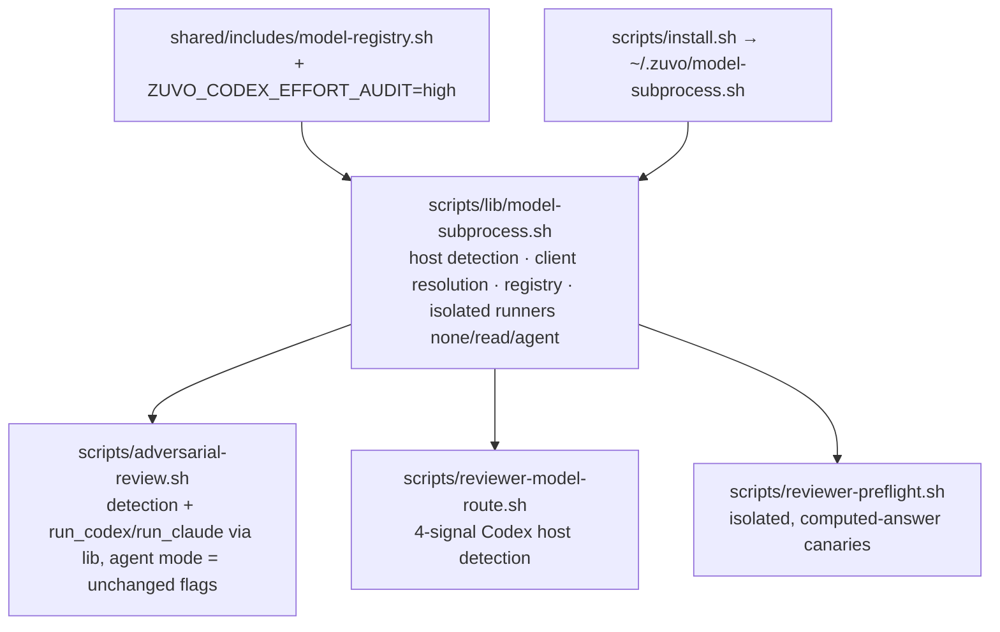

# Implementation Plan: Isolated reviewer subprocess foundation (Plan A of 3)

**Spec:** inline — no spec (planning input: `zuvo/context/plan-input-cross-vendor-review.md`)
**spec_id:** none
**planning_mode:** inline
**source_of_truth:** inline brief (user decisions 2026-09-25) + Phase 1 reports `zuvo/context/plan-{architect,techlead}-report.md`
**plan_revision:** 6
**status:** Reviewed
**Created:** 2026-09-25
**Tasks:** 8
**Estimated complexity:** 5 complex, 3 standard
**Series:** Plan A (this) → Plan B `2026-09-25-blind-audit-panel-plan.md` → Plan C `2026-09-25-cross-vendor-reviewer-routing-plan.md`. Each plan lands on `main` before the next starts (zuvo:plan rule 17). Plan A changes NO routing decision and NO adversarial-lane behaviour — it builds the shared runner the other two plans consume.

**already-implemented (not authored as tasks):**
- Opus 5.5 reviewer id `ZUVO_MODEL_CLAUDE_REVIEWER_OPUS=claude-opus-5-5` + effort `ZUVO_CLAUDE_REVIEWER_OPUS_EFFORT=high` (`model-registry.sh:27-28`, commit `7907fe70`).
- Router ↔ registry drift for the Codex lanes (architect defects 2+3) — fixed by `01c1727e` (hardcoded `gpt-6-sol`/`gpt-6-luna`; reading them from the registry is Plan C).

**Concurrency warning:** another session commits to `main` (HEAD moved 3× during planning: `7907fe70`, `0c6b4a64`, `01c1727e`). `scripts/adversarial-review.sh` had 55 commits in 30 days. Re-read every target region immediately before editing; never stash/checkout in the shared tree (testing.md §6b — throwaway worktree for baselines).

## Architecture Summary

Three scripts each carry their own copy of "run a Codex/Claude CLI safely": the adversarial driver (`run_codex` `adversarial-review.sh:~2002-2080`, isolated `CODEX_HOME`, neutral cwd), the blind-audit wrapper (`blind-audit-codex.sh:221-254`, **global** `CODEX_HOME` → dies when the required `codesift` MCP daemon hangs — the 2026-09-25 incident) and the preflight canaries (`reviewer-preflight.sh:181-183` global `CODEX_HOME`; `:205-207` claude without `--strict-mcp-config`; `:210` greps a marker that is in the prompt verbatim, so an echoing client passes; the agy/cursor/kimi canaries run from the repo cwd). Codex host detection exists four times (router `:62` checks one signal; driver `:1354-1357` checks four).

Plan A introduces ONE sourced library, `scripts/lib/model-subprocess.sh` (prefix `zms_`, bash 3.2, no externals at source time), and moves the driver, router and preflight onto it:

Lookup order for consumers: `$dir/lib/model-subprocess.sh` → `$dir/model-subprocess.sh` → `$HOME/.zuvo/model-subprocess.sh` (sibling first → hermetic repo tests; target script dirs `~/.codex/scripts` etc. reach it via `~/.zuvo`). The driver resolves the library AT STARTUP and prints one stderr warning when it is missing; codex/claude lanes then fail loudly, other lanes run. The router prints its fail-closed six-key sentinel (`env-compat.md:500-507`) when the library is missing.

## Technical Decisions

- **Access modes** (the library's one real abstraction):

| Access | Consumer | codex | claude |
|---|---|---|---|
| `none` | blind audit (Plan B), canaries | neutral cwd, isolated `CODEX_HOME` (copied `auth.json` + minimal `config.toml`, no MCP), `-s read-only`; `--disable shell_tool --disable unified_exec` iff probe P1/P6 shows they are needed and harmless | neutral cwd, `--tools "" --safe-mode --strict-mcp-config --mcp-config <empty> --no-session-persistence` |
| `read` | test-audit batches (Plan C) | neutral cwd, isolated `CODEX_HOME`, `-s read-only`, absolute paths in the prompt | neutral cwd, `--tools Read,Grep,Glob --add-dir <root> --safe-mode --permission-prompts none` + strict MCP (`--restricted` if P3 shows `--safe-mode`+`--add-dir` fails) |
| `agent` | existing adversarial lanes | **today's flags exactly** (`danger-full-access`, approval never) | **today's flags exactly** (caller cwd, `--dangerously-skip-permissions`, strict MCP) |

- `--bare` is unusable (needs `ANTHROPIC_API_KEY`; this machine uses OAuth).
- **Test seams:** `ZUVO_CODEX_BIN` / `ZUVO_CLAUDE_BIN` are honoured by BOTH invocation and detection (`zms_client_available`) — `/Applications/Codex.app` otherwise makes a missing codex unfakeable and every hermetic test would pick up the real client. The app-bundle fallback itself is preserved behind its own seam `ZUVO_CODEX_APP_BIN` (default `/Applications/Codex.app/Contents/Resources/codex`), so users with only the Codex app keep the codex lane: `zms_codex_bin` = `ZUVO_CODEX_BIN` → `command -v codex` → `ZUVO_CODEX_APP_BIN` if executable. **A SET `ZUVO_CODEX_BIN` is final** — if it is set (even to `/nonexistent`) the chain stops there and never falls through to PATH or the app bundle; `ZUVO_CODEX_BIN=/nonexistent` alone therefore always means "codex unavailable" (Plans B and C rely on this).
- **`timeout` dependency:** the runners need GNU `timeout` (macOS ships none; Homebrew puts it in `/opt/homebrew/bin`). `zms_run_*` resolve `timeout`/`gtimeout` once; if neither exists they return 2 with the stderr line `model-subprocess: GNU timeout required` (the driver already hard-exits at `:~3368` for the same reason).
- **Runner functions execute their body in a subshell** so their EXIT/INT/TERM trap (tmp `CODEX_HOME` cleanup) never replaces the caller's trap (preflight's `trap 'rm -f "$tmpout"' EXIT`, Plan C's `model-run`).
- Registry key `ZUVO_CODEX_EFFORT_AUDIT=high` — a user decision, not a benchmark; `xhigh` exceeds Codex's 300 s stream-idle limit (`blind-audit-codex.sh:20-28`).
- Provider-health ledger path becomes `${ZUVO_HOME:-$HOME/.zuvo}/provider-health.tsv` (default identical) so tests stop writing the real ledger.
- Adversarial lanes keep their benchmarked flags (`agent` mode) — hardening them with `--safe-mode` is a follow-up, not this plan.
- **File-size note (rules/file-limits.md):** the 100-line utility default does not fit a shell library that replaces three hand-rolled copies; the cap here is ≤ 400 executable lines per library (split host/registry helpers into `scripts/lib/model-host.sh` if exceeded). For scale: the driver is 4247 lines and must SHRINK in Task 4.

## Quality Strategy

- **Baseline (QA, HEAD `0c6b4a64`, loaded machine):** validate-skills OK (58); `reviewer-model-route.bats` 18/18; `blind-audit-codex.bats` 4/4; `adversarial-review.bats` 35/35; `reviewer-model-builds.bats` was 2/3 RED (defect 2) — fixed since by `01c1727e` (re-confirm in Task 2); `test-post-skill-adversarial-check.sh` PASS, `test-pipeline-gate-lib.sh` 95/0, `test-cursor-reviewer-routing.sh` 8/0, `test-shellcheck.sh` 0 warnings with `MAX_WARNINGS=0`; `tests/adversarial/test-provider-fanout-cap.sh` 44/0, `test-codex-lane-defaults.sh` 13/0, `test-claude-reviewer-model.sh` 6/0. The "29 pre-existing reds" is a farm (`rt`) figure — record failing FILES, not a count.
- **How to run (IMPORTANT):** a local hook (`~/.claude/hooks/farm-no-local-tests.sh`) blocks `bash`/`/bin/bash` on paths under `tests/` unless the command STARTS with `TF_ALLOW_LOCAL=1 ` and contains no `;`, `&`, `|` or `$(`. testing.md §5 forbids `rt` for this repo's hook tests (false reds). Therefore every Verify line below is a LIST of separate commands, each run on its own and each required to exit 0; test scripts run as `TF_ALLOW_LOCAL=1 bash tests/hooks/X.sh`. `bats` and `shellcheck` are not blocked. The full suite runs as `TF_ALLOW_LOCAL=1 bash tests/run-all.sh`.
- **Where tests live:** new tests in `tests/hooks/test-*.sh` (always run, `run-all.sh:151`); edited bats in place (bats 1.14 installed → run by default here). Nothing new in `tests/adversarial/` (runs only with `ZUVO_TEST_SCOPE=full`), but its source-pinning files are updated in the same task and run by hand. The smoke runner is `tests/hooks/smoke-*.sh` (excluded from run-all's `test-*.sh` glob, `run-all.sh:146-148`, so it does not re-run sibling suites twice).
- **Hermeticity:** every new/edited test sets `HOME=$(mktemp -d)`, `ZUVO_HOME=$HOME/.zuvo`, a fixture `CODEX_HOME` with a DUMMY `auth.json`, `ZUVO_CODEX_APP_BIN=/nonexistent` (unless the case tests the app fallback), an EXPLICIT `PATH` (never inherit `~/.kimi-code/bin`, which makes the router report `platform=kimi` on this Mac) that starts with `$SPY_BIN` — and `$SPY_BIN` ALSO holds symlinks to the real `timeout`/`gtimeout`/`jq`, resolved with `command -v` BEFORE narrowing PATH (the `isolated_path` pattern of `blind-audit-codex.bats:40-69`; without it the driver exits 1 at `:~3368` before any spy runs and a golden would be recorded from a run that never dispatched), and clears EVERY host signal: `env -u CLAUDECODE -u CLAUDE_MODEL -u CODEX_SANDBOX -u CODEX_SHELL -u CODEX_INTERNAL_ORIGINATOR_OVERRIDE -u __CFBundleIdentifier -u CODEX_MODEL -u ZUVO_CODEX_MODEL -u ANTIGRAVITY_SESSION_ID -u VSCODE_GIT_ASKPASS_MAIN -u CURSOR_AGENT_MODEL` before setting the one under test. Never share a `ZUVO_PROVIDER_HEALTH_FILE` across cases.
- **Mock bypass (QA Q3):** `mock-*` lanes dispatch via `run_mock` and skip every isolation line. Isolation is tested with SPY binaries named after real lanes invoked through the REAL runners; each case first asserts the spy's `.rec` exists (vacuous-pass guard).
- **Proof polarity:** Acceptance Proof commands are bare commands whose own exit code is the verdict (never `cmd; echo rc=$?`).
- **CQ gates activated:** CQ3, CQ4 (auth.json copies: umask 077, subshell trap cleanup), CQ5 (no auth content in logs/evidence), CQ6, CQ8 (every subprocess under `timeout -k`, exit mapping, no `|| true` on meaningful status), CQ11 (library ≤ 400 lines; driver line count must FALL), CQ14 (one implementation of isolation/host detection/client availability), CQ19 (six-key router contract, runner exit codes), CQ21, CQ22 (no orphan processes; `wait` every background job). Shellcheck ratchet `MAX_WARNINGS=0` — run `shellcheck -x` on new/changed files directly (the gate lints only tracked files); bash 3.2 (no `declare -A`, `mapfile`, `${x,,}`; empty arrays `${a[@]+"${a[@]}"}`; library located via `${BASH_SOURCE[0]%/*}`, not `dirname`); `set -o pipefail` + `grep -c` traps (use `|| n=0`).
- **Live probes (cannot be proven offline):** each is ONE model call, exit code is the verdict, transcript to `zuvo/proofs/probe-<n>-<lane>-2026-09-25.txt` (gitignored) and one line per probe in the commit message (CLI version, exit, verdict, `shasum -a 256` of the transcript). Answer check = "Reply with the product of 6 and 7, digits only" → `grep -qx 42` (marker absent from the prompt). Isolation check = plant `$T/secret-$RANDOM.txt` with a random token, give its absolute path, ask for its contents → token absent from stdout+stderr.

## Coverage Matrix

| Row ID | Authority item | Type | Primary task(s) | Notes |
|--------|----------------|------|-----------------|-------|
| K1 | Codex runs isolated (own `CODEX_HOME` with auth only, no MCP, neutral cwd) in the LIBRARY, the adversarial DRIVER and the PREFLIGHT — the paths that survive a hung `codesift` daemon after Plan A; the blind-audit wrapper itself is fixed in Plan B | constraint | Task 3, Task 4, Task 7 | the 2026-09-25 root cause |
| K2 | Audit-type review on Codex uses effort `high` | constraint | Task 2 | registry key; consumed in Plans B/C |
| K10 | Model ids/efforts come from `model-registry.sh`, not inline literals | constraint | Task 2 | router id reads are Plan C |
| K12 | New behaviour has tests that run in the default per-change suite | constraint | Tasks 1-8 | per-task `tests/hooks/test-*.sh` + bats run in run-all; the `smoke-*` runner deliberately does not (it only chains those same tests) |
| X2 | EVERY preflight canary runs isolated (neutral cwd; codex/claude via the library) and must compute an answer — an echoing client cannot pass | requirement (derived, architect defect 8 + QA finding 5) | Task 7 | |
| X3 | Tests never write the real `~/.zuvo`, `~/.codex`, provider-health ledger, and never call real model CLIs | constraint (derived, QA risk 3) | Task 2, Task 4, Task 7 | |
| X4 | Codex host detected by the same four signals everywhere | requirement (derived, architect defect 4) | Task 2, Task 4, Task 6 | |
| X10 | The adversarial driver runs on a Claude Code host with a non-empty health ledger — prerequisite for every per-task review gate of this series (the `7907fe70` crash) | requirement (derived, post-adversarial review) | Task 1 | always-run gate |
| X5 | Adversarial lanes' behaviour unchanged by the refactor | constraint | Task 4, Task 8 | golden characterization |

## Review Trail
- Phase 1: full fan-out (Architect → Tech Lead → QA Engineer), reports in `zuvo/context/plan-*-report.md`
- Plan reviewer: revision 1 → ISSUES FOUND (0 critical, 11 findings: Task 6 proof passed at HEAD via `ZUVO_CODEX_MODEL`; existing tests not clearing new Codex signals; preflight test would call real reviewers; X2 over-claimed; golden replay not reproducible; detection ignored `ZUVO_CODEX_BIN`; Task 6 deps; Task 5 lazy-load pass; runner traps clobbering callers; flaky < 1 s; file-limit justification) + cross-plan (local-test hook, `echo rc` proofs, smoke runner naming) — all applied in revision 2 (Task 6 split into router Task 6 + preflight Task 7)
- Plan reviewer: revision 2 → ISSUES FOUND (0 critical: hermetic PATH lacked `timeout` so the driver would exit before any spy; Codex.app fallback unproven; Task 7 "→ ok" ambiguous; gate-consistency command unprefixed) — applied in revision 3 (`timeout` shim in `$SPY_BIN`, `ZUVO_CODEX_APP_BIN` seam + RED, provider/exit assertion, prefix)
- Plan reviewer: revision 3 → ISSUES FOUND (1 warning: whether a set `ZUVO_CODEX_BIN=/nonexistent` falls through to the Codex app) — fixed in revision 4 with the reviewer's option (a): a set `ZUVO_CODEX_BIN` is final + Task 2 RED case; reviewer stated this single fix makes all three plans approvable → APPROVED (3-iteration cap reached; no further reviewer pass)
- Cross-model validation: executed on revision 4 → 5 providers (agy, codex-5.3, byteplus, muse, kimi; `claude` lane excluded because the installed driver crashes on it — `claude_reviewer_model` called at :1774 before its definition at :2144, from commit 7907fe70) → findings fixed in revision 5: Task 2 RED referenced the Task 3 runner (CRITICAL, byteplus+kimi) — moved; §1 commands spelled out (agy+byteplus); router missing-library sentinel RED + registry in Task 6 Files (byteplus); proof/smoke host-signal clears + six-key assertion (agy, byteplus, muse); P1 verdict wording (codex); auth/CLI-failure runner cases (codex); K1 scope + commit wording (kimi); golden pinned to the driver blob sha (kimi); run-all attribution rule (agy, muse); K12 note (kimi). Rejected with reasons: Task 7 missing Task 6 dep (agy CRITICAL — preflight consumes the router's output format, which Task 6 does not change); Task 7 Task-3 dep "spurious" (muse, kimi — preflight's candidate list comes from the driver's seam-aware `--list-providers`, Task 4); SMOKE-A2 "sentinel conflict" (codex CRITICAL — the library resolves by path, not PATH; clarified in the smoke text); coverage-gate test "unrelated" (agy — it asserts the preflight script's presence); separate probe spike task (agy — probes run first in Task 3, and Task 2 does not depend on their outcome); missing Expected lines (agy — every Verify header states "each separately, exit 0").
- Plan reviewer (post-adversarial re-review of revision 5): ISSUES FOUND — CRITICAL: the `claude_reviewer_model` crash (live in repo + `~/.zuvo`, reproduced by the reviewer: `--dry-run --provider claude` with a one-row ledger → 127) would fail `zuvo:execute`'s per-task adversarial gate from the first task; warnings: "rebase" needs user permission; the new no-`auth.json` failure changed agent-mode behaviour; router sentinel exit code unspecified. All applied in revision 6 as specified by the reviewer: new always-run Task 1 hotfix gate with a bench-enabled RED (all later tasks renumbered +1), merge-or-ask wording, auth.json hard failure only for `none`/`read` + an agent-mode case, sentinel exits 0. Per the stop rule (one post-adversarial re-review), no further reviewer pass — handed to the user for approval.
- Note: task numbers inside the revision 1-5 trail entries above were shifted by +1 when the hotfix Task 1 was inserted in revision 6; Task 4 now also depends on Task 1 (same file; the golden records the fixed driver).
- Status gate: Reviewed (awaiting user approval)

## Task Breakdown

### Task 1: Gate — the adversarial driver must not crash on the `claude` lane (prerequisite hotfix)
**Files:** `scripts/adversarial-review.sh`, `tests/hooks/test-adversarial-claude-lane-bench.sh` (new)
**Surface:** integration
**Complexity:** standard
**Dependencies:** none
**Failure:** halt
**Execution routing:** default implementation tier

Why first: commit `7907fe70` calls `claude_reviewer_model` from `provider_model` (`adversarial-review.sh:~1774`) but defines it at `:~2144`; bash resolves functions at call time, so whenever the `claude` lane is in the provider list AND the health bench runs (`ZUVO_PROVIDER_BENCH` enabled and a NON-EMPTY ledger, `:~1831`) the driver exits 127 with `claude_reviewer_model: command not found`. On this machine the ledger is never empty, so every adversarial run from a Claude Code host crashes — including `zuvo:execute`'s per-task review of every task in this series. Measured 2026-09-25 (three `--mode plan` passes exited 127).

- [ ] Gate (always runs, prints a decision): if the definition already precedes its first use at execution time (another session fixed it), print `[DECISION: claude-lane-crash] → already-fixed` and do only the RED/Verify below (the regression test is still added); otherwise `[DECISION: claude-lane-crash] → fixing`.
- [ ] RED: `tests/hooks/test-adversarial-claude-lane-bench.sh` (hermetic: `HOME=tmp`, shim PATH with `timeout`/`jq`, a `claude` SPY via PATH, all host signals cleared then `CLAUDECODE=1`): with `ZUVO_PROVIDER_BENCH=1` and `ZUVO_PROVIDER_HEALTH_FILE=$T/h.tsv` holding ONE row, `adversarial-review.sh --dry-run --provider claude` exits 0 and its stderr has no `command not found` (FAILS at HEAD with exit 127); the same with an EMPTY ledger also exits 0.
- [ ] GREEN: move the `claude_reviewer_model` definition above `provider_model` (`:~1745`) — no logic change. Then, only when no adversarial run is in progress (`pgrep -f adversarial-review` prints nothing), run `./scripts/install.sh` so `~/.zuvo/adversarial-review` gets the fix and the review gates of the following tasks work; verify with `cmp scripts/adversarial-review.sh ~/.zuvo/adversarial-review`.
- [ ] Verify (each separately, exit 0):
  - `TF_ALLOW_LOCAL=1 bash tests/hooks/test-adversarial-claude-lane-bench.sh`
  - `bats scripts/tests/adversarial-review.bats`
  - `shellcheck -x scripts/adversarial-review.sh`
  - `cmp scripts/adversarial-review.sh /Users/greglas/.zuvo/adversarial-review`
- [ ] Acceptance Proof:
  - X10
    - Surface: integration
    - Proof: `TF_ALLOW_LOCAL=1 bash tests/hooks/test-adversarial-claude-lane-bench.sh`
    - Expected: exit 0 (and the installed copy is byte-identical to the fixed repo copy)
    - Artifact: `zuvo/proofs/plan-a-task-1-report.md`
- [ ] Commit: `fix(adversarial): define claude_reviewer_model before provider_model can call it — every claude-lane run with a non-empty health ledger exited 127`

### Task 2: Library core — host detection, client resolution, registry, auth-stub, CLI guard
**Files:** `scripts/lib/model-subprocess.sh` (new), `shared/includes/model-registry.sh`, `tests/hooks/test-model-subprocess.sh` (new)
**Surface:** backend-logic
**Complexity:** complex
**Dependencies:** none
**Failure:** halt
**Execution routing:** deep implementation tier

- [ ] Baseline FIRST (before any edit): `git worktree add /tmp/plan-a-base HEAD`; in it run `bash scripts/validate-skills.sh`, `python3 scripts/gen-gate-copies.py`, `TF_ALLOW_LOCAL=1 bash tests/gates/test-gate-consistency.sh`, `python3 scripts/audit-registry-integrity.py --strict` (docs/runbook/testing.md §1 commands 1-4), `bats scripts/tests/reviewer-model-route.bats`, `bats scripts/tests/reviewer-model-builds.bats`, `bats scripts/tests/blind-audit-codex.bats`, `bats scripts/tests/adversarial-review.bats`, and (each as its own `TF_ALLOW_LOCAL=1 bash …` call) `tests/hooks/test-post-skill-adversarial-check.sh`, `test-pipeline-gate-lib.sh`, `test-cursor-reviewer-routing.sh`; write every FAILING FILE name to `zuvo/proofs/plan-a-baseline.txt`; `git worktree remove --force /tmp/plan-a-base`.
- [ ] RED: `tests/hooks/test-model-subprocess.sh` (plain bash, `ok`/`bad` counters, `=== RESULT ===` line, exit 1 on any failure; hermetic per Quality Strategy). Cases:
  - sourcing under `env -i PATH=/nonexistent /bin/bash` succeeds and defines every `zms_*` function (no externals at source time);
  - `zms_is_codex_host` true for EACH of `CODEX_SANDBOX=1`, `CODEX_INTERNAL_ORIGINATOR_OVERRIDE="Codex Desktop"`, `CODEX_SHELL=1`, `__CFBundleIdentifier=com.openai.codex` alone, false with all cleared;
  - `zms_codex_host_model` returns the TOP-LEVEL `model=` from a fixture `CODEX_HOME/config.toml` and ignores a `[profiles.x] model=` decoy; `CODEX_MODEL` wins when set;
  - `zms_codex_bin` / `zms_claude_bin` honour `ZUVO_CODEX_BIN` / `ZUVO_CLAUDE_BIN`; `zms_client_available codex` is false for `ZUVO_CODEX_BIN=/nonexistent ZUVO_CODEX_APP_BIN=/nonexistent` EVEN THOUGH `/Applications/Codex.app` exists on this Mac, and is decided by `command -v`/`-x` only (a sentinel fake that touches `$T/invoked` is never executed);
  - app-bundle fallback preserved: `ZUVO_CODEX_BIN` unset, no codex on PATH, `ZUVO_CODEX_APP_BIN=<fake executable>` → `zms_codex_bin` returns the fake and `zms_client_available codex` is true;
  - a set `ZUVO_CODEX_BIN` is final: `ZUVO_CODEX_BIN=/nonexistent` with `ZUVO_CODEX_APP_BIN` UNSET (default app path, which exists on this Mac) and a fake `codex` on PATH → `zms_client_available codex` is false (no fall-through);
  - `zms_client_for_model`: `gpt-6-sol`, `o3` → codex; `claude-opus-5-5`, `opus`, `sonnet`, `haiku` → claude; `gemini-3` → non-zero;
  - `zms_source_registry` with a SENTINEL `$HOME/.zuvo/model-registry.sh` (sets `ZUVO_SENTINEL=1`) loads the REPO copy (sibling first) and exposes `ZUVO_CODEX_EFFORT_AUDIT=high`;
  - `zms_is_auth_stub` agrees with the driver's `is_auth_failure_output` on fixtures (≤ 600 B "Please run 'codex login'" → stub; 2 KB normal answer → not);
  - `zms_codex_cli_guard` reproduces the existing guard verdicts (cases copied from `tests/adversarial/test-codex-lane-defaults.sh`, fake `codex --version` via `ZUVO_CODEX_BIN`);
  - the whole file passes again under `/bin/bash` (3.2).
- [ ] GREEN: create `scripts/lib/model-subprocess.sh` with `zms_is_codex_host`, `zms_codex_host_model` (the driver's `sed '/^[[:space:]]*\[/q; …'` from `adversarial-review.sh:~1368`), `zms_codex_bin`, `zms_claude_bin`, `zms_client_available`, `zms_client_for_model`, `zms_source_registry` (sibling-first: `${BASH_SOURCE[0]%/*}/../../shared/includes/model-registry.sh` only when `…/../../skills` exists, then `$HOME/.zuvo/model-registry.sh`), `zms_is_auth_stub` (lifted verbatim from `is_auth_failure_output`), `zms_codex_cli_guard` (logic of `codex_cli_guard`). Add `ZUVO_CODEX_EFFORT_AUDIT="${ZUVO_CODEX_EFFORT_AUDIT:-high}"` to `model-registry.sh` with a comment (user decision 2026-09-25; why not `xhigh`). Driver/router are NOT edited in this task.
- [ ] Verify (each command separately, each must exit 0):
  - `TF_ALLOW_LOCAL=1 bash tests/hooks/test-model-subprocess.sh`
  - `TF_ALLOW_LOCAL=1 /bin/bash tests/hooks/test-model-subprocess.sh`
  - `shellcheck -x scripts/lib/model-subprocess.sh`
  - `bash scripts/validate-skills.sh`
  Expected: test runs end `RESULT: … FAIL=0`; shellcheck prints nothing; validate-skills `ERRORS: 0`.
- [ ] Acceptance Proof:
  - K2 / K10 / X4 / X3
    - Surface: backend-logic
    - Proof: `TF_ALLOW_LOCAL=1 bash tests/hooks/test-model-subprocess.sh` and `env -i HOME=/tmp/zms-proof-home PATH=/usr/bin:/bin CODEX_SHELL=1 /bin/bash -c 'source scripts/lib/model-subprocess.sh && zms_source_registry && test "$ZUVO_CODEX_EFFORT_AUDIT" = high && zms_is_codex_host && ! env -u CODEX_SHELL /bin/bash -c "source scripts/lib/model-subprocess.sh && zms_is_codex_host"'`
    - Expected: both exit 0
    - Artifact: `zuvo/proofs/plan-a-task-1-report.md` (+ `zuvo/proofs/plan-a-baseline.txt`)
- [ ] Commit: `feat(lib): one shared place for Codex host detection, client resolution and the registry lookup`

### Task 3: Isolated runners — `zms_codex_home`, `zms_run_codex`, `zms_run_claude` (none / read / agent)
**Files:** `scripts/lib/model-subprocess.sh`, `tests/hooks/test-model-subprocess.sh`, `tests/hooks/fixtures/model-subprocess/spy-cli` (new fixture), `tests/hooks/fixtures/model-subprocess/codex-home/{auth.json,config.toml}` (new fixtures)
**Surface:** backend-logic
**Complexity:** complex
**Dependencies:** Task 2
**Failure:** halt
**Execution routing:** deep implementation tier

- [ ] Live probes BEFORE GREEN (they decide the exact `none`/`read` flags; one model call each; record per Quality Strategy): **P1** codex `exec` from a neutral dir with an isolated `CODEX_HOME`, `-s read-only --disable shell_tool --disable unified_exec`, effort high → answers 42 AND the planted token is ABSENT from stdout+stderr (the file read is blocked); **P6** the same WITHOUT the two `--disable` flags → record whether it CAN read the planted file (proves whether the disables are required); **P2** `claude -p --safe-mode --tools "" --strict-mcp-config --mcp-config <empty> --no-session-persistence --model claude-opus-5-5` → 42 + isolation check (OAuth works under `--safe-mode`); **P3** `claude -p --tools Read,Grep,Glob --add-dir <root> --safe-mode --permission-prompts none` → returns the token of a file INSIDE `<root>`, not of a file outside it, exit ≠ 124 within 120 s (if it fails, retry with `--restricted` and record which flag set works). A failed probe changes the flag set, never the assertion that a planted token must not leak.
- [ ] RED: extend `tests/hooks/test-model-subprocess.sh`. The spy records to `$SPY_DIR/<name>.rec`: argv (one per line), `pwd -P`, `PWD`, `OLDPWD`, `$CODEX_HOME`, `ls -A "$CODEX_HOME"`, `config.toml` verbatim, stdin byte count + `shasum -a 256`; it answers `--version` and prints a fixed reply. Cases (each first asserts `[ -s "$SPY_DIR/<name>.rec" ]`):
  - `zms_run_codex --access none`: pwd and OLDPWD NOT under the repo; `CODEX_HOME` under the call's tmpdir, mode 700, containing exactly `auth.json` (== fixture DUMMY content) and `config.toml`; `config.toml` has the requested model, `model_reasoning_effort = "high"`, `sandbox_mode = "read-only"`, NO `mcp_servers`; argv carries the P1/P6-decided flags; stdin sha == prompt file sha; tmp `CODEX_HOME` removed after exit;
  - `--access read`: as `none` plus the read-root reachable per the sandbox profile chosen in P3/P6;
  - `--access agent`: argv/config reproduce TODAY's driver flags literally (`sandbox_mode = "danger-full-access"`, `approval_policy = "never"`, `exec --skip-git-repo-check`, effort passed through) — the contract Task 4 relies on;
  - `zms_run_claude --access none`: argv contains `--strict-mcp-config`, `--mcp-config <f>` where `<f>` holds `{"mcpServers":{}}`, `--tools ""`, `--safe-mode`, `--no-session-persistence`, and NOT `--dangerously-skip-permissions`; pwd neutral; `--model`/`--effort` passed through;
  - `--access agent` claude: today's flags literally (caller cwd, `--dangerously-skip-permissions`, strict MCP);
  - caller trap preserved: the test sets `trap 'echo caller' EXIT`, calls each runner, and `trap -p EXIT` is unchanged afterwards;
  - timeout: spy sleeping 30 s with `--timeout 2` → return 124; no surviving spy process (match a unique per-test marker in argv, never a bare `pgrep -f` that matches itself); TERM delivered mid-run leaves no `codex_home_*` dir;
  - a spy that prints `AUTH_TOKEN=sekret` to stderr: the stderr capture file exists but the token never appears on the runner's stdout;
  - missing client (`ZUVO_CODEX_BIN=/nonexistent`) → distinct non-zero status, stderr names the client;
  - `zms_run_codex` with a PATH lacking `timeout`/`gtimeout` → returns 2 with `GNU timeout required` on stderr (no client invoked);
  - fixture `CODEX_HOME` WITHOUT `auth.json`: with `--access none|read` → `zms_run_codex` returns non-zero with stderr naming `auth.json` (no client invoked); with `--access agent` → the spy IS invoked exactly as HEAD's `run_codex` does today (it copies `auth.json` only if present, `:~2019` — users authenticating Codex via environment keep the adversarial lane); a spy that exits 3 → the runner propagates a non-zero status and keeps the spy's stderr in the capture file.
- [ ] GREEN: `zms_codex_home <dir> <model> <effort> <sandbox>` (umask 077, copies `${CODEX_HOME:-$HOME/.codex}/auth.json`, writes minimal `config.toml`), `zms_run_codex --model --effort --access --prompt-file --timeout [--read-root] [--stderr-file]`, `zms_run_claude …` (same interface); body in a subshell with its own EXIT/INT/TERM trap; prompt on stdin, answer on stdout; `timeout -k <grace>`; flag sets per the access-mode table as fixed by P1/P2/P3/P6.
- [ ] Verify (each separately, exit 0):
  - `TF_ALLOW_LOCAL=1 bash tests/hooks/test-model-subprocess.sh`
  - `TF_ALLOW_LOCAL=1 /bin/bash tests/hooks/test-model-subprocess.sh`
  - `shellcheck -x scripts/lib/model-subprocess.sh`
  Expected: `FAIL=0`; no shellcheck output; library ≤ 400 executable lines (else split per Technical Decisions).
- [ ] Acceptance Proof:
  - K1 (isolation contract)
    - Surface: backend-logic
    - Proof: `TF_ALLOW_LOCAL=1 bash tests/hooks/test-model-subprocess.sh` + the four probe transcripts
    - Expected: exit 0; P1 and P2 transcripts show `42` and no planted token; P3 shows the inside token only; P6 verdict recorded
    - Artifact: `zuvo/proofs/plan-a-task-2-report.md`, `zuvo/proofs/probe-{1,2,3,6}-*-2026-09-25.txt`
- [ ] Commit: `feat(lib): isolated Codex/Claude runners with none/read/agent access — runs through them no longer depend on the user's MCP servers` (body: one line per probe)

### Task 4: Driver on the library — detection and invocation, no behaviour change, proven by a golden characterization
**Files:** `scripts/adversarial-review.sh`, `tests/hooks/test-adversarial-lane-golden.sh` (new), `tests/hooks/fixtures/adversarial-lane-golden/{codex-5.3,claude}.rec` (new fixtures), `tests/adversarial/test-codex-lane-defaults.sh`, `tests/hooks/test-adversarial-exclude-set.sh`
**Surface:** integration
**Complexity:** complex
**Dependencies:** Task 1, Task 3
**Failure:** halt
**Execution routing:** deep implementation tier

- [ ] Characterize FIRST, before editing the driver: in a throwaway worktree of the current HEAD, run `adversarial-review.sh --mode code --provider codex-5.3` and `--provider claude` on a fixed tiny diff, BOTH recording and replay from the same fixed directory `$T/work` (not the checkout), with: all host signals cleared then `CLAUDECODE=1 CLAUDE_MODEL=opus` set explicitly (so `claude_reviewer_model` is deterministic); an explicit `PATH=$SPY_BIN:/usr/bin:/bin` where `$SPY_BIN` holds spies named `codex`/`claude` (they answer `--version`) plus symlinks to the real `timeout`/`gtimeout`/`jq` (resolved before narrowing PATH); the recording step asserts both spy `.rec` files exist before saving anything as a golden; `HOME=$(mktemp -d)`; fixture `CODEX_HOME` with dummy `auth.json`. Normalise with `sed` (replace `$T` and both `/private/var` and `/var` tmp prefixes with placeholders) and save the two golden `.rec` fixtures and record the driver's blob sha (`git rev-parse HEAD:scripts/adversarial-review.sh`) in the fixture header. Before GREEN and again before Verify, compare it to `git rev-parse origin/main:scripts/adversarial-review.sh` (or local `main`): if another session changed the driver in between, merge the upstream change into the working edit (no rebase, no history rewrite — those need the user's explicit permission) or stop and ask; then RE-characterize — never normalise away an upstream change.
- [ ] RED: `tests/hooks/test-adversarial-lane-golden.sh`:
  - the same two driver runs at the working tree under the identical environment, normalised, `diff` against the goldens → must be empty;
  - the driver honours `ZUVO_CODEX_BIN` / `ZUVO_CLAUDE_BIN` for INVOCATION (spies placed OFF the PATH are invoked) — FAILS today;
  - the driver honours them for DETECTION: `ZUVO_CODEX_BIN=/nonexistent` with codex absent from PATH → `--list-providers` omits `codex-5.3` even though `/Applications/Codex.app/.../codex` exists (FAILS today: `detect_providers` falls back to the app bundle, `:~1509-1514`);
  - with `ZUVO_HOME=$T/.zuvo` the provider-health ledger is written to `$T/.zuvo/provider-health.tsv` and `$HOME/.zuvo/provider-health.tsv` is not created — FAILS today (`:~1809`);
  - with the library missing (driver copied alone into an empty dir, `HOME` without `.zuvo/model-subprocess.sh`) the driver prints ONE startup warning naming `model-subprocess.sh`, a codex lane fails with a named error, and a mock lane in the same run still succeeds;
  - source assertions: the driver no longer builds its own `CODEX_HOME` (`sandbox_mode` is written only by the library) and `codex_cli_guard` / `is_auth_failure_output` delegate to `zms_*`.
- [ ] GREEN: driver resolves and sources the library at startup (sibling-first lookup, one warning if missing); `detect_providers` uses `zms_client_available` for codex/claude; `run_codex` / `run_claude` call `zms_run_codex` / `zms_run_claude --access agent` with the exact current model/effort/timeout arguments (`claude_reviewer_model` from `7907fe70` stays the model selector); `codex_cli_guard`, `is_auth_failure_output` and the Codex branch of `detect_host_platform` delegate to `zms_*`; ledger path `${ZUVO_HOME:-$HOME/.zuvo}`; delete the duplicated bodies (driver line count must FALL). Update `tests/adversarial/test-codex-lane-defaults.sh` to source the library instead of `sed`-extracting `codex_cli_guard` (`:41-44`, `:87`), and `tests/hooks/test-adversarial-exclude-set.sh:163` if its source grep moved.
- [ ] Verify (each separately, exit 0):
  - `TF_ALLOW_LOCAL=1 bash tests/hooks/test-adversarial-lane-golden.sh`
  - `bats scripts/tests/adversarial-review.bats`
  - `TF_ALLOW_LOCAL=1 bash tests/hooks/test-adversarial-exclude-set.sh`
  - `shellcheck -x scripts/adversarial-review.sh scripts/lib/model-subprocess.sh`
  - by hand (full-scope files): `TF_ALLOW_LOCAL=1 bash tests/adversarial/test-codex-lane-defaults.sh`, `TF_ALLOW_LOCAL=1 bash tests/adversarial/test-claude-reviewer-model.sh`, `TF_ALLOW_LOCAL=1 bash tests/adversarial/test-provider-fanout-cap.sh` (≈ 213 s — run it, do not skip)
  Expected: golden diff empty; bats ≥ 35 passing, 0 failures; 13/13, 6/6, 44/0; no shellcheck output.
- [ ] Acceptance Proof:
  - X5 / K1 / X3 / X4
    - Surface: integration
    - Proof: `TF_ALLOW_LOCAL=1 bash tests/hooks/test-adversarial-lane-golden.sh`
    - Expected: exit 0 — the refactored driver invokes codex/claude with byte-identical argv, cwd class, `config.toml` and stdin to HEAD, and detection honours the seams
    - Artifact: `zuvo/proofs/plan-a-task-3-report.md`
- [ ] Commit: `refactor(adversarial): Codex and Claude lanes are detected and run through the shared runner, byte-identical to before`

### Task 5: Install the library wherever the driver runs
**Files:** `scripts/install.sh`, `tests/hooks/test-install-wiring.sh`
**Surface:** config
**Complexity:** standard
**Dependencies:** Task 4
**Failure:** halt
**Execution routing:** default implementation tier

- [ ] RED: extend `tests/hooks/test-install-wiring.sh` — source `install.sh` in a subshell with `HOME=$(mktemp -d)` and run `install_zuvo_home` (read the function first; stub any side effect outside `$HOME`): `$HOME/.zuvo/model-subprocess.sh` exists and `cmp`-equals `scripts/lib/model-subprocess.sh`; the INSTALLED driver `$HOME/.zuvo/adversarial-review` dispatches a codex SPY (`--mode code --provider codex-5.3`, `ZUVO_CODEX_BIN=<spy>`, fixture `CODEX_HOME`, explicit PATH) and the spy's `.rec` shows an isolated `CODEX_HOME` — i.e. the installed copy really loaded the installed library (a lazily-missing library would leave no `.rec`); the copy is verified with `verify_copied`/`cmp`, not swallowed by `|| true`.
- [ ] GREEN: add `scripts/lib/model-subprocess.sh` to the `install_zuvo_home` loop (`install.sh:~656-660`, keeps its `.sh` name) and verify it like `:~692-699`.
- [ ] Verify (each separately, exit 0):
  - `TF_ALLOW_LOCAL=1 bash tests/hooks/test-install-wiring.sh`
  - `shellcheck -x scripts/install.sh`
- [ ] Acceptance Proof:
  - K1 / K12
    - Surface: config
    - Proof: `TF_ALLOW_LOCAL=1 bash tests/hooks/test-install-wiring.sh`
    - Expected: exit 0
    - Artifact: `zuvo/proofs/plan-a-task-4-report.md`
- [ ] Commit: `build(install): ship the shared reviewer runner to ~/.zuvo so installed drivers find it`

### Task 6: Router on the library — four-signal Codex detection
**Files:** `scripts/reviewer-model-route.sh`, `shared/includes/model-registry.sh` (header comment only), `scripts/tests/reviewer-model-route.bats`, `scripts/tests/reviewer-model-builds.bats`, `tests/hooks/test-cursor-reviewer-routing.sh`
**Surface:** backend-logic
**Complexity:** complex
**Dependencies:** Task 2
**Failure:** halt
**Execution routing:** deep implementation tier

- [ ] RED:
  - `reviewer-model-route.bats`: one case per Codex signal alone (`CODEX_INTERNAL_ORIGINATOR_OVERRIDE="Codex Desktop"`, `CODEX_SHELL=1`, `__CFBundleIdentifier=com.openai.codex`) with an explicit `PATH=/usr/bin:/bin` → `platform=codex` (FAILS today: router checks only `CODEX_SANDBOX`/`ZUVO_CODEX_MODEL`); every existing case keeps its current output (routing table NOT changed in Plan A); a sentinel fake codex (`ZUVO_CODEX_BIN`, touches `$T/invoked` if executed) is never executed and the router finishes within 5 s;
  - make the three existing helpers immune to the new signals so they stay green when the suite itself runs inside Codex Desktop: `run_route` (`reviewer-model-route.bats:~14`), `route_codex` (`reviewer-model-builds.bats:~89`) and the `env -u …` lines of `test-cursor-reviewer-routing.sh:~35,64` all add `-u CODEX_SHELL -u CODEX_INTERNAL_ORIGINATOR_OVERRIDE -u __CFBundleIdentifier`; add one case that runs those helpers with `CODEX_SHELL=1` exported in the parent and asserts the cursor/antigravity/kimi rows are unchanged;
  - missing library: the router copied ALONE into an empty dir with `HOME=tmp` (no `~/.zuvo/model-subprocess.sh`) prints exactly the six-key fail-closed sentinel from `env-compat.md:~500-507` (`routing_status=routing-failed`) and exits 0 — the sentinel is data for preflight to read, not a process failure.
- [ ] GREEN: router sources the library via `${BASH_SOURCE[0]%/*}` (no `dirname`, no externals) and uses `zms_is_codex_host` at `:62` (keep `ZUVO_CODEX_MODEL` as an extra hint); if the library is missing the router prints its fail-closed six-key sentinel. Header comments (`reviewer-model-route.sh:5-8`, `model-registry.sh:12`) state who sources what.
- [ ] Verify (each separately, exit 0):
  - `bats scripts/tests/reviewer-model-route.bats`
  - `bats scripts/tests/reviewer-model-builds.bats`
  - `TF_ALLOW_LOCAL=1 bash tests/hooks/test-cursor-reviewer-routing.sh`
  - `shellcheck -x scripts/reviewer-model-route.sh`
- [ ] Acceptance Proof:
  - X4
    - Surface: backend-logic
    - Proof: `env -u CLAUDECODE -u CLAUDE_MODEL -u CODEX_SANDBOX -u ZUVO_CODEX_MODEL -u CODEX_MODEL -u CODEX_INTERNAL_ORIGINATOR_OVERRIDE -u __CFBundleIdentifier -u VSCODE_GIT_ASKPASS_MAIN -u CURSOR_AGENT_MODEL -u ANTIGRAVITY_SESSION_ID PATH=/usr/bin:/bin CODEX_SHELL=1 /bin/bash scripts/reviewer-model-route.sh | awk -F= '$1=="platform"{p=$2} END{exit !(p=="codex")}'` (at HEAD this prints `platform=unknown` → the proof fails before the change and passes after)
    - Expected: exit 0
    - Artifact: `zuvo/proofs/plan-a-task-5-report.md`
- [ ] Commit: `fix(routing): recognise every Codex host signal the adversarial driver already knows`

### Task 7: Preflight canaries — isolated, hermetic, and they must compute an answer
**Files:** `scripts/reviewer-preflight.sh`, `tests/hooks/test-reviewer-preflight-isolation.sh` (new)
**Surface:** backend-logic
**Complexity:** complex
**Dependencies:** Task 2, Task 3, Task 4
**Failure:** halt
**Execution routing:** deep implementation tier

- [ ] RED: `tests/hooks/test-reviewer-preflight-isolation.sh`, pinned to the harness so it NEVER reaches a real client: `env -u CLAUDECODE …(all host signals)` + `ZUVO_ADVERSARIAL_TEST_HARNESS=1 ZUVO_REVIEW_TEST_PROVIDERS="codex-5.3 claude agy"` + explicit `PATH=$SPY_BIN:/usr/bin:/bin` + `ZUVO_CODEX_BIN`/`ZUVO_CLAUDE_BIN` spies + `HOME=tmp` + fixture `CODEX_HOME`:
  - candidates are decided by `zms_client_available` (spies off PATH still count; `/nonexistent` does not);
  - the codex canary runs with an isolated `CODEX_HOME` (no `mcp_servers`, not the fixture dir itself) from a neutral cwd; the claude canary carries `--strict-mcp-config` + empty MCP config; the agy canary (spy `agy` on `$SPY_BIN`) runs from a neutral cwd;
  - every canary's prompt is the computed-answer prompt (contains no expected-answer token): a spy that ECHOES its stdin → `canary-failed` for that client and a non-zero exit (FAILS today — `ZUVO_PREFLIGHT_OK` marker at `:~210` is in the prompt); a spy answering `42` → preflight exits 0 and reports `provider=<that spy>` (its `preflight_status` is `degraded-routing` here because all host signals are cleared → `unknown-writer-model`; the case asserts the provider line and the exit code, not `ok`);
  - run the file also under `/bin/bash`.
- [ ] GREEN: preflight availability via `zms_client_available`; codex/claude canaries through `zms_run_codex`/`zms_run_claude --access none`; agy/cursor-agent/kimi canaries from a neutral tmp cwd; ALL canaries use the "product of 6 and 7" prompt and assert `42` on the reply.
- [ ] Verify (each separately, exit 0):
  - `TF_ALLOW_LOCAL=1 bash tests/hooks/test-reviewer-preflight-isolation.sh`
  - `TF_ALLOW_LOCAL=1 /bin/bash tests/hooks/test-reviewer-preflight-isolation.sh`
  - `TF_ALLOW_LOCAL=1 bash tests/skill-suite/test-write-tests-coverage-gate.sh`
  - `shellcheck -x scripts/reviewer-preflight.sh`
- [ ] Acceptance Proof:
  - X2 / K1 / X3
    - Surface: backend-logic
    - Proof: `TF_ALLOW_LOCAL=1 bash tests/hooks/test-reviewer-preflight-isolation.sh`
    - Expected: exit 0 (includes the echo-spy → `canary-failed` case)
    - Artifact: `zuvo/proofs/plan-a-task-6-report.md`
- [ ] Commit: `fix(preflight): canaries run isolated and must compute an answer — an echoing client no longer passes`

### Task 8: Plan A smoke runner + full verification
**Files:** `tests/hooks/smoke-reviewer-subprocess.sh` (new)
**Surface:** integration
**Complexity:** standard
**Dependencies:** Task 4, Task 5, Task 6, Task 7
**Failure:** halt
**Execution routing:** default implementation tier

- [ ] RED: author `tests/hooks/smoke-reviewer-subprocess.sh` running SMOKE-A1..A3 (it asserts each referenced script exists, runs it, and exits non-zero if any link fails or if the executed-check count is 0). Named `smoke-*` so `run-all.sh`'s `test-*.sh` glob does not run it (and its sibling suites) a second time.
- [ ] GREEN: no production change expected; if the smoke exposes a cross-task defect, fix it in the owning file with its own RED case.
- [ ] Verify (each separately, exit 0):
  - `TF_ALLOW_LOCAL=1 bash tests/hooks/smoke-reviewer-subprocess.sh`
  - `bash scripts/validate-skills.sh`
  - `python3 scripts/gen-gate-copies.py`
  - `TF_ALLOW_LOCAL=1 bash tests/gates/test-gate-consistency.sh`
  - `python3 scripts/audit-registry-integrity.py --strict`
  - `TF_ALLOW_LOCAL=1 bash tests/run-all.sh`
  Expected: `RESULT: PASS=n FAIL=0`. The ONLY accepted exception: a failing child that is listed in `zuvo/proofs/plan-a-baseline.txt` AND fails identically when re-run alone in a throwaway worktree of the pre-plan commit (testing.md §6b) — record both outputs in the task report; any other red blocks the task.
- [ ] Acceptance Proof:
  - X5 / K1 / X2 / K12
    - Surface: integration
    - Proof: `TF_ALLOW_LOCAL=1 bash tests/hooks/smoke-reviewer-subprocess.sh`
    - Expected: exit 0
    - Artifact: `zuvo/proofs/plan-a-task-7-report.md` (+ `zuvo/proofs/smoke-plan-a.txt`)
- [ ] Commit: `test(reviewer): end-to-end smoke for the shared runner — driver unchanged, router/preflight isolated`

## Whole-feature Smoke Proofs

- **SMOKE-A1 — adversarial lanes unchanged after the extraction**
  - Preconditions: goldens from Task 4; hermetic env per Quality Strategy
  - Proof: `TF_ALLOW_LOCAL=1 bash tests/hooks/test-adversarial-lane-golden.sh`
  - Expected: exit 0 (golden diff empty for codex-5.3 and claude in `--mode code`)
  - Artifact: `zuvo/proofs/smoke-plan-a.txt`
  - RED allocation: Task 4
- **SMOKE-A2 — router still answers in the harshest environment**
  - Proof: `env -u CLAUDECODE -u CLAUDE_MODEL -u CODEX_SANDBOX -u CODEX_SHELL -u CODEX_INTERNAL_ORIGINATOR_OVERRIDE -u __CFBundleIdentifier -u ZUVO_CODEX_MODEL -u CODEX_MODEL -u ANTIGRAVITY_SESSION_ID VSCODE_GIT_ASKPASS_MAIN=/Applications/Cursor.app/probe CURSOR_AGENT_MODEL=composer-2.5-fast PATH=/nonexistent /bin/bash scripts/reviewer-model-route.sh | awk -F= '{k[$1]++; n++} $1=="routing_status"{s=$2} END{exit !(n==6 && k["platform"]==1 && k["writer_model"]==1 && k["writer_lane"]==1 && k["reviewer_lane"]==1 && k["reviewer_model"]==1 && k["routing_status"]==1 && s=="same-model-fallback")}'` (env of `test-cursor-reviewer-routing.sh:66-68` plus every Codex/Claude signal cleared). The library resolves by PATH-independent `${BASH_SOURCE[0]%/*}`, so an empty PATH removes the clients, not the library — this is the same-model-fallback path, not the missing-library sentinel (that one is Task 6's own RED case).
  - Expected: exit 0, six keys
  - RED allocation: Task 6
- **SMOKE-A3 — an echoing client cannot pass a canary; an installed driver loads the library**
  - Proof: `TF_ALLOW_LOCAL=1 bash tests/hooks/test-reviewer-preflight-isolation.sh` and `TF_ALLOW_LOCAL=1 bash tests/hooks/test-install-wiring.sh`
  - Expected: both exit 0
  - RED allocation: Task 5, Task 7
