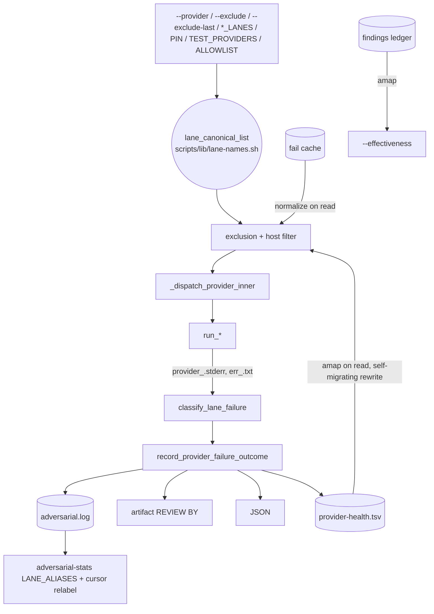

# Implementation Plan: adversarial lane rename + failure classification

**Spec:** inline — no spec
**spec_id:** none
**planning_mode:** inline
**source_of_truth:** inline brief (user decisions of 2026-10-04: naming scheme "vendor + number when >1 lane", scope "everywhere + aliases")
**plan_revision:** 5
**status:** Reviewed
**Created:** 2026-10-04
**Tasks:** 9
**Estimated complexity:** 5 complex / 4 standard. `scripts/adversarial-review.sh` (5158 L) is the
hotspot; five tasks edit it and are serialized (T1 → T3 → T4 → T5 → T7).
**Working notes:** `zuvo/context/plan-lanes/{brief,architect,techlead}.md` (Phase 1 reports, local).

## Design Constraints (measured, source: 2026-10-04 investigation + live probes)

- DC-1 [cursor refusal] stderr "You're out of usage. Switch to Auto" (`~/.zuvo/adversarial-failures/1790757215-2990`, 09-30) and "Cannot use this model: composer-2.5-fast" (`1790831940-88997`, 10-01); exit 1 after ~7 s.
- DC-2 [agy, ryzen-dev] "Authentication required…"; `agy models` → "Please sign in"; ~60 s wait per model.
- DC-3 [kimi, ryzen-dev canary 10-04] "Token … has no refresh_token; re-login required".
- DC-4 [muse canary 10-04] HTTP 429 "Subscription quota exhausted… resets at 2026-10-05T00:00:00Z".
- DC-5 [cursor model] runner :2853 `${ZUVO_CURSOR_MODEL:-composer-2.5-fast}`, logger :2405 `${ZUVO_CURSOR_MODEL:-${ZUVO_MODEL_CURSOR:-auto}}`; registry `auto`. **Verified 2026-10-04:** `cursor-agent models` lists `composer-2.5-fast`; cursor lane since 10-01: Mac 510 ok / 3 empty, ryzen 3801 ok / 11 timeout → keep composer-2.5-fast.
- DC-6 [agy fallback] `agy models` (Mac) no longer lists `Claude Opus 4.6 (Thinking)`; 1,915/1,915 of its ryzen calls in the last week failed.
- DC-7 [naming, user decision] codex-5.3→codex-1, codex-5.4→codex-2, cursor-agent→cursor, byteplus→byteplus-1, byteplus-alt→byteplus-2, openrouter→openrouter-1, openrouter-alt→openrouter-2; byteplus-3, openrouter-3/-4, claude, agy, kimi, kimi-api, muse, qwen, gemini unchanged.
- DC-8 [scope, user decision] everywhere + aliases: old names keep working on INPUT and normalize to new; every OUTPUT (log, artifact, JSON, REVIEW BY) emits new names. Historical specs/backlog/audit-results are NOT rewritten.
- DC-9 [call sites, brief DC-6] lane id strings appear ~46× in the driver and ~250× repo-wide; tests assert them literally (see Task 3 Files) — every literal site must be renamed or keep driving the old name as an alias on purpose.
- DC-10 [keys, brief DC-7] the lane NAME keys the run log, artifact, exclusion logic, fail cache, health ledger, quota markers, adversarial-stats billing map, the hub dashboard collector, and REVIEW BY lines.

## Architecture Summary

- Lane ids are defined, dispatched and persisted only in `scripts/adversarial-review.sh`; satellites
  consume them: `scripts/lib/blind-audit-panel.sh` (vendor map, `_BAP_ISOLATED`), `scripts/reviewer-preflight.sh`
  (`pf_map_lane` :533 regex `^codex-5(\.[0-9]+)*$`, client case :724), `scripts/blind-audit-codex.sh` (:184),
  `scripts/zuvo-home/adversarial-stats` (Python log reader, `billing_for` :70, lane at :163).
- Inputs (normalize right after arg parsing, before `HOST_PROVIDER` :1959): `--provider`/`ZUVO_REVIEW_PROVIDER`
  (:370/:808), `--exclude` (:374), `--exclude-last` (:384), `ZUVO_REVIEW_TEST_PROVIDERS` (:2014),
  `ZUVO_ADV_OPENROUTER_LANES` (:2130), `ZUVO_ADV_BYTEPLUS_LANES` (:2151), `ZUVO_REVIEW_PIN_PROVIDERS` (:2566),
  `ZUVO_BLIND_AUDIT_ALLOWLIST`.
- Persisted stores keyed by lane: fail cache (tmp, read :2322), `provider-health.tsv` (readers :2487/:4654,
  rewrite :4668), findings ledger (`--effectiveness` awk on `$4`, :757–805), `adversarial.log` (col 14).
  agy cooldown files are keyed by MODEL slug (unaffected). Quota markers are per-run tmp files.
- Failure outcome: `record_provider_failure_outcome` (:4446): 124→timeout, `norunner_`→no-runner,
  `quota_`→quota, else **empty**. `auth` exists only via `exclude_auth_stub` (:3890, exit-0 ≤600 B).
  All-fail path (:4772) logs only `none/all-failed`, so per-lane failures are invisible to stats.
- Unaffected: `hooks/lib/pipeline-gate-lib.sh` (counts REVIEW BY lines only), `scripts/lib/reviewer-lanes.sh`
  (different concept), binary names (`cursor-agent` in `command -v`, runner, provision-host.sh, spies).



## Technical Decisions

- **One alias table** in new `scripts/lib/lane-names.sh` (bash 3.2: newline-separated string, no `declare -A`):
  `lane_canonical`, `lane_canonical_list` (dedup, order kept, always exit 0), `lane_alias_pairs`,
  `lane_alias_awk_map`. Resolved like `blind-audit-panel.sh` but only from `lib/` dirs (`$AR_SCRIPT_DIR/lib/`, `~/.zuvo/lib/` — install.sh
  ships a flat copy only for blind-audit-panel.sh, so no flat candidate); accept only if `declare -F` finds every
  function. Sourced right after argument parsing, BEFORE the `--effectiveness`/`--record-disposition` early-exit
  blocks (:757ff), so every mode sees it. Missing lib → identity
  functions + ONE WARN (old names then fail loudly at the allowlist :2229, never silently `empty`).
  `install_runner_lib` already ships `scripts/lib/*` (install.sh :271).
- **Python copy** `LANE_ALIASES` in adversarial-stats, kept exact by a sync test (runpy precedent,
  `test-adversarial-stats.sh` :91/:133). Chosen over runtime parsing: the script is installed alone.
- **Stores:** fail cache normalized on read; `provider-health.tsv` mapped through `amap` in both readers,
  collapse keeps the larger epoch, rewrite emits new names only (self-migrates); findings ledger mapped on
  read, never rewritten; stats maps on read and relabels `cursor-agent`+`auto` → `composer-2.5-fast`
  (keyed on the OLD lane name, so only pre-fix rows change).
- **OpenRouter label:** `ZUVO_OR_LANE_LABEL=$provider` for all four slots; `run_openrouter` default
  `openrouter-1`; hard-coded `openrouter` at :3457 → `$_lane` (stderr evidence names the right slot).
- **Classification centrally:** `classify_lane_failure <lane>` greps `provider_<lane>.stderr` + `err_<lane>.txt`
  with `LC_ALL=C grep -qiE -e <const> --`, patterns scoped per lane (`case`), writes `$JSON_TMPDIR/{auth,quota}_<lane>`
  only if no marker exists. Outcome order: 124→timeout; norunner→no-runner; `cooldown_<lane>`→not-attempted;
  classify; auth (+ append lane to `PROVIDER_FAIL_CACHE`); quota; else empty.
- **Cooldowns:** generalize `_agy_cooldown_*` into `_lane_cooldown_* <lane> <key>` (`<lane>-cooldown-<slug>` in
  `${ZUVO_HOME:-$HOME/.zuvo}`), `_agy_*` stay as wrappers (agy file names byte-identical). Muse key `quota`,
  deadline parsed from `resets at <ISO>` (GNU `date -d`, then BSD `date -j -f`), clamped 60 s..7 d, fallback
  `ZUVO_MUSE_QUOTA_COOLDOWN` (3600). A cooldown skip is `not-attempted` (already skipped by the health ledger,
  stats and `bap_ledger_outcomes`).
- **All-fail runs log per-lane rows** (extract `log_lane_rows` from :5110–5124, call it at :4772, keep the
  `none/all-failed` row; skip when `FINAL_STATUS=suspended`).
- **agy fallback default `""`** (:3005, registry :196 `-` form, usage :582–585); empty already supported (:3008).
- **Cursor:** runner reads `provider_model cursor`; registry `ZUVO_MODEL_CURSOR=composer-2.5-fast`.
- **benchmark.sh :225** fallback `gpt-6-luna` (= registry) + equality test.
- **Test isolation in the driver:** harness mode without `ZUVO_ADVERSARIAL_LOG_FILE`/`ZUVO_HOME` → log, inputs and
  failure evidence (`adversarial-failures`, :4270/:4284) go to `${TMPDIR:-/tmp}`; row guard refuses `mock-*` rows only when
  BOTH `ZUVO_HOME` and `ZUVO_ADVERSARIAL_LOG_FILE` are unset and the target is `$HOME/.zuvo/adversarial.log` (tests that
  sandbox `HOME`+`ZUVO_HOME`, e.g. `test-adversarial-blind-audit.sh` M8/M10, keep their rows) (mirrors
  `findings_log_rows` :4853); `tests/adversarial/run.sh` exports a `mktemp -d` `ZUVO_HOME` (outside the repo).
- **Golden fixture** `codex-5.3.rec` stays byte-identical; the golden test maps lane `codex-1` to it and replays
  with both `--provider codex-1` and `--provider codex-5.3`. Never `ZUVO_GOLDEN_RECORD=1`.
- **Not edited:** `skills/plan/SKILL.md:196`, `skills/brainstorm/SKILL.md:241` (`codex-5.4` = model generation);
  env var names (`ZUVO_MODEL_OPENROUTER_ALT`, `ZUVO_MODEL_BYTEPLUS_ALT`, …).

## Quality Strategy

- Hook tests run **locally** (`TF_ALLOW_LOCAL=1`; runbook §5: false reds on the farm); pure-analysis tests may
  use `rt --light`. New/changed hook tests run under both `bash` and `/bin/bash` (3.2).
- `tests/adversarial/` runs only in full scope of run-all → every task touching it names `tests/adversarial/run.sh`
  explicitly; the final gate runs it.
- Fake CLIs follow `test-agy-quota-fallback.sh` / `test-lane-error-text.sh` (per-test bin dir, `env -u …`,
  `ZUVO_HOME=$c HOME=$c`). Never put fakes named `agy`/`cursor-agent`/`kimi`/`muse` in `mocks/`.
- Classification tests use a sandboxed `TMPDIR` + unique `ZUVO_RUN_ID` (the real fail cache in
  `$TMPDIR/zuvo-adv-$uid/` would otherwise exclude real lanes in this repo).
- Match "out of usage", never the apostrophe (U+2019 vs '). `LC_ALL=C grep -qiE`.
- Silent-skip trap: `test-adversarial-exclude-set.sh` :78 `has "$BASE" "cursor-agent" || pass skipped` → must
  become `cursor`; sweep for the same gating.
- Driver copies without the lib (golden §5 :529/573/589/610, OC.10 :33) → switch to new names; WARN text must not
  mention `model-subprocess.sh` (golden §5 counts that line).
- Never stage `tests/adversarial/.tmp/*` (tracked, dirty before this work).
- A proof that runs `tests/adversarial/run.sh <filter>` must also show the filter ran ≥1 test (check the `SUMMARY: N run` line has N ≥ 1); a filter that matches nothing must not read as green.
- No live driver runs between task commits: real reviews use the INSTALLED copy (`~/.zuvo/adversarial-review`), which changes only at Rollout step 1 after the final gate. So Task 3 emitting new names before Task 5 merges stored old names is a within-branch ordering, never seen by a real run.
- CQ focus: CQ8 (loud degradation, `$(…)` exit 0), CQ12 (named constants for patterns and 60/604800/3600), CQ14
  (one amap builder, one cooldown impl, one classifier), CQ11 (keep driver additions small), CQ31
  (`grep -e "$pat" --`, `-F` for the fail cache, `awk -v`), CQ6 (stream with `grep -q`, cap quoted text with `head -c`).

## Coverage Matrix

| Row ID | Authority item | Type | Primary task(s) | Notes |
|---|---|---|---|---|
| G1 | Lanes renamed per DC-7 in every output (log col 14, artifact, JSON, REVIEW BY, `--list-providers`) | requirement | Task 3 | blind-audit satellites included |
| G2 | Old names accepted on every input and normalized (DC-8) | requirement | Task 3 | Task 2 provides the table |
| G3 | Persisted old-name data merges with new (health ledger, fail cache, findings ledger, stats) | requirement | Task 5, Task 6 | |
| G4 | Cursor model single source; registry `composer-2.5-fast`; history relabelled in stats (DC-5) | requirement | Task 6, Task 7 | |
| G5 | Refusals classified: cursor/muse → quota, agy/kimi → auth, cooldown skip → not-attempted; muse cooldown until stated reset (DC-1..4) | requirement | Task 4 | |
| G6 | agy fallback "Claude Opus 4.6 (Thinking)" removed; default none (DC-6) | requirement | Task 7 | |
| G7 | `benchmark.sh` no longer defaults to retired gpt-5.4 | requirement | Task 7 | |
| G8 | Tests no longer write mock-* rows to the real `~/.zuvo/adversarial.log` | requirement | Task 1 | |
| G9 | Docs/includes describe the new names | deliverable | Task 8 | |
| C1 | Historical specs/backlog/audit-results not rewritten | constraint | Task 8 | doc-scan excludes them |
| C2 | bash 3.2 compatible, `set -e` safe | constraint | Task 2, Task 3 | |
| C3 | Golden fixture `codex-5.3.rec` byte-identical | constraint | Task 3 | |
| C4 | Binary name `cursor-agent` and env var names unchanged | constraint | Task 3 | |
| C5 | All-fail runs visible per lane in stats | requirement | Task 4 | Tech Lead recommendation |
| S1 | Whole-feature smoke | deliverable | Task 9 | |

## Review Trail

- Phase 1: full fan-out (Architect → Tech Lead → QA, Opus, sequential).
- [DEVIATION] `scripts/benchmark.sh`, `skills/benchmark`, `benchmark-output-schema.md` keep their own provider ids (`cursor-agent`, `codex-fast`, …): that namespace names CLIs for the benchmark skill, it is not the adversarial lane set the user renamed. Only the retired gpt-5.4 default changes there (Task 7). Surfaced to the user with the plan.
- [DEVIATION] brief lists `skills/plan` and `skills/brainstorm` among lane-naming files; their `codex-5.4` means a model generation, not a lane → deliberately not edited (Task 8 doc scan excludes those two lines).
- Plan reviewer: revision 1 -> ISSUES FOUND (13: unlisted broken tests in T3, T1 guard vs blind-audit sandbox, T6 stats already counts auth/quota [already-implemented part dropped], lib load point before --effectiveness, :853→:4853, CAP.1m vs T7 model, T3 proof polarity, T9 deps, smoke artifact, failures dir, review/SKILL.md, flat lib candidate, DC carry-over) -> all applied in revision 2
- Plan reviewer: revision 2 -> ISSUES FOUND (2: driver rename and blind-audit satellites must land together — `_BAP_ISOLATED`/`pf_map_lane`/bats refuse the new names in between; classification task Verify must be the full adversarial suite) -> applied in revision 3: old Task 5 merged into Task 3, Tasks 6–10 renumbered 5–9, refusal-classification Verify widened
- Plan reviewer: revision 3 -> APPROVED
- Cross-model validation (rev 3): 5/5 providers ok (cursor-agent, agy, openrouter-4, byteplus-3, claude), 0 timeouts. 3 CRITICAL + ~20 WARNING. Fixed in revision 4: awk on a missing log (CRIT, agy); classification risk scheduled late (CRIT agy+byteplus, WARN cursor+claude) → moved to Task 4 with a GNU/BSD date spike; C5 proof now runs adversarial-stats; Task 3 G1 proof covers log/artifact/JSON; Task 2 no longer claims G2; smoke RED made honest (run against the pre-rename tree); provider-health backup before the migrating rewrite; hub-collector rollout step; artifact-provenance role stated. Dispositioned without change: split Task 3 (rejected — atomic commit required, else blind audit degraded between commits; internal checkpoints added instead); split Task 6/Task 8 for file count (rejected — Task 6's benchmark change is one line, Task 8 is docs-only); generic 'verify only checks exit 0' (rejected — every Verify runs suites that assert concrete values); refusal-text drift monitoring (INFO, noted: a changed wording falls back to `empty`, visible in stats).
- Plan reviewer: revision 4 -> APPROVED (one low note: rollout vs out-of-scope wording on the hub collector — aligned)
- Cross-model validation (rev 4, pass 2, `--exclude-last cursor-agent`): 5/5 ok (agy, byteplus-3, claude, kimi, qwen), 0 timeouts; 3 CRITICAL + 16 WARNING + 2 INFO. Applied in revision 5 (notes/proof edits, no task added/removed/reordered → no further pass): cooldown files follow harness routing (kimi); rollback procedure in Rollout (kimi); Task 6 proof asserts concrete stats output (kimi); not-attempted not counted as failure in the C5 case (qwen); GNU `date` branch exercised on the Linux farm via `rt` (qwen); filter proofs must show ≥1 test ran (qwen); Task 9 RED procedure made exact (claude); benchmark namespace recorded as [DEVIATION] (claude). Dispositioned without change: CRIT 'Task 4 C5 proof needs Task 6 stats' — FP, stats groups lanes verbatim and FAILURES already lists auth/quota (plan-reviewer verified :171/:197); CRIT/WARN 'stores migrate after rename' (agy, claude, qwen) — no live run sees the window (installed driver changes only at Rollout), stated in Quality Strategy; CRIT 'extract date spike to its own task' (byteplus) — the spike is the first step of Task 4 and a failure only degrades the muse cooldown to its 3600 s default; task-size splits for Tasks 3/7/8 — rejected as before; 'installed lib resolution unproven' — install-wiring 14a (:1011–1031) proves `scripts/lib/*` reaches hosts and Task 3 runs it; DC-9 literal sweep guard — covered by the Task 3 CodeSift sweep step plus the full suites; doc-scan lane-vs-binary (INFO) — Task 8 lists the allowed binary occurrences explicitly.
- Status gate: Reviewed (reviewer APPROVED + 2 cross-model passes recorded) — awaiting user approval
- Cross-model validation: pending

## Task Breakdown

### Task 1: Tests stop writing to the real adversarial log
**Files:** `scripts/adversarial-review.sh`, `tests/adversarial/run.sh`, NEW `tests/hooks/test-adversarial-log-isolation.sh`
**Surface:** backend-logic
**Complexity:** standard
**Dependencies:** none
**Failure:** halt
**Execution routing:** default implementation tier

- [ ] RED: `tests/hooks/test-adversarial-log-isolation.sh` (title tags `G8`): (a) `env -i HOME=$T PATH=$MOCKS:$SHIM ZUVO_ADVERSARIAL_TEST_HARNESS=1 ZUVO_REVIEW_TEST_PROVIDERS=mock-success bash scripts/adversarial-review.sh --multi --json --files $EMPTY` leaves `$T/.zuvo/adversarial.log` with zero `mock-` rows in column 14, and `$T/.zuvo/adversarial-inputs/` and `$T/.zuvo/adversarial-failures/` absent or empty (today: 1 row); (b) same run WITHOUT the harness flag (`--provider mock-success`, ZUVO_HOME/ZUVO_ADVERSARIAL_LOG_FILE unset) → no mock row in `$T/.zuvo/adversarial.log` (row guard); (c) anchors: `ZUVO_ADVERSARIAL_LOG_FILE=$T/x.log` still receives the row, and `HOME=$T ZUVO_HOME=$T/.zuvo` (the blind-audit `drive()` shape) still receives the row.
- [ ] GREEN: in the `LOG_FILE`/`LOG_DIR` resolution (:4161–4164) and the failure-evidence root (:4270/:4284) route harness runs without `ZUVO_ADVERSARIAL_LOG_FILE`/`ZUVO_HOME` to `${TMPDIR:-/tmp}` (mirror the health-ledger precedent :2438); in `adversarial_log_row` refuse `mock-*` rows only when both overrides are unset and the target is `$HOME/.zuvo/adversarial.log` (mirror `findings_log_rows` :4853); `tests/adversarial/run.sh` exports `ZUVO_HOME="$(mktemp -d)"` with a cleanup trap.
- [ ] Verify: `TF_ALLOW_LOCAL=1 bash tests/hooks/test-adversarial-log-isolation.sh && TF_ALLOW_LOCAL=1 /bin/bash tests/hooks/test-adversarial-log-isolation.sh && TF_ALLOW_LOCAL=1 bash tests/hooks/test-adversarial-blind-audit.sh && bash tests/adversarial/run.sh`
  Expected: all exit 0; adversarial suite `0 failed`.
- [ ] Acceptance Proof:
  - G8:
    - Surface: backend-logic
    - Proof: `mk(){ [ -f ~/.zuvo/adversarial.log ] && awk -F'\t' '$14 ~ /^mock-/' ~/.zuvo/adversarial.log | wc -l || echo 0; }; before=$(mk); bash tests/adversarial/run.sh >/dev/null; after=$(mk); test "$before" -eq "$after"`
    - Expected: exit 0 (no new mock rows in the real log after a full adversarial suite run)
    - Artifact: `zuvo/proofs/task-1-report.md`
- [ ] Commit: `fix(adversarial): test runs no longer write mock lanes into the real adversarial log`

### Task 2: Lane alias library
**Files:** NEW `scripts/lib/lane-names.sh`, NEW `tests/hooks/test-lane-names.sh`
**Surface:** backend-logic
**Complexity:** standard
**Dependencies:** none
**Failure:** halt
**Execution routing:** default implementation tier

- [ ] RED: `tests/hooks/test-lane-names.sh` (fails: lib missing). Assert: every DC-7 pair maps; `lane_canonical` idempotent; `mock-x`, `byteplus-3`, `openrouter-4`, `kimi-api`, `unknown` pass through; `lane_canonical_list "codex-5.3 codex-1 cursor-agent"` → `codex-1 cursor`; empty list exits 0 under `set -euo pipefail`; no new name appears in the old column; `lane_alias_awk_map` contains no backslash; `lane_alias_pairs` is TAB-separated.
- [ ] GREEN: `_LANE_ALIAS_PAIRS` string + the four functions (pure bash, no forks in `lane_canonical`, ≤100 L, bash 3.2).
- [ ] Verify: `/bin/bash tests/hooks/test-lane-names.sh && bash tests/hooks/test-lane-names.sh`
  Expected: exit 0 under both shells.
- [ ] Acceptance Proof:
  - C2 (alias table; G2 is proven in Task 3):
    - Surface: backend-logic
    - Proof: `/bin/bash -c 'set -euo pipefail; . scripts/lib/lane-names.sh; test "$(lane_canonical_list codex-5.3 codex-1 cursor-agent openrouter-alt)" = "codex-1 cursor openrouter-2"; test "$(lane_canonical_list)" = ""'`
    - Expected: exit 0
    - Artifact: `zuvo/proofs/task-2-report.md`
- [ ] Commit: `feat(adversarial): one alias table maps the old lane names onto the new ones`

### Task 3: Driver emits new lane names and accepts old ones
**Files:** `scripts/adversarial-review.sh`, NEW `tests/adversarial/test-lane-aliases.sh`; rename call sites in `tests/adversarial/test-backward-compat.sh`, `tests/adversarial/test-provider-outcome-refactor-regression.sh`, `tests/adversarial/test-openrouter-response.sh` (:28–56), `tests/adversarial/test-openrouter-response-refactor-regression.sh`, `tests/adversarial/test-lane-error-text.sh` (LET.3), `tests/adversarial/test-byteplus-billing-guard.sh` (bp.5 :77–80), `tests/adversarial/test-qwen-lane.sh` (qw.8f :223), `tests/hooks/test-adversarial-exclude-set.sh`, `tests/hooks/test-adversarial-lane-golden.sh`, `tests/hooks/test-adversarial-claude-lane-bench.sh` (:241/:243), `tests/hooks/test-install-wiring.sh` (:441); blind-audit satellites `scripts/lib/blind-audit-panel.sh` (:566–585), `scripts/reviewer-preflight.sh` (:533, :724), `scripts/blind-audit-codex.sh` (:184) with call sites in `tests/hooks/test-reviewer-preflight-isolation.sh`, `tests/hooks/test-blind-audit-panel.sh`, `tests/hooks/test-adversarial-blind-audit.sh`, `tests/hooks/smoke-blind-audit.sh`, `scripts/tests/blind-audit-codex.bats`, `scripts/tests/adversarial-review.bats`
**Surface:** integration
**Complexity:** complex
**Dependencies:** Task 1, Task 2
**Failure:** halt
**Execution routing:** deep implementation tier
**Size note:** four production files (driver + three blind-audit satellites) — over the 5-file rule only through tests; they must land in ONE commit because the driver's new names are refused by `_BAP_ISOLATED`/`pf_map_lane` until the satellites change (plan-review rev 2, issue 1), so splitting them leaves blind audit degraded and the suite red between commits. The test files are the rename's literal call sites (DC-9) and cannot be split from it without leaving the suite red between commits. Before editing, sweep `tests/` and `scripts/tests/` with CodeSift `search_text` for every old lane id and confirm each hit is either renamed or a deliberate alias case. Internal checkpoints (not commits): (a) lib sourcing + input normalization + `test-lane-aliases.sh` green; (b) driver id renames + driver-side tests green; (c) satellites + blind-audit suites + bats green; then the single commit.

- [ ] RED: `test-lane-aliases.sh` with fake `cursor-agent`/`codex` binaries in a per-test bin dir: `--provider cursor-agent --json` → `.providers_used == "cursor"`, log col 14 `cursor`, artifact `REVIEW BY: CURSOR`; `--exclude cursor-agent`, `--exclude-last codex-5.3`, `ZUVO_ADV_OPENROUTER_LANES=openrouter-alt`, `ZUVO_REVIEW_PIN_PROVIDERS=cursor-agent`, `ZUVO_BLIND_AUDIT_ALLOWLIST=codex-5.3` each act on the new name (`--dry-run` `Providers:` line); `--list-providers` prints only new names. Blind-audit cases: preflight stub driver printing `codex-1\ncursor\n` → codex and cursor-agent spies run (today `codex-1` is canaried as a binary and dropped); `bap_vendor_excluded` on a Cursor host excludes lane `cursor`; `bap_allowlist` admits `codex-1`; `blind-audit-codex.sh` reports `providers=codex-1`. Update BC.6 (:96) expected auto-list, exclude-set case 4 + :78 gating (`cursor`), OC.10 (:36), golden §1/§1b/§5 (map `codex-1` → `codex-5.3.rec`, replay with both names; lib-less driver copies use new names and an old name is rejected loudly).
- [ ] GREEN: source `lane-names.sh` right after argument parsing and before the `--effectiveness`/`--record-disposition` early exits (:757ff) (candidates `$AR_SCRIPT_DIR/lib/`, `~/.zuvo/lib/` + `declare -F` check + identity fallback with one WARN that does not mention `model-subprocess.sh`); normalize every input listed in the Architecture Summary before :1959; rename ids in `detect_host_platform` (:1892–1953), `_ba_host` (:1965–1966, add `cursor`), `detect_providers` (:2046/2061/2174), defaults (:2130, :2151, :2566), allowlist + "Valid:" (:2229/2238), `provider_model` (:2377–2409), `run_codex_53/54` labels (:2792–2800), `_dispatch_provider_inner` (:3837–3870, `ZUVO_OR_LANE_LABEL=$provider` for openrouter-1..4), `run_openrouter` default label + :3457, help text, `err_cursor.txt`. Keep binary `cursor-agent` (:2046 `command -v`, :2861). Satellites: `pf_map_lane` regex `^codex-[0-9]+(\.[0-9]+)*$` (:533); client case `cursor|cursor-agent)` (:724); `bap_vendor_excluded` + `_BAP_ISOLATED` (:566–585) new ids; `blind-audit-codex.sh` :184 `codex-1`; rename ids in the listed tests, keeping ≥1 case that drives an old name.
- [ ] Verify: `bash tests/adversarial/run.sh && TF_ALLOW_LOCAL=1 bash tests/hooks/test-adversarial-exclude-set.sh && TF_ALLOW_LOCAL=1 bash tests/hooks/test-adversarial-lane-golden.sh && TF_ALLOW_LOCAL=1 /bin/bash tests/hooks/test-adversarial-lane-golden.sh && TF_ALLOW_LOCAL=1 bash tests/hooks/test-adversarial-claude-lane-bench.sh && TF_ALLOW_LOCAL=1 bash tests/hooks/test-install-wiring.sh && TF_ALLOW_LOCAL=1 bash tests/hooks/test-reviewer-preflight-isolation.sh && TF_ALLOW_LOCAL=1 bash tests/hooks/test-blind-audit-panel.sh && TF_ALLOW_LOCAL=1 bash tests/hooks/test-adversarial-blind-audit.sh && npx --yes bats@1.11.0 scripts/tests/blind-audit-codex.bats scripts/tests/adversarial-review.bats && git diff --exit-code "$(git merge-base HEAD origin/main)" -- tests/hooks/fixtures/adversarial-lane-golden/codex-5.3.rec`
  Expected: all exit 0; golden fixture unchanged.
- [ ] Acceptance Proof:
  - G1, G2, C3, C4:
    - Surface: integration
    - Proof: `bash tests/adversarial/run.sh test-lane-aliases && test "$(ZUVO_ADVERSARIAL_TEST_HARNESS=1 ZUVO_REVIEW_TEST_PROVIDERS='codex-5.3 cursor-agent openrouter-alt' bash scripts/adversarial-review.sh --list-providers 2>/dev/null)" = "$(printf 'codex-1\ncursor\nopenrouter-2')"`
      `&& bash tests/adversarial/run.sh test-lane-aliases` must include the case `G1-outputs`: one harness run with a fake `cursor-agent` and `--provider cursor-agent` asserting together log col 14 `cursor`, artifact `REVIEW BY: CURSOR`, JSON `.providers_used == "cursor"`
    - Expected: exit 0 (old names in → exactly the new names out on every output; an empty or failing listing fails the comparison)
    - Artifact: `zuvo/proofs/task-3-report.md`
- [ ] Commit: `feat(adversarial): lanes are named vendor-N; the old names stay accepted as aliases, blind audit included`

### Task 4: Refusals are classified as quota/auth; cooldown skips are not-attempted; all-fail runs log per lane
**Files:** `scripts/adversarial-review.sh`, NEW `tests/adversarial/test-lane-failure-classification.sh`, `tests/adversarial/test-provider-outcome-classification.sh`
**Surface:** backend-logic
**Complexity:** complex
**Dependencies:** Task 3
**Failure:** halt
**Execution routing:** deep implementation tier

- [ ] RED: table-driven (LET style), sandboxed `TMPDIR` + unique `ZUVO_RUN_ID`, fakes in a per-test bin dir. Exact outcomes: cursor DC-1 strings, exit 1 → `quota`; agy `Authentication required` and `PLEASE SIGN IN` → `auth`; kimi DC-3 (MOONSHOT unset) → `auth`; muse DC-4 → `quota` both on stderr+exit 1 and as an exit-0 body. Negatives: `error: boom` → `empty`; muse bare `429` → `empty`; a >1000-char review quoting "out of usage" → `ok`. Plus: `auth` lane lands in the sandboxed fail cache, `quota` does not; seeded `agy-cooldown-*` → `not-attempted`, empty call log; muse cooldown deadline = stated reset ±60 s and a second run makes no muse call; past reset → 60 s, 30 days → 7 d, malformed → 3600 s; an all-fail run writes one row per lane plus `none/all-failed`. OC.5 in `test-provider-outcome-classification.sh`: `mock-fail` stays `empty`.
- [ ] SPIKE (first step, before GREEN): prove the reset parser on both date implementations — run the parse helper on `2026-10-05T00:00:00Z`, a past ISO and a malformed string on the Mac (BSD `date`) and on ryzen-dev (`ssh ryzen-dev`, GNU `date`); record outputs in the task report. The DC-1..4 strings are verbatim captures from real CLI output (`~/.zuvo/adversarial-failures/`, 10-04 canaries), so the patterns are not invented.
- [ ] GREEN: `_lane_cooldown_*` resolve their directory through the same harness routing as Task 1 (harness without `ZUVO_HOME` → `${TMPDIR:-/tmp}`); add one assertion to `test-adversarial-log-isolation.sh` that a fake-muse quota run leaves no `*-cooldown-*` file in the sandboxed home. `classify_lane_failure` (constants for patterns and limits), extended `record_provider_failure_outcome` order, `_lane_cooldown_*` with `_agy_*` wrappers, `run_agy` writes `cooldown_agy` when `attempted=0 && cooled=1`, `run_muse` cooldown check + reset parse, `log_lane_rows` extracted and called on the all-fail path (skip on `suspended`).
- [ ] Verify: `bash tests/adversarial/run.sh && TF_ALLOW_LOCAL=1 bash tests/hooks/test-adversarial-log-isolation.sh && rt --light bash tests/adversarial/run.sh test-lane-failure-classification`
  Expected: `0 failed`, exit 0 — the `rt` run exercises the GNU `date` branch on the Linux farm (farm noise = retry, never fall back to the Mac) (full suite: the all-fail per-lane rows touch every failing run's log — test-hard-timeout-and-suspend, test-observability-log, test-d4-exclude-last; the LET table unchanged).
- [ ] Acceptance Proof:
  - G5, C5:
    - Surface: backend-logic
    - Proof: `bash tests/adversarial/run.sh test-lane-failure-classification` — includes case `C5-stats`: an all-fail run (fake cursor quota + fake agy auth) in a sandbox, then `python3 scripts/zuvo-home/adversarial-stats --log <sandbox log> --days 1 --markdown` shows a `cursor` row with `quota 1` and an `agy` row with `auth 1`, and a cooldown-skipped lane (`not-attempted`) is not counted as a failure
    - Expected: exit 0; every DC-1..4 probe yields its exact outcome and all-fail lanes are visible in stats
    - Artifact: `zuvo/proofs/task-4-report.md`
- [ ] Commit: `feat(adversarial): usage and login refusals are recorded as quota/auth, not empty; muse waits for its stated reset`

### Task 5: Stored lane data merges old and new names
**Files:** `scripts/adversarial-review.sh`, `tests/adversarial/test-provider-fanout-cap.sh` (CAP.1m + fail-cache case), `tests/adversarial/test-findings-ledger.sh` (`test-artifact-provenance.sh` runs unchanged as a regression check)
**Surface:** backend-logic
**Complexity:** complex
**Dependencies:** Task 2, Task 3, Task 4
**Failure:** halt
**Execution routing:** deep implementation tier

- [ ] RED: CAP.1m — pin `ZUVO_CURSOR_MODEL=cap-m` (survives Task 7's registry change), seed `provider-health.tsv` with `cursor-agent\tcap-m\t9\t<now>`; harness `"cursor-agent mock-success"` prints `Benched…cursor`; afterwards the ledger has no `^cursor-agent\t` row and exactly one `^cursor\t` row carrying the larger epoch. Findings ledger: a col-4 `codex-5.3` row plus a `codex-1` row give ONE `--effectiveness` group `codex-1`, driven through the real driver (`adversarial-review.sh --effectiveness`), proving the lib is loaded before that early exit. Fail cache: seeded `failed-providers.$RUN_ID` containing `cursor-agent` excludes `cursor`.
- [ ] GREEN: one `amap` builder (`lane_alias_awk_map`) passed via `awk -v amap=` to the health readers (:2487, :4654) and `--effectiveness` (:757–805); collapse keeps larger `f[4]`; rewrite (:4668) emits new names; fail cache normalized with `lane_canonical_list` before `grep -vFx -f` (:2322), keep `|| true` guards. Before the first rewrite that changes any row's lane name, copy the ledger once to `provider-health.tsv.pre-lane-rename` (only if that backup does not exist) so a rollback to the old driver can restore it; RED asserts the backup appears exactly once.
- [ ] Verify: `bash tests/adversarial/run.sh test-provider-fanout-cap test-findings-ledger test-artifact-provenance`
  Expected: `0 failed`, exit 0.
- [ ] Acceptance Proof:
  - G3:
    - Surface: backend-logic
    - Proof: `bash tests/adversarial/run.sh test-provider-fanout-cap test-findings-ledger`
    - Expected: exit 0, CAP.1m and the ledger merge case PASS
    - Artifact: `zuvo/proofs/task-5-report.md`
- [ ] Commit: `fix(adversarial): health, fail-cache and findings history recorded under old lane names keep counting`

### Task 6: adversarial-stats merges old and new lane history
**Files:** `scripts/zuvo-home/adversarial-stats`, `tests/hooks/test-adversarial-stats.sh`
**Surface:** backend-logic
**Complexity:** standard
**Dependencies:** Task 2
**Failure:** halt
**Execution routing:** default implementation tier

- [ ] RED: sync check `g["LANE_ALIASES"] == dict(pairs from lane_alias_pairs)` (exact); fixture log with `cursor-agent/auto ok`, `cursor/composer-2.5-fast ok`, `codex-5.3 …`, `codex-1 …` → one `cursor composer-2.5-fast n=2` row and one `codex-1` row; a `cursor-agent/<other model>` row is NOT relabelled; `auth N` / `quota N` appear separately from `empty N` in the existing FAILURES column (already implemented at :171/:197 — assert only, no new column; the hub collector parses this output).
- [ ] GREEN: `LANE_ALIASES` dict, canonicalize lane at :163 before grouping and `billing_for` (:70); relabel model `auto` → `composer-2.5-fast` only for OLD lane `cursor-agent`.
- [ ] Verify: `rt --light bash tests/hooks/test-adversarial-stats.sh`
  Expected: exit 0.
- [ ] Acceptance Proof:
  - G3, G4:
    - Surface: backend-logic
    - Proof: `rt --light bash tests/hooks/test-adversarial-stats.sh && python3 scripts/zuvo-home/adversarial-stats --log tests/hooks/fixtures/adversarial-stats/lane-rename.log --days 36500 --markdown | grep -q 'cursor .*composer-2.5-fast' && ! python3 scripts/zuvo-home/adversarial-stats --log tests/hooks/fixtures/adversarial-stats/lane-rename.log --days 36500 --markdown | grep -q 'cursor-agent'` (fixture log committed with the test; adjust flags to the script's real CLI)
    - Expected: exit 0 — one merged `cursor` row on `composer-2.5-fast`, no `cursor-agent` row
    - Artifact: `zuvo/proofs/task-6-report.md`
- [ ] Commit: `feat(adversarial-stats): history under old lane names merges into the new names; cursor rows show the model that ran`

### Task 7: Cursor model single source, agy fallback removed, benchmark default fixed
**Files:** `scripts/adversarial-review.sh`, `shared/includes/model-registry.sh`, `scripts/benchmark.sh`, `tests/adversarial/test-agy-quota-fallback.sh`, `tests/adversarial/test-codex-lane-defaults.sh` (+ cursor runtime case in `tests/adversarial/test-lane-aliases.sh`)
**Surface:** config
**Complexity:** standard
**Dependencies:** Task 3, Task 4, Task 5
**Failure:** halt
**Execution routing:** default implementation tier

- [ ] RED: cursor runtime case — `ZUVO_MODEL_CURSOR=probe-m`, `ZUVO_CURSOR_MODEL` unset → fake `cursor-agent` receives `--model probe-m` and log col 4 is `probe-m`; agy.8 — both fallback vars unset → call log holds only the primary model (make agy.4–6 set the fallback explicitly; `run_adv`'s `${FB-…}` currently masks the default); cx.8 — `benchmark.sh`'s `ZUVO_MODEL_CODEX_ALT:-X` fallback equals the registry value (golden §1b `reg_val` idiom).
- [ ] GREEN: `run_cursor_agent` uses `provider_model cursor`; registry `ZUVO_MODEL_CURSOR=composer-2.5-fast` with corrected comment and lane-name comments updated; agy fallback default `""` at :3005, registry :196, usage :582–585; `benchmark.sh` :225 `gpt-6-luna`.
- [ ] Verify: `bash tests/adversarial/run.sh test-codex-lane-defaults test-agy-quota-fallback test-lane-aliases test-provider-fanout-cap test-lane-failure-classification`
  Expected: `0 failed`, exit 0.
- [ ] Acceptance Proof:
  - G4, G6, G7:
    - Surface: config
    - Proof: `bash tests/adversarial/run.sh test-codex-lane-defaults test-agy-quota-fallback test-lane-aliases && test "$(git grep -nE 'FALLBACK(_MODEL)?-Claude Opus 4\.6|FALLBACK(_MODEL)?:-Claude Opus 4\.6|AGY_FALLBACK=.*Opus 4\.6' -- scripts/adversarial-review.sh shared/includes/model-registry.sh | wc -l)" -eq 0 && ! grep -q 'CODEX_ALT:-gpt-5\.4' scripts/benchmark.sh`
      (behaviour is the primary proof: agy.8 asserts the call log holds only the primary model with no fallback set; the grep is secondary. Historical comments that mention Opus 4.6 / gpt-5.4 as past facts stay)
    - Expected: exit 0
    - Artifact: `zuvo/proofs/task-7-report.md`
- [ ] Commit: `fix(adversarial): cursor runs and logs the same model; the retired agy fallback and gpt-5.4 default are gone`

### Task 8: Docs and includes use the new lane names
**Files:** `shared/includes/cross-provider-review.md`, `shared/includes/env-compat.md`, `shared/includes/test-reviewer-routing.md`, `docs/adversarial-providers.md`, `skills/agent-benchmark/SKILL.md`, `skills/refactor/references/review.md`, `skills/review/SKILL.md` (:720/:736), `scripts/install.sh` (comments :2519–2546), `tests/hooks/test-lane-names.sh` (doc scan)
**Surface:** docs
**Complexity:** standard
**Dependencies:** Task 2, Task 3, Task 4, Task 7
**Failure:** halt
**Execution routing:** default implementation tier

- [ ] RED: doc-scan case in `test-lane-names.sh`: the live docs above contain no `openrouter-alt`, `byteplus-alt`, `cursor-agent` (as a lane — the binary name in command examples is allowed and listed explicitly) or `codex-5\.[34]` lane tokens, excluding alias-table lines, `skills/plan/SKILL.md:196`, `skills/brainstorm/SKILL.md:241`, `docs/specs/`, `memory/backlog.md`, `audit-results/`.
- [ ] GREEN: update the listed files (names, aliases, cursor model, no agy fallback, quota/auth/not-attempted outcomes); `docs/adversarial-providers.md` gets a rename table (old → new) and states old names are accepted. NOT edited: `scripts/benchmark.sh`, `skills/benchmark`, `benchmark-output-schema.md` — a separate provider namespace where `cursor-agent` names the CLI.
- [ ] Verify: `bash scripts/validate-skills.sh && /bin/bash tests/hooks/test-lane-names.sh`
  Expected: `ERRORS: 0`; exit 0.
- [ ] Acceptance Proof:
  - G9, C1:
    - Surface: docs
    - Proof: `/bin/bash tests/hooks/test-lane-names.sh && git diff --exit-code "$(git merge-base HEAD origin/main)" -- docs/specs memory/backlog.md audit-results`
    - Expected: exit 0 (doc scan clean; history files untouched)
    - Artifact: `zuvo/proofs/task-8-report.md`
- [ ] Commit: `docs(adversarial): lane names, aliases and refusal outcomes documented`

### Task 9: Whole-feature smoke runner
**Files:** NEW `tests/hooks/smoke-lane-rename.sh`
**Surface:** integration
**Complexity:** standard
**Dependencies:** Task 3, Task 4, Task 6
**Failure:** halt
**Execution routing:** default implementation tier

- [ ] RED: post-hoc acceptance script — its red-first coverage lives in the RED suites of Tasks 3/6/4 (aliases, stats merge, classification). To prove it can fail: create the base tree (`git worktree add /tmp/lane-base $(git merge-base HEAD origin/main)`), run THIS branch's `tests/hooks/smoke-lane-rename.sh` with `ADV=/tmp/lane-base/scripts/adversarial-review.sh` (the script takes the driver path from `ADV`), record the first failing step in the report, then `git worktree remove /tmp/lane-base`.
- [ ] GREEN: script only (no production change); `smoke-*` name keeps it out of the run-all glob; it writes its step-by-step evidence to `zuvo/proofs/smoke-lane-rename.md`.
- [ ] Verify: `TF_ALLOW_LOCAL=1 bash tests/hooks/smoke-lane-rename.sh`
  Expected: exit 0, prints `SMOKE1 PASS`.
- [ ] Acceptance Proof:
  - S1: see SMOKE1
    - Surface: integration
    - Proof: `TF_ALLOW_LOCAL=1 bash tests/hooks/smoke-lane-rename.sh`
    - Expected: exit 0
    - Artifact: `zuvo/proofs/task-9-report.md` + `zuvo/proofs/smoke-lane-rename.md` (written by the script)
- [ ] Commit: `test(adversarial): end-to-end smoke for lane aliases, refusal outcomes and merged stats`

## Whole-feature Smoke Proofs

- **SMOKE1 — old name in, new name out, refusal classified, history merged**
  - Preconditions: temp sandbox `S` with `bin/` fakes: `cursor-agent` → stderr "You're out of usage. Switch to Auto", exit 1; `muse` → stderr "HTTP 429 Subscription quota exhausted… resets at <now+2h ISO>", exit 1; `HOME`, `ZUVO_HOME`, `TMPDIR` inside `S`; `ZUVO_ADVERSARIAL_TEST_HARNESS=1`, unique `ZUVO_RUN_ID`, `ZUVO_PROVIDER_BENCH=0`, `ZUVO_REVIEW_MAX_PROVIDERS=99`, empty `ZUVO_REVIEW_PIN_PROVIDERS`; seeded old-name history rows (`cursor-agent/auto ok`, `codex-5.3 ok`) in `$ZUVO_HOME/adversarial.log`.
  - Proof: (1) `ZUVO_REVIEW_TEST_PROVIDERS="cursor-agent muse mock-success" adversarial-review.sh --multi --json --files $EMPTY` → `.provider_outcomes == "cursor:quota,muse:quota,mock-success:ok"`; (2) no new log row has col 14 `cursor-agent`; (3) `muse-cooldown-*` exists; (4) a second run with `--exclude-last cursor-agent` and lanes `cursor mock-success` → `.providers_used` lacks `cursor`; (5) `adversarial-stats --log <log> --days 1 --markdown` shows a `cursor` row, no `cursor-agent`, and a `quota` count.
  - Expected: every step exits 0.
  - Artifact: `zuvo/proofs/smoke-lane-rename.md`
  - RED mapping: Task 9 (runner); its pieces are exercised in Task 3 (aliases), Task 6 (stats merge) and Task 4 (classification) RED suites.

## Final gate (execute Phase Final)

```bash
mk(){ [ -f ~/.zuvo/adversarial.log ] && awk -F'\t' '$14 ~ /^mock-/' ~/.zuvo/adversarial.log | wc -l || echo 0; }
m0=$(mk)
bash scripts/validate-skills.sh \
 && TF_ALLOW_LOCAL=1 bash tests/run-all.sh \
 && TF_ALLOW_LOCAL=1 bash tests/adversarial/run.sh \
 && npx --yes bats@1.11.0 scripts/tests/adversarial-review.bats scripts/tests/blind-audit-codex.bats \
 && TF_ALLOW_LOCAL=1 bash tests/hooks/smoke-lane-rename.sh \
 && test "$(mk)" -eq "$m0"
```
Expected: `ERRORS: 0`; run-all `FAIL=0`; adversarial `0 failed`; bats all ok; `SMOKE1 PASS`; the final `test`
proves the mock-row count in `~/.zuvo/adversarial.log` did not grow. Then `./scripts/install.sh` so both hosts' drivers carry
`scripts/lib/lane-names.sh` (ryzen-dev picks it up on its next install/sync).

## Rollout

1. Final gate green → commit → `./scripts/install.sh` (Mac); ryzen-dev picks the driver up on its next install/sync.
2. **Before or together with step 1**, update the tgm-mockup hub collector (`~/DEV/tgm-mockup/projects/zuvo-plugin/adversarial-stats/collect.py`) to map old lane names to new (same table as `LANE_ALIASES`) and re-run it once; verify the dashboard shows `cursor`/`codex-1` with history merged. Until then new rows appear under new names beside the old ones (split, not dropped). This is the orchestrator's follow-up in the tgm-mockup repo in the same session, with its own check (dashboard shows merged `cursor`/`codex-1`).
3. Rollback: reinstall the previous driver and restore `provider-health.tsv.pre-lane-rename`; log/ledger rows written under new names stay, and the old driver will not match them in `--exclude-last`/log-based features until re-upgraded. Forward fix (re-upgrade) is the preferred path.

## Out of scope (reported to the user)

agy/kimi logins on ryzen-dev (owner action); agy concurrency cap; glm-5.3-flash timeout tuning; the tgm-mockup
dashboard collector (separate repo, not a task of this plan — handled by Rollout step 2 in the same session); tracked-and-dirty
`tests/adversarial/.tmp/*` files; `shared/includes/codex-agent-registry.md:15-16` still documents a
`sonnet->gpt-5.4` Codex agent mapping — a model mapping, not a lane, flagged to the user for a separate check.
