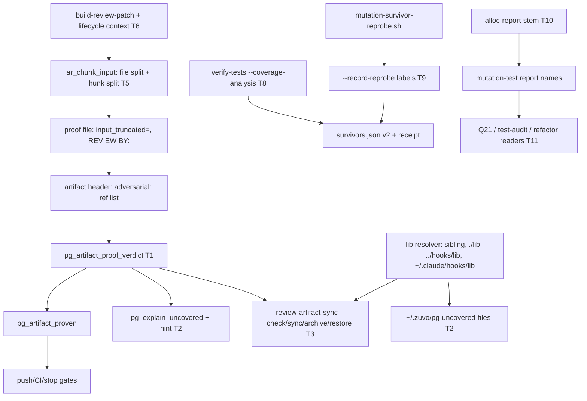

# Implementation Plan: RD-1040 — review-pipeline tooling (patch context, hunk split, proof verdict, pg-uncovered-files, coverageAnalysis, report names)

**Spec:** inline — no spec (decision text `~/.local/state/backlog-agents/decisions/RD-1040.json`, field `decision`)
**spec_id:** none
**planning_mode:** inline
**source_of_truth:** inline brief (RD-1040 owner decision, parts 1-8)
**plan_revision:** 4
**status:** Approved
**Created:** 2026-10-10
**Tasks:** 12
**Estimated complexity:** 5 complex (T1 gate lib, T2 installed classifier, T3 sync, T5 hunk split, T6 lifecycle context), 7 standard

Twelve tasks, above the 5-10 target (justification, rule 1): the decision bundles six independent tools plus their
docs, a cross-tool smoke runner and the backlog; merging any two would push a task over the five-file boundary
(T3+T4, T10+T11) or mix unrelated tools in one commit. Every task is a single tool, a single doc set, or the smoke.
One PR is still right (rule 17): the tools are independent, nothing is a cutover, and every task lands green.

Already done / out of this plan (verified on origin/main 8606769a and open PR #65):
- **Part 7 (append-runlog INCLUDES)** — covered by RD-1039 (= cur-misc-1-T70), open PR #65, commit 15eb10b4
  (session-start exports `ZUVO_INCLUDES_FILE`; track-includes prunes trackers > 24 h). The decision says "do it
  there if T70 already covers it". `[DECISION: part 7 → covered by RD-1039 PR #65, not implemented here]`.
  `append-runlog`, `track-includes.sh` and `session-start` are NOT touched. B-20260920-APPEND-RUNLOG-CANNOT-IDENTIFY-
  ITS-INCLUDES-TRACKER is filed OPEN in T12 with that pointer and closes when #65 merges.
- Literal acceptance "Multiple --adversarial with metadata preserved": there is no `--adversarial` CLI flag. Read as
  several proof refs in the artifact HEADER (repeated `adversarial:` lines or a comma list), each proof file kept
  whole with its own metadata block and each required to pass on its own. No concatenating composite command
  (concatenation would break the `write_artifact` record-header structure the gate's scan trusts).
- Backlog clause "archives the pair atomically": reinterpreted as idempotent per-file `copy_preserving` of the
  artifact and EVERY proof (the archive hook re-runs on every write, so a crash leaves a subset the next run
  completes). Recorded as a reinterpretation in T12, not claimed done as written.
- Part (1) reaches only callers of `build-review-patch` (build, execute, debug, fix-tests, receive-review, write-e2e,
  seo/geo/content-fix, content-migration, adversarial-loop.md). `zuvo:review`/`zuvo:ship` pipe a raw `git diff`;
  the owner decision names `build-review-patch` only — recorded in T12's closure note, not silently widened.

## Architecture Summary

- `hooks/lib/pipeline-gate-lib.sh` (sourced, fail-closed proof layer, never `exit`): `pg_artifact_proven`
  (:377-567) reads the FIRST `adversarial:` line anywhere (fallback `adv-proof:`), containment via `path_contained`,
  missing proof → proven only under `PG_PROOF_OPTIONAL=1` (CI), one awk scan: `input_truncated=true` → refuse,
  closed `mode=blind-audit` header → refuse, ≥2 `REVIEW BY:` or 1 + single-provider note → exit 3 = proven.
  `_pgl_proven` memoizes → `_pgl_uncovered` → `pg_range_reviewed` / `pg_uncovered_files` (:859, rc 0/2/3) /
  `pg_explain_uncovered` (own sed reader :976-985, wrong "<2 REVIEW BY" text for truncation; `bash -c` hint :999).
- `scripts/review-artifact-sync.sh`: `lint_artifact` re-implements a weaker subset (no truncation, no blind-audit,
  no grandfathering; missing proof/ref = WARN rc 0); `do_sync`/`do_archive`/`do_restore` use only the first ref,
  archive/restore ignore `adv-proof:`, archive key is `<stem>/<basename>` (collides for same-basename refs).
  Installed to `~/.zuvo` (works today only through a stale Aug-22 `~/.zuvo/path-contain.sh`; no gate lib there),
  `~/.codex/scripts` + `~/.cursor/scripts` (lib in `./lib/`), antigravity/kimi (`../hooks/lib/`).
- `scripts/lib/adversarial-input.sh`: `ar_chunk_input` (:471-680) Pass 1 splits at `FILE_HEADER_RE`, Pass 2 packs
  into `MAX_CHARS-500`; trigger needs `_chunk_headers ≥ 2`, so a single-file diff over the cap is never chunked; a
  child (`ZUVO_ADV_CHUNK=i/n`) truncates an over-cap part (`INPUT_TRUNCATED=true`, rc 4), which refuses the whole
  proof at the gate.
- `scripts/zuvo-home/build-review-patch`: one `git diff` (post-image = working tree in both modes) + untracked files
  into `$OUTF`, then stdout; no context beyond git's 3 lines.
- `scripts/zuvo-home/verify-tests`: Stryker cfg dict hardcodes `"coverageAnalysis": "perTest"` (:1662-1695 in
  `check_mutation` :1559); `record_survivors` (:1384) + `write_survivor_report` (:1261, `zuvo-survivors/v1`, only
  when survivors exist); `r.detail` → `stamp_receipt` (:1825) → manifest receipt.
- `skills/mutation-test/SKILL.md` §4.3b (:1272-1280): report names allocated in prose only.

## Technical Decisions

- **One verdict, many readers (part 3).** New in `pipeline-gate-lib.sh`:
  - `pg_artifact_proof_refs <artifact>` — one awk pass. Anchor = the first line matching
    `^[[:space:]]*(adversarial|adv-proof):` with a non-empty value (after CR/backtick strip) — same anchor the gate
    uses today (measured: 230 of 16,115 fleet artifacts carry the ref outside the marker's paragraph, so a
    marker-paragraph anchor would drop real coverage). Header scope = the contiguous non-blank block containing
    the anchor (a CR-only line counts as blank). Every `adversarial:`/`adv-proof:` line in that block counts; values
    split on `,`, trimmed, CR/backticks stripped, empty items dropped, duplicates collapsed in order, at most
    `PG_MAX_PROOF_REFS=16` refs (more → one `too-many-refs` refusal). Prints one ref per line, rc 0.
  - `pg_artifact_proof_verdict <root> <artifact>` — prints `<token>\t<ref>\t<detail>` per ref; tokens
    `grandfathered`, `no-ref`, `too-many-refs`, `not-a-path` (whitespace, `;`, `(`, `|` — prose such as
    "not run (CLI providers unavailable…)" or the retrospective line `adversarial: pass1=… | …`; 49 fleet artifacts
    carry such a value, and comma-splitting prose must never yield refs a CI run waives as missing-optional),
    `no-containment` (no `path_contained`), `escapes`, `missing`, `missing-optional`, `unreadable`, `truncated`,
    `blind-audit`, `weak`, `scan-error`, `proven`. rc 0 only when grandfathered or EVERY ref is `proven`/
    `missing-optional`. The existing awk scan stays as is except its END exits 4 truncated / 5 blind-audit /
    6 weak (count on stdout) / 3 proven; any other code → `scan-error`, refused.
  - `pg_artifact_proven() { pg_artifact_proof_verdict "$1" "$2" >/dev/null; }` — memo `_pgl_proven` unchanged.
  - `_pgl_proof_reason_msg` maps a token to `pg_explain_uncovered`'s message; replaces its own sed reader and the
    wrong "<2 REVIEW BY" text for truncation/blind-audit.
- **review-artifact-sync.sh** resolves the lib (before `set -u`), first readable wins: `$dir/pipeline-gate-lib.sh`
  (~/.zuvo flat) → `$dir/lib/pipeline-gate-lib.sh` (codex/cursor) → `$dir/../hooks/lib/pipeline-gate-lib.sh` (repo,
  antigravity, kimi) → `$HOME/.claude/hooks/lib/pipeline-gate-lib.sh`; requires `PG_LIB_LOADED=1` and
  `path_contained`; otherwise every mode but `--help` exits 2 "cannot compute the gate's verdict". No env override
  (a planted lib would make a forged check pass). `lint_artifact` keeps marker/`range:`/`files:` checks, then calls
  `pg_artifact_proof_verdict` directly (not the memo — its locals are unbound under `-u`); `OK   <name>` line format
  kept (three spaces); FAIL lines name ref + reason; the `escapes` reason keeps the phrase "escapes the repo".
  `do_sync`/`do_archive`/`do_restore` iterate `pg_artifact_proof_refs` (fixes the ignored `adv-proof:` alias);
  archive key becomes `proofs/<stem>/<contained repo-relative ref>`; `--restore` tries that key, then the legacy
  `<stem>/<basename>`. Behaviour change: `--check`/`do_sync` FAIL (rc 1) whenever the gate would reject.
- **Installer (parts 3/4/5):** add `hooks/lib/pipeline-gate-lib.sh`, `hooks/lib/path-contain.sh` (T2) and
  `scripts/mutation-survivor-reprobe.sh` (T8) to the `~/.zuvo` extras list in `scripts/install.d/zuvo-home.sh`
  (:309-312, flat, never `~/.zuvo/lib/`). Codex/cursor already ship the lib in `./lib/`.
- **pg-uncovered-files (part 4):** `scripts/zuvo-home/pg-uncovered-files <range>` (bash, ~40 lines), resolver
  `$self/pipeline-gate-lib.sh` → `$self/../../hooks/lib/` → `$HOME/.claude/hooks/lib/`; exit set {0 computed,
  2 cannot compute / lib missing / usage, 3 no production files}; runs in CWD's repo (`PG_REPO_ROOT` honoured).
  `~/.zuvo` is not on PATH, so the hint at lib:999 prints the expanded `$HOME/.zuvo/pg-uncovered-files "<range>"`
  when that file is executable, else today's `bash -c` form.
- **Hunk split (part 2), inside `adversarial-input.sh`** (no new module — `AR_MODULES`, stamp and builds stay):
  `_ck_count_hunks` counts `^@@ ` only inside sections starting `^diff --git `; trigger becomes
  `_chunk_headers ≥ 2 || (_ck_fence == 0 && hunks ≥ 2)`. `_ck_split_hunks` (Pass 1.5) splits a section over
  `_ck_budget` that starts with `diff --git ` and has ≥ 2 hunks into header (lines before the first `@@`) + hunk
  units + trailer (from `^=== CONTEXT: ` to section end); packs units greedily so header+units+trailer ≤ budget;
  writes `sec-NNNN-pKKK`, empties the original with `: >` (Pass 2 skips empty files). A single unit over the budget
  becomes its own part → child truncates, `input_truncated=true`, rc 4 (owner decision). Per-part note sidecar
  `pnote-*` ("hunks a-b of N of <path ≤ 80 chars>") folds into the chunk `--context` note, capped at 400 chars
  (headroom 500).
- **Lifecycle context (part 1):** `lifecycle_context` = one awk pass over `$OUTF` reading each shell file's
  post-image with `getline`. Shell file: `.sh/.bash/.zsh/.ksh` or shebang `#!…(ba|z|k|da)?sh`; skip `/dev/null`,
  quoted paths, untracked whole-file additions (the whole file is already in the hunk). Trigger = the owner's text,
  literally: a tracked shell file with a changed hunk whose post-image DEFINES a `trap` or a cleanup-named function
  (`(^|_)(cleanup|teardown|on_exit|stop)($|_)`) or a trap-handler function — no changed-line token heuristic
  (`[DECISION r2: owner trigger, not the narrower backlog wording; the block is bounded so the noise cost is capped]`).
  A script that starts background jobs but defines no trap/cleanup has nothing to add, so it gets no block.
  Content: every `trap` line, bodies of trap-handler functions and cleanup-named functions (≤ 40 lines each), minus
  lines already visible inside the hunks; caps 80 lines / 4000 chars per file with an omission line. Block after the
  file's last hunk:
  `=== CONTEXT: <path> - lifecycle definitions outside the changed hunks (unchanged; reference only, NOT part of this diff) ===`,
  `<lineno>: <text>` lines, `=== END CONTEXT ===`; no line may start `diff --git `, `=== FILE: `, `@@`, `+`, `-`,
  space, `\` or `##` (verified: `git apply --check` accepts such a block). T5's splitter repeats it as a trailer in
  every part. Fail-open: annotation failure → plain patch + stderr warning, exit codes 0/2/3 unchanged. Opt-out
  `ZUVO_REVIEW_PATCH_NO_CONTEXT=1` (exact value). POSIX awk only (no `\b`, no gawk extensions — BSD awk on macOS).
- **verify-tests coverage analysis (part 5):** `--coverage-analysis {off,all,perTest}` (argparse choices, default
  None) → `resolve_coverage_analysis(cli)`: CLI > non-empty `ZUVO_VERIFY_COVERAGE_ANALYSIS` > `perTest`; invalid env
  value → stderr + exit 2 before any work (case-sensitive, Stryker spelling). Threaded into `check_mutation(...,
  coverage_analysis=)`. `incrementalFile`: perTest keeps `<manifest>.stryker-incremental.json`; off/all use
  `<manifest>.stryker-incremental.<mode>.json`. `r.detail` always gets ` [coverageAnalysis=<mode>]`
  (`n/a (infection)` for Infection) — the receipt reader `test-coverage-gate.py` reads only the prefix.
  `survivors.json` → `zuvo-survivors/v2` (keeps `count`, `obligation`; adds top-level `coverage_analysis`, per-row
  `id`, `location`, `original` (sliced from `files[*].source`, ≤ 400 chars, null when the slice cannot be trusted),
  `replacement`, `confirmation` = `unconfirmed` (perTest) / `not-required` (off, all) / `n/a` (Infection) /
  `confirmed` / `refuted`). perTest gap lines get `(unconfirmed under perTest — confirm with
  ~/.zuvo/mutation-survivor-reprobe.sh --label <id>)`; the existing `"NoCoverage L10 Boolean"` prefix holds.
  Unconfirmed survivors still FAIL.
- **Reprobe confirmation (part 5, "until reprobe confirms them") — labels only:** `verify-tests --manifest M
  --record-reprobe <file|->` parses reprobe KEY=VALUE blocks (`label=`, `verdict=`, `restored=`, `reason=`), matches
  `label` to a survivor row `id` in `M.survivors.json` and rewrites that row's `confirmation`: SURVIVED+restored=yes →
  `confirmed`; KILLED+restored=yes → `refuted` (row note: "killed by physical reprobe — a perTest false survivor;
  triage it"); ERROR or restored=no → stays `unconfirmed` with the reason. Exit 0 all labels matched, 1 an unknown
  label (file unchanged), 2 usage. The mutation VERDICT never changes: refuted survivors still FAIL until triaged by
  the existing route (`[DECISION r2: typed KEY=VALUE text is agent-writable, so it may move a label but never exempt a
  survivor — no-agent-typable-bypass]`). Labels live in that run's survivors.json; the next run rewrites it.
- **alloc-report-stem (part 6):** `scripts/zuvo-home/alloc-report-stem --dir D --prefix P --scope S [--date
  YYYY-MM-DD] [--ext .md,.json,.report.json]`; slug `LC_ALL=C`: lowercase, runs of `[^a-z0-9]` → `-`, trim,
  cut 60, trim, empty → `all`; candidates `""`, `-2` … `-99`: skip if ANY sibling extension exists, else create the
  first extension under `set -C` (O_EXCL) — first successful create owns the stem; prints the stem (no extension);
  exit 0 / 1 after 99 / 2 usage, bad date, unwritable dir. Date default = local `date +%F` (the user's day). Scope
  from the SKILL: the path argument, `full`, `branch-<branch>`, or `head-<sha7>` when detached.
- Each production task adds a `changelog.d/<topic>.md` fragment (never VERSION/CHANGELOG — release owns those).

## Quality Strategy

- Test framework: standalone bash tests (`pass/bad`, `ALL PASS`, exit status), `tests/adversarial/run.sh` with
  `start_test`/`assert_*` and mocks, `unittest` for verify-tests (`python3 -m unittest tests.hooks.<module>`; no
  pytest on the farm). Every new test sets `GIT_CONFIG_GLOBAL=/dev/null` and an explicit `PG_REVIEW_PROOF_CUTOFF`,
  and never reads the real `~/.zuvo`/`~/.claude` (sandbox `HOME`). Driver text only via
  `tests/lib/adversarial-driver.sh`; installer text only via `tests/lib/installer-sources.sh`.
- Runner: farm only, `cd <worktree> && TF_HOST=waw-tf rt --light <cmd>` (rt bare — no pipe hiding its exit code).
  Baseline at 8606769a: test-review-artifact.sh, test-review-artifact-archive.sh, test-build-review-patch.sh,
  test-pipeline-gate-lib.sh, test-adversarial-truncation.sh (11/11) green; `run.sh test-input-chunking` 77 run /
  6 failed = CK.15, CK.21, CK.22 (pre-existing, B-20261009-CK-DRYRUN-NEEDS-LANES); test_verify_tests_mutation
  11 OK. test-install-wiring.sh, test-verify-tests.sh, test-proof-path-containment.sh, test-artifact-diagnose.sh,
  test-review-proof-gate.sh get a baseline run at the start of the task that touches them.
- RED discipline (test-scope.md): every test names the bug it catches; regression tests are run on the pre-change
  code and seen FAILING before GREEN; >3 cases → table; no tests for docs/prose; no file-presence install tests
  (run the installed tool instead).
- CQ gates activated: CQ3 (header refs, reprobe input, env/flag values, scope/dir input validated), CQ4 (the proof
  verdict authorizes pushes — fail closed on every new branch, containment on every ref, no lib-path override),
  CQ6 (caps: refs 16, context 80 lines/4000 chars, note 400, slug 60, attempts 99, `original` 400), CQ8 (awk fault
  → `scan-error` refuse; no lib → exit 2; annotation failure → plain patch + warning; reprobe ERROR → unconfirmed),
  CQ14 (verdict implemented once; the three lib resolvers are pinned by tests, not shared code), CQ19 (contracts
  pinned: `--check` rc + OK/FAIL lines, archive layout + legacy restore, survivors v1→v2 keys, `r.detail` prefix,
  `pg-uncovered-files` exit set, report names), CQ21 (atomic stem allocation; idempotent archive), CQ22 (sidecars
  under the existing trap-cleaned temp dir).
- Risk ranking: (1) T1 gate fail-open (empty items, prose, all-missing under CI), (2) T5 regressions in CK.17/
  CK.19/CK.23/truncation, (3) T3 behaviour change of `--check`/`do_sync` exit codes, (4) T5/T6/T7 mocks that
  cannot see every part (test-local per-call stdin logger, never `mock-echo-prompt`), (5) portability (BSD awk, bash 3.2) — reviewed by reading, the farm is Linux.

## Coverage Matrix

| Row ID | Authority item | Type | Primary task(s) | Notes |
|--------|----------------|------|-----------------|-------|
| P1 | Trap/cleanup/background-job definitions included as context for hunks in shell functions/scripts that define them | requirement | Task 6 | trailer repeated per hunk part by Task 5 |
| P2a | A single file section > MAX_CHARS is split at `@@` hunk boundaries, each chunk repeating the file's diff header | requirement | Task 5 | |
| P2b | Truncation only when one hunk alone exceeds the cap, still recording input_truncated=true | constraint | Task 5 | |
| P3a | `--check` runs the push gate's proof verdict (pg_artifact_proven incl. input_truncated refusal), prints FAIL + exits non-zero when the gate would reject | requirement | Task 1, Task 3 | |
| P3b | Several proof paths (repeated `adversarial:` lines or comma list), each proof's metadata kept, proven only if every proof passes | requirement | Task 1, Task 3 | "Multiple --adversarial" read as header refs |
| P4a | Thin executable `pg-uncovered-files <range>` passing pg_uncovered_files' exit status through, installed beside the zuvo-home tools | deliverable | Task 2 | |
| P4b | The printed `bash -c` hint points to it | requirement | Task 2 | |
| P4c | "so it is on PATH in a login shell" | constraint | Task 2 | `[DECISION]` ~/.zuvo is not on PATH in login shells on these hosts; every helper is called by absolute path, so the hint prints `$HOME/.zuvo/pg-uncovered-files`. A `bin/` wrapper was rejected: Claude Code's `{installPath}/bin` goes stale after a release (CLAUDE.md, install section) and is absent from login shells too |
| P5a | `--coverage-analysis off\|all\|perTest` + `ZUVO_VERIFY_COVERAGE_ANALYSIS`, default perTest | requirement | Task 8 | |
| P5b | Value used written into the report | requirement | Task 8 | r.detail/receipt + survivors.json |
| P5c | Under perTest survivors labelled 'unconfirmed' until mutation-survivor-reprobe.sh confirms them | requirement | Task 8, Task 9 | |
| P6 | Report name `mutation-test-<YYYY-MM-DD>-<scope-slug>.md`, [a-z0-9-] max 60, -2/-3 instead of overwrite | requirement | Task 10, Task 11 | readers updated in Task 11 |
| P7 | append-runlog INCLUDES filled | requirement | Task 12 (decision gate) | covered by RD-1039 PR #65; recorded OPEN with the pointer |
| P8 | The 8 B-ids recorded and closed in zuvo memory/backlog.md per backlog-protocol.md when their fix lands | deliverable | Task 12 | |
| S1 | Whole-feature smoke (SMOKE1) | constraint | Task 7 | RED halves in Tasks 2, 3, 5 |
| C1 | Tests on the farm via rt; each bug fix has a regression test seen failing pre-change | constraint | Tasks 1-3, 5-10 | |
| C2 | No install.sh / release / dev-push; no edits to ~/.zuvo or ~/.claude/hooks; no rm/kill | constraint | all | installer exercised only in sandbox HOME (Task 2) |
| C3 | Docs that describe the changed contracts stay true | constraint | Task 4, Task 11 | |
| B1 | "Close RD-1040 in rdesigner with no rdesigner change" | scope boundary | none | the orchestrator's job after the PR; no rdesigner file is touched by this plan |

## Review Trail
- Phase 1: full fan-out (Architect → Tech Lead → QA Engineer, Opus, read-only); reports in `zuvo/context/rd1040-{architect,techlead,qa}.md`.
- Plan reviewer: revision 1 -> ISSUES FOUND (10: part-1 trigger narrowed, T9 typed-verdict exemption, Verify loops exit 0, git grep through rt, T1/T5 unlisted cross-read, mocks blind to parts, T6 RED cannot see T5 trailer, class-guard suites missing, P4c/B1 rows, small fixes) -> all applied in revision 2
- Plan reviewer: revision 2 -> APPROVED (2 nits applied: T6 class guards, stale wording)
- Cross-model validation (revision 2): executed, 2 chunks, 10 providers (cursor-agent, agy, codex-5.3, byteplus-3, claude; cursor-agent, agy, openrouter-4, claude, kimi); byteplus-3 returned no structured findings (judged the chunked part "truncated"). Dispositions:
  - FIXED in revision 3: smoke moved to Task 7 right after the pipeline tasks it exercises (agy/kimi CRITICAL, cursor/claude WARNING); smoke RED made per-assertion via `ZUVO_ADV_NO_CHUNK=1` / `ZUVO_REVIEW_PATCH_NO_CONTEXT=1`; smoke Verify lists each assertion; reprobe-helper install moved into the verify-tests mode task so the hint never names an uninstalled helper (agy CRITICAL); Task 2 relabelled complex; P4c added to Task 2's proof; Task 4 proof checks each file incl. testing.md; Task 5 Verify also pins the count of baseline failing assertions; readers task proof asserts the `*.report.json` exclusion positively; backlog task title/Verify cover the OPEN pointer and both PARTIAL items; mawk/busybox portability re-run steps added to Tasks 1 and 6.
  - REJECTED (false positive / by design): reprobe script "introduced in GREEN" (it exists: `scripts/mutation-survivor-reprobe.sh`); first-ref-anywhere anchor (measured: 230 of 16,115 fleet artifacts carry the ref outside the marker paragraph — a header-only anchor drops real coverage; prose refs are refused by `not-a-path`); stale cache across modes (each mode has its own incremental file); stem reserves only `.md` (a candidate is skipped when ANY sibling exists, and the `.md` O_EXCL create is the reservation); docs tasks without committed tests and a split of the readers task (test-scope.md forbids prose tests; generated copies are not hand edits); Task 3→Task 2 and Task 5→Task 1 dependencies (serialization of shared suites/files, stated); smoke "happy path only" (it has the flipped-proof negative leg); parts 5-6 reader smoke (single-tool contracts, N/A justified); backlog task split (one file pair, one helper run).
- Plan reviewer: revision 3 -> ISSUES FOUND (3 one-line fixes: T8 install check + reprobe-helper run row, T4 proof phrase that pre-exists, a renumbering leftover) -> applied in revision 4 without another loop (stop rule: one re-review per adversarial-driven revision; all three trivially correct)
- Status gate: Approved (autonomous run: the caller pre-authorized plan→execute with no approval pause)

## Task Breakdown

### Task 1: Gate library — header-scoped multi-ref proofs and one reason-returning verdict
**Files:** `hooks/lib/pipeline-gate-lib.sh`, `tests/hooks/test-proof-multi-ref.sh` (new), `tests/hooks/test-artifact-diagnose.sh`, `changelog.d/review-proof-multi-ref.md` (new)
**Surface:** backend-logic
**Complexity:** complex
**Dependencies:** none
**Failure:** halt
**Execution routing:** deep implementation tier

- [ ] Baseline: run `test-review-proof-gate.sh`, `test-proof-path-containment.sh`, `test-artifact-diagnose.sh` on the farm at the task's start; record results in the task report.
- [ ] RED (`tests/hooks/test-proof-multi-ref.sh`, sandbox repos, `PG_REVIEW_PROOF_CUTOFF=1`, `GIT_CONFIG_GLOBAL=/dev/null`): one table, each row = artifact header + proof files, asserting `pg_artifact_proven` rc AND the `pg_artifact_proof_verdict` token per ref:
  1. two `adversarial:` lines, good then truncated → rc 1, `truncated` on ref 2 (bug: only the first ref is read) — RED;
  2. `adversarial: a.txt, b.txt`, both good → rc 0 (bug: comma list read as one path) — RED;
  3. `a.txt,b.txt` good + truncated → rc 1, token `truncated` names b;
  4. two proofs with 1 `REVIEW BY:` each → rc 1, `weak` ×2 (bug: counts pooled across files);
  5. good + blind-audit / good + `../x` / good + absolute path → rc 1, `blind-audit` / `escapes` / `escapes`;
  6. `adversarial: ,` and `adversarial: , ,` under `PG_PROOF_OPTIONAL=1` → rc 1, `no-ref` (bug: empty item → missing-optional → proven in CI) — RED;
  7. `a,,a` good → rc 0, a evaluated once;
  8. good + missing, optional unset → rc 1; 9. same with `PG_PROOF_OPTIONAL=1` → rc 0 (`missing-optional`);
  10. truncated present + missing under optional → rc 1 (bug: optional waives present proofs);
  11. all refs missing under optional → rc 0 (deliberate CI parity);
  12. header ref good, blank line, body `adversarial: pass1=mock(0,0,0) | cross_provider=true` → rc 0, refs = [good] (bug: reader widened to the body);
  13. no header ref, body retrospective line only, `PG_PROOF_OPTIONAL=1` → rc 1, `not-a-path` (bug: prose waived as missing-optional in CI) — RED;
  14. CRLF artifact `a.txt,b.txt\r`, `\r`-only line, body `adversarial: bad.txt` → rc 0, refs = [a, b];
  15. mtime before the cutoff with bad refs → rc 0, `grandfathered`; 16. 17 refs → rc 1, `too-many-refs`.
  Plus one wiring case: `pg_uncovered_files` on a range covered only by row 1's artifact lists the file (bug: wrapper/memo not wired) — RED. In `test-artifact-diagnose.sh`: `pg_explain_uncovered` for a truncated proof names truncation and does NOT say "<2 'REVIEW BY:'" (RED); weak and missing keep distinct texts; the existing missing-proof text stays.
- [ ] Portability: where the farm or host has `mawk` or `busybox awk`, run the new awk programs' table once under it (`PG_AWK` is NOT a product knob — the test copies the lib with `awk` rewritten); record "not checked" when neither exists. One-true-awk/BSD semantics stay reviewed by reading.
- [ ] GREEN: add `pg_artifact_proof_refs`, `pg_artifact_proof_verdict`, `_pgl_proof_reason_msg`, `PG_MAX_PROOF_REFS=16`; awk END exit codes 3/4/5/6; `pg_artifact_proven` becomes the thin wrapper; `pg_explain_uncovered` uses the verdict instead of its own sed reader. Invariants: every new branch resolves toward NOT proven; sourced file never `exit`s / `set -e`; all locals declared `local`.
- [ ] Verify: `cd /Users/greglas/DEV/zuvo-plugin-worktrees/rd-1040-review-pipeline && fail=; for t in test-proof-multi-ref test-pipeline-gate-lib test-review-proof-gate test-proof-path-containment test-artifact-diagnose test-adversarial-truncation; do TF_HOST=waw-tf rt --light bash tests/hooks/$t.sh || { echo "RED: $t"; fail=1; }; done; [ -z "$fail" ]`
  Expected: exit 0, no `RED:` line; each run ends with `ALL PASS` (truncation: `PASS=11 FAIL=0`).
- [ ] Acceptance Proof:
  - AC P3b (lib half):
    - Surface: backend-logic
    - Proof: `TF_HOST=waw-tf rt --light bash tests/hooks/test-proof-multi-ref.sh`
    - Expected: exit 0, `ALL PASS`; rows 1, 2, 6, 13 and the wiring case were recorded FAILING on 8606769a first.
    - Artifact: `zuvo/proofs/task-1-report.md`
  - AC P3a (gate half): same run, rows 1/3/10 refuse a truncated ref; Expected: tokens `truncated`; Artifact: same report.
- [ ] Commit: `gate: a review artifact may cite several proofs, every one must pass, and the verdict says why`

### Task 2: pg-uncovered-files executable, absolute hint, and the gate lib installed beside the ~/.zuvo helpers
**Files:** `scripts/zuvo-home/pg-uncovered-files` (new), `hooks/lib/pipeline-gate-lib.sh`, `scripts/install.d/zuvo-home.sh`, `tests/hooks/test-pg-uncovered-files.sh` (new), `changelog.d/pg-uncovered-files.md` (new)
**Surface:** integration
**Complexity:** complex
**Dependencies:** Task 1
**Failure:** halt
**Execution routing:** deep implementation tier

- [ ] Baseline: `test-install-wiring.sh`, `test-retro-shrink-guard.sh`, `test-retro-loop-docs.sh`, `test-windows-portability.sh` on the farm at task start.
- [ ] RED (`tests/hooks/test-pg-uncovered-files.sh`, sandbox repo + sandbox HOME):
  - exit-status table: uncovered list → 0 + the file; covered range → 0 + empty; docs-only range → 3; bad range / not a repo / no argument / lib unreachable (script copied alone, empty HOME) → 2 (bug: wrapper swallows rc so "cannot compute" reads as "nothing uncovered") — RED (file absent);
  - hint executes: > 10 uncovered files, an executable `$HOME/.zuvo/pg-uncovered-files` present; extract the hinted command from `pg_explain_uncovered` output and run it → lists the files (bug: hint names a command that does not exist / is not on PATH) — RED;
  - installed layout: `tests/lib/install-manifest.sh` sandbox install (GIT_CONFIG_GLOBAL=/dev/null), then `$HOME/.zuvo/pg-uncovered-files` run inside a fixture repo returns 0 and `$HOME/.zuvo/review-artifact-sync.sh --check` on a good pair returns 0 (bug: fresh machine — no lib/path-contain beside the installed helpers, every mode exits 2) — RED.
- [ ] GREEN: `pg-uncovered-files` (resolver sibling → `../../hooks/lib` → `~/.claude/hooks/lib`, `PG_LIB_LOADED` check, passes rc through, usage → 2); hint at lib:999 prints `"$HOME/.zuvo/pg-uncovered-files" "<range>"` when executable, else the `bash -c` form; add `hooks/lib/pipeline-gate-lib.sh` and `hooks/lib/path-contain.sh` to the `~/.zuvo` extras loop (flat). New file passes the `zuvo-home/*` class guards (no dotted quad, no `grep -c … || echo`).
- [ ] Verify: `cd /Users/greglas/DEV/zuvo-plugin-worktrees/rd-1040-review-pipeline && fail=; for t in test-pg-uncovered-files test-install-wiring test-proof-multi-ref test-retro-shrink-guard test-retro-loop-docs test-windows-portability; do TF_HOST=waw-tf rt --light bash tests/hooks/$t.sh || { echo "RED: $t"; fail=1; }; done; [ -z "$fail" ]`
  Expected: exit 0, no `RED:` line (the last three are the directory-wide `scripts/zuvo-home/*` class guards; baseline them first if they were never run on the farm).
- [ ] Acceptance Proof:
  - AC P4a / P4b:
    - Surface: integration
    - Proof: `TF_HOST=waw-tf rt --light bash tests/hooks/test-pg-uncovered-files.sh`
    - Expected: exit 0; the hinted command run by the test lists the uncovered files; exit table 0/0/3/2 matches.
    - Artifact: `zuvo/proofs/task-2-report.md`
  - AC P4c: same run — with `$HOME/.zuvo/pg-uncovered-files` executable the hint is that absolute path; with it absent the hint is the `bash -c` form and running that form also lists the files. Artifact: same report.
- [ ] Commit: `pg-uncovered-files: the coverage classifier becomes a command the push hint can name`

### Task 3: review-artifact-sync runs the gate's verdict and carries every proof
**Files:** `scripts/review-artifact-sync.sh`, `tests/hooks/test-artifact-diagnose.sh`, `tests/hooks/test-review-artifact-archive.sh`, `tests/hooks/test-proof-path-containment.sh`, `changelog.d/review-artifact-sync-gate-verdict.md` (new)
**Surface:** integration
**Complexity:** complex
**Dependencies:** Task 1, Task 2
**Failure:** halt
**Execution routing:** deep implementation tier

- [ ] RED:
  - `test-artifact-diagnose.sh`: `--check` on a truncated proof → rc 1 + `FAIL … truncated` (pre-change: OK, rc 0); same for a blind-audit proof; post-cutoff artifact with no ref → rc 1 (pre-change WARN rc 0); good-then-truncated two-ref artifact → rc 1 naming ref 2; script copied with `path-contain.sh` but no reachable gate lib (empty HOME) → rc 2 "cannot compute" (bug: falls back to the weak lint and says OK) — all RED. Guards: grandfathered artifact with missing proof → `OK` (bug: stricter than the gate); sibling lib wins over a planted always-proven `$HOME/.claude/hooks/lib` (bug: version skew); `OK   memory/reviews/good.md` three-space format kept.
  - `test-review-artifact-archive.sh`: two refs with the same basename in different dirs → both archived, `--restore` returns each byte for byte (bug: basename key hands back the wrong proof — manufactured coverage) — RED; `adv-proof:` alias archived — RED; `a.txt, b.txt` archived — RED. Update cases 1-2 to the path-keyed layout; case 3 (legacy-key restore) unchanged.
  - `test-proof-path-containment.sh`: keep the "both sites call `path_contained`" assertion (archive/sync still copy files); add: `do_sync` of an escaping ref now exits 1 and still prints `escapes the repo`.
  - `do_sync` with one ref missing at the source → rc 1 (intentional behaviour change).
- [ ] GREEN: lib resolver + guard (exit 2), `lint_artifact` through `pg_artifact_proof_verdict`, all modes iterate `pg_artifact_proof_refs`, path-keyed archive + legacy restore fallback, usage text (`--help` lines 3-26) updated to say `--check` applies the push gate's verdict — and the two `sed -n '3,26p'` ranges (`:51` early `--help`, `:74` `usage()`) follow the header's new length.
- [ ] Verify: `cd /Users/greglas/DEV/zuvo-plugin-worktrees/rd-1040-review-pipeline && fail=; for t in test-artifact-diagnose test-review-artifact-archive test-proof-path-containment test-pg-uncovered-files; do TF_HOST=waw-tf rt --light bash tests/hooks/$t.sh || { echo "RED: $t"; fail=1; }; done; [ -z "$fail" ]`
  Expected: exit 0, no `RED:` line, each `ALL PASS`.
- [ ] Acceptance Proof:
  - AC P3a:
    - Surface: integration
    - Proof: `TF_HOST=waw-tf rt --light bash tests/hooks/test-artifact-diagnose.sh`
    - Expected: exit 0; the truncated/blind-audit/no-ref/two-ref cases assert rc 1 with a FAIL line naming the reason; recorded RED on 8606769a.
    - Artifact: `zuvo/proofs/task-3-report.md`
  - AC P3b (metadata preserved): `TF_HOST=waw-tf rt --light bash tests/hooks/test-review-artifact-archive.sh`; Expected: exit 0, two same-basename proofs archived and restored byte-identical (`cmp`); Artifact: same report.
- [ ] Commit: `review-artifact-sync: --check answers with the push gate's own verdict, and every cited proof travels`

### Task 4: Docs for the proof verdict and pg-uncovered-files
**Files:** `shared/includes/review-artifact.md`, `docs/pipeline.md`, `docs/runbook/testing.md`, `CLAUDE.md`
**Surface:** docs
**Complexity:** standard
**Dependencies:** Task 1, Task 2, Task 3
**Failure:** halt
**Execution routing:** default implementation tier

- [ ] RED: docs-only — no test (test-scope: no tests for prose). Instead list each stale sentence before editing: review-artifact.md (header grammar: several refs, comma list, every proof must pass; `--check` = gate verdict; archive layout), docs/pipeline.md:322-331 (`bash -c` → `~/.zuvo/pg-uncovered-files`; `do_sync` exit 1 when a proof is missing), testing.md §3 (`--check` now fails where the gate would), CLAUDE.md:356 (`pg_uncovered_files` → `~/.zuvo/pg-uncovered-files <range>`).
- [ ] GREEN: edit those passages; no new sections.
- [ ] Verify: `cd /Users/greglas/DEV/zuvo-plugin-worktrees/rd-1040-review-pipeline && TF_HOST=waw-tf rt --light bash scripts/validate-skills.sh`
  Expected: exit 0, `ERRORS: 0`.
- [ ] Acceptance Proof:
  - AC C3:
    - Surface: docs
    - Proof (local, a text check — not a test suite): `cd /Users/greglas/DEV/zuvo-plugin-worktrees/rd-1040-review-pipeline && python3 -c 'import sys;r=lambda f:open(f).read();ok=all(["pg-uncovered-files" in r("docs/pipeline.md"),"pg-uncovered-files" in r("CLAUDE.md"),"pg-uncovered-files" in r("shared/includes/review-artifact.md"),"&& pg_uncovered_files" not in r("docs/pipeline.md"),"every cited proof must pass" in r("shared/includes/review-artifact.md"),"verdict" in r("docs/runbook/testing.md")]);sys.exit(0 if ok else 1)' && TF_HOST=waw-tf rt --light bash scripts/validate-skills.sh`
    - Expected: exit 0 — each doc names the executable, review-artifact.md states "every cited proof must pass" (phrase the GREEN step writes, absent on 8606769a), testing.md §3 says `--check` applies the gate's verdict, no doc sources the lib to call the function.
    - Artifact: `zuvo/proofs/task-4-report.md`
- [ ] Commit: `docs: the proof header may list several proofs, and the classifier is ~/.zuvo/pg-uncovered-files`

### Task 5: Adversarial driver splits an oversized file at its hunks
**Files:** `scripts/lib/adversarial-input.sh`, `tests/adversarial/test-input-chunking.sh`, `changelog.d/adversarial-hunk-split.md` (new)
**Surface:** backend-logic
**Complexity:** complex
**Dependencies:** Task 1
**Failure:** halt
**Execution routing:** deep implementation tier

(Depends on Task 1 only for serialization: both Verify commands run `test-adversarial-truncation.sh`, which runs the driver AND the gate lib.)

- [ ] RED (new cases in `test-input-chunking.sh`, real runs — not `--dry-run` — with a TEST-LOCAL mock `$CK_TMP/bin/mock-partlog` (the CK.17 `mock-chunkfate` pattern) that saves each call's stdin to its own numbered file `$CK_TMP/parts/<n>.in` and prints a harmless `SEVERITY: INFO` review; never `mock-echo-prompt`, which overwrites one file per call and is a blind-audit echo):
  - CK.26 one file, 3 hunks of ~12k each with unique `+MARKER-H<n>` lines, piped on stdin with `--artifact` → rc 0; artifact has NO `input_truncated=true`; every part's prompt carries that file's `diff --git`/`---`/`+++` header; each marker appears exactly once across parts; the part note names "hunks a-b of 3" (bug: single-file diff truncated, rc 4) — RED;
  - CK.27 several files, one over the cap with ≥ 2 hunks → same assertions for that file — RED;
  - CK.28 one hunk over the cap beside small hunks → that part cut, rc 4, `input_truncated=true`; the other hunks intact (owner decision);
  - CK.29 `--files` input whose `=== FILE:` section has raw `@@ ` lines, over the cap → not split, rc 4 (bug: raw `@@` read as hunk boundaries);
  - CK.30 a ~300-char path, parts packed to the budget → rc 0, no child truncation (bug: part note overflows the 500 headroom);
  - CK.31 a 3-hunk file whose section ends with a `=== CONTEXT: … ===`/`=== END CONTEXT ===` trailer → every part carries the trailer exactly once.
  Keep green: CK.17, CK.19, CK.23 and `tests/hooks/test-adversarial-truncation.sh`.
- [ ] GREEN: `_ck_count_hunks`, trigger change, `_ck_split_hunks` (Pass 1.5, header/units/trailer, greedy pack, `sec-NNNN-pKKK`, original emptied with `: >`), `pnote-*` sidecars folded into the chunk note (≤ 400 chars), diff-mode note text "sibling files or hunks of the same file are reviewed in other chunks". Comment at :505-508 rewritten to the new rule.
- [ ] Verify: `cd /Users/greglas/DEV/zuvo-plugin-worktrees/rd-1040-review-pipeline && TF_HOST=waw-tf rt --light bash -c 'out=$(bash tests/adversarial/run.sh test-input-chunking 2>&1); printf "%s\n" "$out" | tail -4; bad=$(printf "%s\n" "$out" | sed -n "s/.*FAIL[^]]*\] \(CK\.[0-9]*\) .*/\1/p" | sort -u | tr "\n" " "); n=$(printf "%s\n" "$out" | sed -n "s/.*FAIL[^]]*\] \(CK\.[0-9]*\) .*/\1/p" | wc -l); echo "failing: $bad ($n assertions)"; [ "$bad" = "CK.15 CK.21 CK.22 " ] && [ "$n" -eq 6 ]' && TF_HOST=waw-tf rt --light bash tests/hooks/test-adversarial-truncation.sh`
  Expected: exit 0; `failing: CK.15 CK.21 CK.22  (6 assertions)` — the baseline's exact six failing assertions (the pre-existing farm set, B-20261009-CK-DRYRUN-NEEDS-LANES — if a merge fixes that item before this task runs, the expected set is empty: re-baseline on origin/main first); truncation `PASS=11 FAIL=0`.
- [ ] Acceptance Proof:
  - AC P2a:
    - Surface: backend-logic
    - Proof: the Verify command; CK.26/CK.27 pass.
    - Expected: CK.26 artifact contains no `input_truncated=true`, three markers seen once each; recorded RED (rc 4) on 8606769a.
    - Artifact: `zuvo/proofs/task-5-report.md`
  - AC P2b: CK.28 passes (one over-cap hunk → rc 4 + `input_truncated=true`); Artifact: same report.
- [ ] Commit: `adversarial: one file over the cap is split at its hunks instead of being cut`

### Task 6: build-review-patch adds the shell lifecycle definitions around a changed hunk
**Files:** `scripts/zuvo-home/build-review-patch`, `tests/hooks/test-build-review-patch.sh`, `changelog.d/review-patch-lifecycle-context.md` (new)
**Surface:** backend-logic
**Complexity:** complex
**Dependencies:** Task 5
**Failure:** halt
**Execution routing:** deep implementation tier

- [ ] RED (table in `test-build-review-patch.sh`; base fixture: a tracked script with `cleanup(){ kill -- -"$pg"; }` + `trap cleanup EXIT INT TERM` at the top, ~30 filler lines, then the changed line):
  - block expected (RED — no block exists today): changed line `setsid npm run dev:stack &` → block holds the trap line and the cleanup body with line numbers; a changed line with no lifecycle token (`echo hi`) in the same script → block (owner trigger: the script defines them); extensionless script detected by shebang; `trap on_sig INT` + `on_sig()` → that body included;
  - no block: a `.ts` file; a shell script with no trap/cleanup/handler definitions (even if it runs `cmd &`); an untracked new script; every definition already inside the hunk (nothing outside to add);
  - contract rows: no block line matches `^(diff --git |=== FILE: |@@|[-+ \\]|##)` (bug: forged boundaries); `git apply --check` accepts the output; index untouched; a 200-line cleanup → ≤ 40 lines + omission line, ≤ 80 lines / 4000 chars per file; `ZUVO_REVIEW_PATCH_NO_CONTEXT=1` → no block, `=yes` → block;
  - fail-open branch: unreadable post-image (skipped when running as root) → plain patch, exit 0, warning on stderr;
  - cross-check with Task 5 (makes the dependency real): real `build-review-patch` output for the base script changed in 3 hunks of ~12k chars, piped through `scripts/adversarial-review.sh` (`ZUVO_ADVERSARIAL_TEST_HARNESS=1`, a test-local per-call stdin logger mock on PATH) → rc 0, ≥ 2 parts, the `=== CONTEXT:` block appears exactly once in every part's input.
- [ ] Portability: same `mawk`/`busybox awk` re-run of the T6 table as Task 1, recorded in the report.
- [ ] GREEN: `lifecycle_context` (POSIX awk filter over `$OUTF`, getline of the post-image) inserted before emit; opt-out; usage text documents the block and the env var.
- [ ] Verify: `cd /Users/greglas/DEV/zuvo-plugin-worktrees/rd-1040-review-pipeline && TF_HOST=waw-tf rt --light bash tests/hooks/test-build-review-patch.sh && TF_HOST=waw-tf rt --light bash tests/hooks/test-review-patch-callsites.sh && TF_HOST=waw-tf rt --light bash tests/hooks/test-windows-portability.sh && TF_HOST=waw-tf rt --light bash tests/hooks/test-retro-shrink-guard.sh && TF_HOST=waw-tf rt --light bash tests/hooks/test-retro-loop-docs.sh`
  Expected: exit 0, every suite `ALL PASS`.
- [ ] Acceptance Proof:
  - AC P1:
    - Surface: backend-logic
    - Proof: `TF_HOST=waw-tf rt --light bash tests/hooks/test-build-review-patch.sh`
    - Expected: exit 0; the `setsid … &` row's patch contains `trap cleanup EXIT INT TERM` and the `kill -- -"$pg"` body under `=== CONTEXT:`; recorded RED on 8606769a.
    - Artifact: `zuvo/proofs/task-6-report.md`
- [ ] Commit: `build-review-patch: show reviewers the trap and cleanup definitions of a script whose hunks they review`

### Task 7: Whole-feature smoke — oversized shell change reviewed whole, proof checked by the gate's verdict
**Files:** `tests/hooks/test-review-pipeline-smoke.sh` (new)
**Surface:** integration
**Complexity:** standard
**Dependencies:** Task 1, Task 2, Task 3, Task 5, Task 6
**Failure:** halt
**Execution routing:** default implementation tier

- [ ] RED: write the smoke as a committed integration test (it catches cross-tool defects no single task's test sees: a context trailer that breaks hunk packing, a split proof the verdict still refuses, a classifier that disagrees with `--check`). RED per assertion, on the finished branch: re-run it with `ZUVO_ADV_NO_CHUNK=1` (the pre-T5 driver behaviour) → the `input_truncated` and `--check` OK assertions fail with their own messages; with `ZUVO_REVIEW_PATCH_NO_CONTEXT=1` (pre-T6) → the per-part trailer assertion fails. Record both outputs in the report.
- [ ] GREEN: no production change expected; a failure here is fixed in the task that owns the defect, with a RED test there.
- [ ] Verify: `cd /Users/greglas/DEV/zuvo-plugin-worktrees/rd-1040-review-pipeline && TF_HOST=waw-tf rt --light bash tests/hooks/test-review-pipeline-smoke.sh`
  Expected: exit 0, `ALL PASS`, with one PASS line per SMOKE1 Expected assertion: ≥ 2 parts; no `input_truncated=true`; trailer once per part; `--check` rc 0 OK; `pg-uncovered-files` rc 0 empty; flipped proof → `--check` rc 1 and the script listed.
- [ ] Acceptance Proof:
  - SMOKE1:
    - Surface: integration
    - Proof: the Verify command (SMOKE1 below, scripted).
    - Expected: as SMOKE1 Expected.
    - Artifact: `zuvo/proofs/task-7-report.md`
- [ ] Commit: `test: an oversized shell change goes through patch, split review and the gate's verdict end to end`

### Task 8: verify-tests --coverage-analysis, recorded in the report, survivors labelled under perTest
**Files:** `scripts/zuvo-home/verify-tests`, `tests/hooks/test_verify_tests_mutation.py`, `scripts/install.d/zuvo-home.sh`, `tests/hooks/test-pg-uncovered-files.sh`, `changelog.d/verify-tests-coverage-analysis.md` (new)
**Surface:** backend-logic
**Complexity:** standard
**Dependencies:** Task 2
**Failure:** halt
**Execution routing:** default implementation tier

- [ ] Baseline: `test-verify-tests.sh` on the farm at task start.
- [ ] RED (`unittest`, existing `ensure_stryker`/`Popen` patch harness):
  - table for `resolve_coverage_analysis`: CLI `off` beats env `all`; env `all` → all; empty env → perTest; env `pertest` → exit 2 (bugs: env ignored, CLI not overriding, invalid value silently defaulted) — RED (function absent);
  - `check_mutation` writes `coverageAnalysis` = the mode into the Stryker cfg file it runs (bug: flag parsed, value still hardcoded) — RED;
  - incremental file: off → `<m>.stryker-incremental.off.json`, perTest → legacy name (bug: perTest cache reused under off);
  - zero survivors under `all`: `r.detail` contains `[coverageAnalysis=all]` and `test-coverage-gate.py`'s prefix rule still accepts it (bug: mode lost when no survivors.json is written);
  - survivors table: perTest → rows `confirmation: unconfirmed`, gap suffix names `mutation-survivor-reprobe.sh`, status FAIL; off → `not-required`; Infection → `n/a`; v2 keeps `count`/`obligation`;
  - `original` slice: multi-line location and an emoji before the mutant on its line → correct text or null, never a shifted slice (Stryker columns are UTF-16 units).
  - installed helper runs: in `test-pg-uncovered-files.sh`'s sandbox install, `"$HOME/.zuvo/mutation-survivor-reprobe.sh" --help` exits 0 (bug: the gap hint names a helper the install never ships) — RED.
- [ ] GREEN: argparse flag, `resolve_coverage_analysis`, cfg + incremental key, detail suffix, survivors v2 fields, gap suffix; `scripts/mutation-survivor-reprobe.sh` added to the `~/.zuvo` extras in `install.d/zuvo-home.sh` so the hint's `~/.zuvo/mutation-survivor-reprobe.sh` exists (Task 2 already edits that list — serialized); update `shared/includes/coverage-manifest-schema.md`'s survivors note only if it names v1 keys.
- [ ] Verify: `cd /Users/greglas/DEV/zuvo-plugin-worktrees/rd-1040-review-pipeline && TF_HOST=waw-tf rt --light python3 -m unittest tests.hooks.test_verify_tests_mutation && TF_HOST=waw-tf rt --light bash tests/hooks/test-verify-tests.sh && TF_HOST=waw-tf rt --light bash tests/hooks/test-pg-uncovered-files.sh && TF_HOST=waw-tf rt --light bash tests/hooks/test-install-wiring.sh`
  Expected: exit 0; unittest `OK`; every suite `ALL PASS` (test-pg-uncovered-files re-runs the sandbox install and runs the new extra).
- [ ] Acceptance Proof:
  - AC P5a / P5b / P5c (label half):
    - Surface: backend-logic
    - Proof: the Verify command.
    - Expected: the cfg file written under `--coverage-analysis off` holds `"coverageAnalysis": "off"`; `r.detail` ends with `[coverageAnalysis=<mode>]`; perTest rows are `unconfirmed`; recorded RED on 8606769a.
    - Artifact: `zuvo/proofs/task-8-report.md`
- [ ] Commit: `verify-tests: coverageAnalysis is a choice, it is recorded, and perTest survivors say they are unconfirmed`

### Task 9: verify-tests records physical reprobe verdicts as survivor labels
**Files:** `scripts/zuvo-home/verify-tests`, `tests/hooks/test_verify_tests_mutation.py`, `skills/write-tests/SKILL.md`, `changelog.d/verify-tests-coverage-analysis.md`
**Surface:** backend-logic
**Complexity:** standard
**Dependencies:** Task 8
**Failure:** halt
**Execution routing:** default implementation tier

- [ ] RED (`unittest`):
  - `--record-reprobe` table: SURVIVED+restored=yes → `confirmed`; KILLED+restored=yes → `refuted` with the false-survivor note; ERROR → `unconfirmed` + reason; restored=no → `unconfirmed` (bug: a probe that left the source mutated counted as evidence); unknown label → exit 1 and survivors.json byte-identical; several blocks in one input; usage error → 2 — RED (mode absent);
  - the verdict does not move: after recording a `refuted` label, the receipt/status of that run is unchanged (bug: a typed KEY=VALUE block exempts a survivor);
  - integration: real output of `scripts/mutation-survivor-reprobe.sh` on a tiny fixture (bash `--test-cmd`) parsed by `--record-reprobe` (bug: KEY=VALUE drift between the two scripts).
- [ ] GREEN: `--record-reprobe` mode (label rewrite only, atomic replace of survivors.json); write-tests SKILL.md: one paragraph where it reads the mutation verdict — perTest survivors are unconfirmed, how to reprobe and record, and that a refuted label is triage evidence, not a pass.
- [ ] Verify: `cd /Users/greglas/DEV/zuvo-plugin-worktrees/rd-1040-review-pipeline && TF_HOST=waw-tf rt --light python3 -m unittest tests.hooks.test_verify_tests_mutation && TF_HOST=waw-tf rt --light bash scripts/validate-skills.sh`
  Expected: exit 0; unittest `OK`; `ERRORS: 0`.
- [ ] Acceptance Proof:
  - AC P5c (confirmation half):
    - Surface: backend-logic
    - Proof: the Verify command.
    - Expected: labels move unconfirmed → confirmed/refuted only on SURVIVED/KILLED with restored=yes; verdict unchanged; recorded RED on 8606769a.
    - Artifact: `zuvo/proofs/task-9-report.md`
- [ ] Commit: `verify-tests: a physical reprobe confirms or refutes a perTest survivor's label, never its verdict`

### Task 10: alloc-report-stem and mutation-test report names that never overwrite
**Files:** `scripts/zuvo-home/alloc-report-stem` (new), `tests/hooks/test-alloc-report-stem.sh` (new), `skills/mutation-test/SKILL.md`, `changelog.d/mutation-report-names.md` (new)
**Surface:** backend-logic
**Complexity:** standard
**Dependencies:** none
**Failure:** halt
**Execution routing:** default implementation tier

- [ ] RED (`tests/hooks/test-alloc-report-stem.sh`): slug table (`src/Foo Bar.ts` → `src-foo-bar-ts`; unicode; `../../etc` → no `.` or `/`; empty → `all`; 200 chars → 60 with no trailing `-`); existing `.md` → `-2`; existing sibling `.json` only → `-2` (bug: second same-day session overwrites the first); 8 concurrent runs (`&` + `wait`) → 8 distinct stems; 99 taken → rc 1; bad date / missing or unwritable dir → rc 2 — RED (helper absent).
- [ ] GREEN: the helper per Technical Decisions; SKILL.md §4.3b replaces the prose with `STEM=$(~/.zuvo/alloc-report-stem --dir "$ZUVO_DIR/audits" --prefix mutation-test --scope "<scope>") || stop` and names the three files `$STEM.md`, `$STEM.json`, `$STEM.report.json`; the scope rule (path / full / branch-<branch> / head-<sha7>) is stated once.
- [ ] Verify: `cd /Users/greglas/DEV/zuvo-plugin-worktrees/rd-1040-review-pipeline && fail=; for t in test-alloc-report-stem test-install-wiring test-retro-shrink-guard test-retro-loop-docs test-windows-portability; do TF_HOST=waw-tf rt --light bash tests/hooks/$t.sh || { echo "RED: $t"; fail=1; }; done; TF_HOST=waw-tf rt --light bash scripts/validate-skills.sh || fail=1; [ -z "$fail" ]`
  Expected: exit 0, no `RED:` line; `ERRORS: 0`.
- [ ] Acceptance Proof:
  - AC P6:
    - Surface: backend-logic
    - Proof: `TF_HOST=waw-tf rt --light bash tests/hooks/test-alloc-report-stem.sh`
    - Expected: exit 0; collision rows give `mutation-test-<date>-<slug>-2`; concurrent rows distinct.
    - Artifact: `zuvo/proofs/task-10-report.md`
- [ ] Commit: `mutation-test: report names carry the scope and are allocated atomically, never overwritten`

### Task 11: Mutation-report readers find the new names
**Files:** `shared/includes/gate-registry.md` (+ regenerated `shared/includes/quality-gates.md`, `docs/quality-gates.md`, `rules/testing.md` — generated by `gen-gate-copies.py --write`, not hand-edited, so they are counted like fixtures; four hand-edited files), `shared/includes/test-audit-batch-prompt.md`, `shared/includes/refactor-reference.md`, `skills/refactor/references/remediation.md`
**Surface:** docs
**Complexity:** standard
**Dependencies:** Task 10
**Failure:** halt
**Execution routing:** default implementation tier

- [ ] RED: docs-only — no test. List the stale reader sentences first: "newest `mutation-test-*.json`" (also matches `*.report.json`), "`mutation-test-<date>.json`".
- [ ] GREEN: readers say "the newest `$ZUVO_DIR/audits/mutation-test-*.json` by mtime, excluding `*.report.json`, whose `scope` covers the audited files"; `<date>` → `<date>-<scope-slug>[-N]`; Q21 row edited in `gate-registry.md` only, copies regenerated with `python3 scripts/gen-gate-copies.py --write`.
- [ ] Verify: `cd /Users/greglas/DEV/zuvo-plugin-worktrees/rd-1040-review-pipeline && TF_HOST=waw-tf rt --light bash -c 'python3 scripts/gen-gate-copies.py && bash tests/gates/test-gate-consistency.sh && bash scripts/validate-skills.sh'`
  Expected: exit 0; `0 stale`; `ERRORS: 0`.
- [ ] Acceptance Proof:
  - AC P6 (readers) / C3:
    - Surface: docs
    - Proof (local text check, then the farm generator check): `cd /Users/greglas/DEV/zuvo-plugin-worktrees/rd-1040-review-pipeline && python3 -c 'import sys,glob;fs=[f for d in ("shared","skills","rules") for f in glob.glob(d+"/**/*.md",recursive=True)]+glob.glob("docs/*.md");stale=[f for f in fs if "mutation-test-<date>.json" in open(f).read()];rd=["shared/includes/test-audit-batch-prompt.md","shared/includes/refactor-reference.md","skills/refactor/references/remediation.md","shared/includes/gate-registry.md"];miss=[f for f in rd if "report.json" not in open(f).read()];print(stale,miss);sys.exit(1 if stale or miss else 0)' && TF_HOST=waw-tf rt --light python3 scripts/gen-gate-copies.py`
    - Expected: exit 0 — no reader outside `docs/specs/` names the dateless pattern, every reader names the `*.report.json` exclusion, `0 stale`.
    - Artifact: `zuvo/proofs/task-11-report.md`
- [ ] Commit: `docs: mutation-report readers pick the newest scoped report, not the cross-tool sibling`

### Task 12: Backlog — record the eight RD-1040 items, close seven, mark two existing ADV items PARTIAL
**Files:** `memory/backlog.md`, `memory/backlog-done.md`
**Surface:** docs
**Complexity:** standard
**Dependencies:** Task 1, Task 2, Task 3, Task 4, Task 5, Task 6, Task 7, Task 8, Task 9, Task 10, Task 11
**Failure:** halt
**Execution routing:** default implementation tier

- [ ] RED: none (backlog file). Gate: `~/.zuvo/backlog-archive.py lookup --repo "$PWD" "<id>"` for each of the 8 ids → `ABSENT` before writing (else update in place).
- [ ] GREEN: append 8 new `- [ ]` entries (the two ADV items are pre-existing and edited in place) with the original problem text (from the rdesigner/tsp backlogs) and `Source: RD-1040`; tick 7 with `[FIXED <sha7> — RD-1040: …]` naming the task commits (REVIEW-PATCH-OMITS-SHELL-LIFECYCLE-CONTEXT → T6 — FIXED because its incident is `build-review-patch` output by its own text; the note says `zuvo:review`/`zuvo:ship` pipe a raw `git diff` and are not covered; REVIEW-ARTIFACT-COMPOSITE-PROOF → T1+T3, noting the "atomically" reinterpretation; PG-UNCOVERED-FILES-NOT-IN-PATH → T2; REVIEW-TOOLING-GAPS-SEEN-IN-GG-PLAN-A → T5+T1+T3 (its CodeSift and claude-127 sub-items checked/out of scope, stated); ZUVO-VERIFY-PERTEST-FALSE-SURVIVORS → T8+T9, noting refuted labels do not lift the verdict; SHARED-ZUVO-AUDITS-FILENAME-COLLISION → T10+T11; CROSSTAB-REVIEW-PARTIAL-PROVIDERS → T5+T3); B-20260920-APPEND-RUNLOG-CANNOT-IDENTIFY-ITS-INCLUDES-TRACKER stays OPEN: duplicate of B-20260925-APPEND-RUNLOG-INCLUDES-AUTO, fixed by 15eb10b4 in open PR #65, close when #65 merges. Mark B-20260925-ADV-CHUNK-TRUNCATES-SINGLE-FILE and B-20261005-CP-ADV-HUNK-SPLIT `PARTIAL` with `Remaining: a single hunk over the cap is still truncated (owner decision); diff -u input without diff --git headers is not split`. Archive with `~/.zuvo/backlog-archive.py archive --repo "$PWD" --dry-run`, then without `--dry-run`.
- [ ] Verify (local — the backlog helper reads the checkout's git state): `cd /Users/greglas/DEV/zuvo-plugin-worktrees/rd-1040-review-pipeline && fail=; python3 ~/.zuvo/backlog-archive.py verify --repo "$PWD" || fail=1; for id in B-20261006-REVIEW-PATCH-OMITS-SHELL-LIFECYCLE-CONTEXT B-20261006-REVIEW-ARTIFACT-COMPOSITE-PROOF B-20261006-PG-UNCOVERED-FILES-NOT-IN-PATH B-20260925-REVIEW-TOOLING-GAPS-SEEN-IN-GG-PLAN-A B-20260928-ZUVO-VERIFY-PERTEST-FALSE-SURVIVORS B-20260923-SHARED-ZUVO-AUDITS-FILENAME-COLLISION B-20261006-CROSSTAB-REVIEW-PARTIAL-PROVIDERS; do python3 ~/.zuvo/backlog-archive.py lookup --repo "$PWD" "$id"; [ $? -eq 11 ] || { echo "NOT ARCHIVED: $id"; fail=1; }; done; python3 ~/.zuvo/backlog-archive.py lookup --repo "$PWD" B-20260920-APPEND-RUNLOG-CANNOT-IDENTIFY-ITS-INCLUDES-TRACKER; [ $? -eq 10 ] || fail=1; python3 -c 'import sys,re;t=open("memory/backlog.md").read();blk=lambda i:t[t.index(i):t.index(i)+3000];ok="PR #65" in blk("B-20260920-APPEND-RUNLOG-CANNOT-IDENTIFY") and all("PARTIAL" in blk(i)[:300] and "Remaining:" in blk(i) for i in ("B-20260925-ADV-CHUNK-TRUNCATES-SINGLE-FILE","B-20261005-CP-ADV-HUNK-SPLIT"));sys.exit(0 if ok else 1)' || fail=1; [ -z "$fail" ]`
  Expected: exit 0; verify clean; no `NOT ARCHIVED:` line; the APPEND-RUNLOG id OPEN (exit 10) with the PR #65 pointer; both ADV items carry `PARTIAL` (first 300 chars) + `Remaining:`.
- [ ] Acceptance Proof:
  - AC P8 / P7:
    - Surface: docs
    - Proof: the Verify command.
    - Expected: 7 ids ARCHIVED (exit 11), 1 OPEN (exit 10) with the PR #65 pointer.
    - Artifact: `zuvo/proofs/task-12-report.md`
- [ ] Commit: `backlog: record the eight RD-1040 items and close the seven this branch fixes`

## Whole-feature Smoke Proofs

- **SMOKE1 — an oversized shell change is reviewed whole and its proof passes the gate's own check**
  - Preconditions: sandbox repo with one shell script (trap + cleanup at the top) changed in 3 hunks of ~12k chars each; `ZUVO_ADVERSARIAL_TEST_HARNESS=1` with two test-local per-call stdin logger mocks (each saves every call's input to its own numbered file and prints a harmless review) as `ZUVO_REVIEW_TEST_PROVIDERS`.
  - Proof: `build-review-patch | adversarial-review --multi --mode code --artifact zuvo/proofs/smoke-adversarial.txt`, write an artifact citing that proof plus a second good proof (`adversarial: zuvo/proofs/smoke-adversarial.txt, zuvo/proofs/second.txt`), then `review-artifact-sync.sh --check . --slug smoke` and `pg-uncovered-files <base>..HEAD`.
  - Expected: driver rc 0 with ≥ 2 chunks, proof has no `input_truncated=true`, every part's prompt holds the `=== CONTEXT:` trailer; `--check` rc 0 `OK`; `pg-uncovered-files` rc 0 with empty output; flipping the second proof to `input_truncated=true` makes `--check` rc 1 and `pg-uncovered-files` list the script.
  - Artifact: runner `tests/hooks/test-review-pipeline-smoke.sh` (Task 7) + output `zuvo/proofs/smoke-review-pipeline.txt`
  - Task RED mapping: the hunk-split + trailer half is CK.26/CK.31 (Task 5); the multi-proof + `--check` half is test-artifact-diagnose's two-ref rows (Task 3); the classifier half is test-pg-uncovered-files (Task 2).
- SMOKE for parts 5-6: Not applicable as an end-to-end flow — each is a single-tool contract fully exercised by its task's tests (Task 8/9 unittest through `check_mutation` with a real cfg file; Task 10 helper run as a process).
