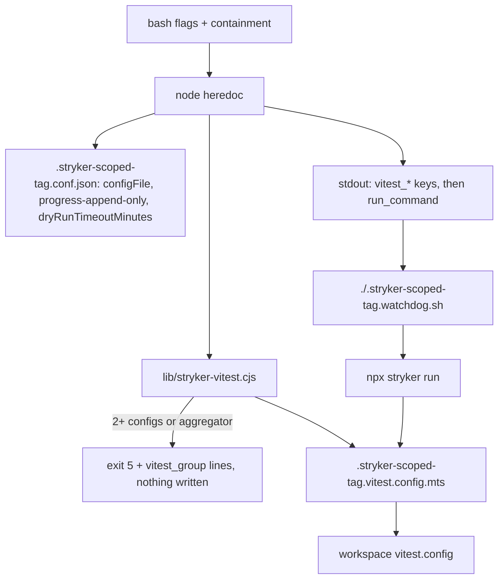

# Implementation Plan: RD-121 — Stryker scoper resolves the workspace Vitest config, names its covering tests, and aborts on no progress

**Spec:** inline — no spec (authority: `~/.local/state/backlog-agents/decisions/RD-121.json`, field `decision` + `acceptance`)
**spec_id:** none
**planning_mode:** inline
**source_of_truth:** inline brief (RD-121 owner decision)
**plan_revision:** 5
**status:** Approved
**Created:** 2026-10-10
**Tasks:** 9
**Estimated complexity:** 4 complex, 5 standard (Task 9 is docs-only)

## Code evidence that overrides the decision text

1. **Generated Vitest config location.** The decision says `<temp_dir>/stryker.vitest.config.mts`. Stryker 10.0.0 never
   copies `tempDirName` into its sandbox (`@stryker-mutator/core/dist/src/fs/project-reader.js`: `ignoreRules = [...ALWAYS_IGNORE,
   tempDirName, …]`), and the vitest runner passes `vitest.configFile` raw to `createVitest` with cwd = sandbox. Farm spike with
   real Stryker 10.0.0 + vitest 4.1.11: the `<temp_dir>` location fails at startup — `Cannot resolve entry module
   .stryker-tmp-x/stryker.vitest.config.mts` (run `1791576862-1857612-2864`); a repo-tree location
   `<repo>/.stryker-scoped-<tag>.vitest.config.mts` importing the workspace config RELATIVELY killed 5/5 mutants with only the
   co-located test run and an unrelated throwing test excluded (run `1791576764-1831848-21513`). → generate it in the repo tree.
2. **`mergeConfig`.** vite's `mergeConfig` concatenates arrays, so `mergeConfig(base, {test:{include}})` would ADD the covering
   tests to the workspace include instead of replacing it. → object spread `{...b, root, test: {...b.test, root, dir, include}}`
   (the same shape rdesigner's hand-made `apps/designer/vitest.part-worth.config.ts` uses).
3. **`progress-append-only` heartbeats.** Stryker 10's `ProgressAppendOnlyReporter` prints a line every 10 s from plan-ready
   to report-ready even when no mutant finished (`Mutation testing N% (elapsed: …, remaining: …) T/M tested (S survived, X timed
   out)`). "No new output" therefore never happens during mutation. → a heartbeat line counts as progress only when its
   `T/M tested (…)` part changes; every other line counts.
4. **Watchdog location on the farm.** `rt` syncs `git ls-files` of the repo, not `$HOME`, so a `run_command` naming the
   watchdog in the plugin cache does not exist on the farm. → the scoper copies the watchdog into the repo
   (`.stryker-scoped-<tag>.watchdog.sh`) and `run_command` calls it repo-relatively. rt syncs
   `git ls-files --cached --others --exclude-standard`, so this holds only while the target repo does not gitignore
   `.stryker-scoped-*` (rdesigner ignores only `.stryker-tmp*`); the same limit already applies to the existing `.conf.json`.
5. **Exit 5 for an aggregator.** The decision defines exit 5 for "2 or more different configs" and separately says a root
   `test.projects` config must never be chosen for a one-workspace scope. When the ONLY config a scope resolves to is such an
   aggregator there is no honest config to pick, so the scoper refuses with the same exit 5 and a `--vitest-config` hint
   (groups keyed by the nearest `package.json` workspace dir). Groups print once per workspace:
   `vitest_group=<config> -> <file>,<file>`.

6. **rdesigner timing acceptance.** "Initial run < 60 s on the farm" needs a Stryker run inside rdesigner, which this run may
   not modify (no writes to other repos/worktrees; the scoper writes its config into the target repo). This branch proves the
   resolution half read-only (Task 4 proof R1: the library resolves `apps/designer/vitest.config.ts` / `apps/designer` for a
   designer file of a local rdesigner checkout, and refuses the root aggregator); the timing half is verified in rdesigner when
   RD-121 is closed after the zuvo release (the decision's own last acceptance item).

7. **An aggregator passed with `--vitest-config` is refused (exit 2), not warned about.** Found in Task 2 review: a
   `test.projects` config runs every project and no include can narrow it, so "warn and run" would silently be the
   RD-121 defect again. **Include escaping** is backslash-style (`\[id\]`), not `[c]` classes: checked against real
   picomatch/tinyglobby (Vitest's matchers), where the class form globbed nothing.

## Architecture Summary

- `scripts/stryker-scoped-config.sh` — bash arg layer (flags, containment), then ONE node heredoc (scope → Stryker JSON →
  KEY=VALUE contract), then a `case` wrapper that whitelists exit codes. Today the vitest branch (lines 504-507) checks only
  repo-root candidates — the RD-121 defect.
- NEW `scripts/lib/stryker-vitest.cjs` — pure functions required by the heredoc (path passed as argv): `findNearestConfig`,
  `hasProjects`, `parseTestInclude`, `colocatedTests`, `resolveVitest` (grouping + include source), `renderVitestConfig`.
  ~200 lines: one cohesive module of six small pure functions (each ≤ 30 lines) rather than a single helper, so the 100-line
  helper limit is applied per function; the scoper heredoc gets SHORTER (lines 504-507 replaced by one call).
  `install_runner_lib` (`scripts/install.d/copy.sh:210`) already ships every `scripts/lib/*` file to every target; no collision
  with `hooks/lib/*`.
- NEW `scripts/stryker-run-watchdog.sh` — `--idle-timeout <s> -- <cmd…>`: own process group, progress-aware idle detection,
  exit-code pass-through, 124 on idle.
- Generated per run (tag = sha1(scope)+pid): `.stryker-scoped-<tag>.conf.json` (existing), `.stryker-scoped-<tag>.vitest.config.mts`,
  `.stryker-scoped-<tag>.watchdog.sh` — all already excluded from mutation by `whyNotMutable` (`.stryker-scoped-` prefix).

## Technical Decisions

- **Resolution:** per scoped file walk up from its dir to `--repo` (never above); first dir holding
  `vitest.config.{ts,mts,cts,js,mjs}` (preferred) or `vite.config.{ts,mts,js,mjs}`. One distinct config → use it. ≥2 → exit 5.
  A resolved config that is a multi-project aggregator (`projects:` inside its `test` object, or a sibling
  `vitest.workspace.{ts,mts,js,json}`) → exit 5 (groups keyed by the nearest `package.json` dir) with a `--vitest-config` hint.
  No config anywhere → `vitest_config=none`, `vitest_root=.`, empty base.
- **Exit codes:** 1 = `--vitest-config` path does not exist (bash, before node); 2 = usage (incl. vitest-only flags with another
  runner, explicit test outside `vitest_root`, lib missing); 3 = missing/out-of-repo file or test file; 5 = Vitest config
  ambiguous (one `vitest_group=<config> -> <file>,<file>` line per workspace on stdout). Wrapper `case` passes `0|2|3|4|5`; a node crash (1) stays 2.
- **Covering tests:** explicit `--test-file`/`--tests-from` (same parsing/containment as `--file`/`--files-from`, travel to node
  as ONE newline-joined argv entry) → `explicit`; else, when EVERY scoped file has ≥1 co-located test (`foo.test.*`,
  `foo.spec.*`, `__tests__/foo.*`, filtered by the workspace `test.include` when it parses) → `colocated`; else
  `workspace-include` + stderr `WARNING covering_tests=workspace-include` naming the files without co-located tests. Include
  globs are `vitest_root`-relative and glob-escaped (`escapeGlob`).
- **Printed include in workspace-include mode:** the `.mts` does not override include; the printed globs come from a depth-aware
  static parse of `test.include` (never `coverage.include`); unparseable → `vitest_include_count=unknown` + one
  `vitest_include=<inherited from CONFIG>` line; no config → vitest default `**/*.{test,spec}.?(c|m)[jt]s?(x)`.
- **`.mts` template:** plain JS (no TS annotations); relative `import base from './<cfg>'` (no import at all when
  `vitest_config=none`: base `{}`); `root` from
  `new URL('./<root>/', import.meta.url)`; base may be object/promise/function(env); spread, never `mergeConfig`.
- **Stryker config:** `vitest: {configFile: '<relative .mts>'}` (`related` left default); `reporters` gains
  `progress-append-only`; `dryRunTimeoutMinutes` from `--dry-run-timeout-min` (default 5).
- **Watchdog:** `setsid` (fallback `perl -e 'setpgrp(0,0); exec @ARGV'`; neither → 125, child never started); combined output
  through a FIFO in a `mktemp -d` dir; process group verified by polling `ps -o pgid=` for ≤ 1 s (setsid/setpgrp may not
  have run yet); 1 s read slices with a deadline clock; heartbeat rule (evidence 3) keyed on the counter, not the percent
  (`Math.floor(ticks/total*100)` prints `NaN%` when every covering test takes 0 ms); idle → TERM the group,
  KILL after 10 s (no test override: the test pins the real 10 s grace), exit 124, stderr
  `ERROR: stryker made no progress for <s>s (last: <line>)`; child exited but pipe held by an orphan → kill group, return the
  child's code; INT/TERM to the watchdog → kill group, exit 128+n; usage errors 125; `--help` exit 0 with `Usage:`.
- **run_command:** `(cd <repo> && bash ./.stryker-scoped-<tag>.watchdog.sh --idle-timeout <N> -- npx stryker run <out>)`;
  scoper flag `--no-progress-timeout <s>` (default 600, ≥1); warn when it is ≤ dry-run minutes × 60.

## Quality Strategy

Plain-bash harness (`tests/gates/test-*.sh`, PASS/FAIL/SKIP lines) like `tests/gates/test-stryker-diff-scope.sh`; every test names
the defect it catches (`~/.claude/rules/test-scope.md`). Lib logic is table-tested through `node -e require(...)`. Watchdog tests use
a 2 s idle timeout, `sleep 30` children (leaks expire), PID files + `ps -p` liveness, and `timeout -s KILL 40` around every
invocation so 137 ≠ 124. All runs on the farm: `TF_HOST=waw-tf rt --light bash tests/gates/<file>.sh`. The real-Stryker e2e is a
proof script (`tests/gates/smoke-stryker-vitest-e2e.sh`, not matched by run-all's `test-*.sh` glob) because it needs npm network.
CQ gates in play: CQ3 (containment for new paths), CQ8 (bounded waits), CQ14 (no duplicated containment loop), CQ22 (no orphan
process/FIFO/temp file on any exit path).

## Coverage Matrix

| Row ID | Authority item | Type | Primary task(s) | Notes |
|--------|----------------|------|-----------------|-------|
| D1 | Nearest vitest/vite config per scoped file; same config → used | requirement | Task 2, Task 4 | |
| D2 | ≥2 configs → exit 5, groups config→files, no config written | requirement | Task 4 | |
| D3 | Root config only when no nearer one; root `test.projects` never chosen for a one-workspace scope | requirement | Task 2, Task 4 | |
| D4 | `--vitest-config` override; missing path → exit 1 with a clear message | requirement | Task 3, Task 4 | |
| D5 | Generated config: workspace config + test.root + test.include (replace, not merge); `vitest.configFile` points at it; `related` default | requirement | Task 2, Task 5 | location per evidence 1 |
| D6 | Covering tests: explicit `--test-file`/`--tests-from` → co-located → workspace include + warning | requirement | Task 2, Task 3, Task 4 | |
| D7 | stdout `vitest_config/root/include_source/include_count/include` before `run_command`; mirrored on stderr | requirement | Task 4 | |
| D8 | Watchdog: own process group, idle kill TERM→KILL 10 s, exit 124 + ERROR line, normal exit passes through, no hang | requirement | Task 1 | heartbeat rule per evidence 3 |
| D9 | `run_command` calls the watchdog; `--no-progress-timeout` (default 600); `progress-append-only` reporter; `dryRunTimeoutMinutes` via `--dry-run-timeout-min` (default 5) | requirement | Task 6 | |
| D10 | SKILL.md documents flags, exit 5, watchdog 124 | deliverable | Task 9 | |
| D11 | Tests cover nearest config, override, exit 5, include printing, watchdog abort + pass-through | deliverable | Task 1, Task 4 | |
| C1 | Helpers travel with the scoper (Codex install + activation test) | constraint | Task 8 | |
| C2 | Real Stryker run uses the generated config inside the sandbox (mutants killed, unrelated tests excluded) | constraint | Task 7 | |
| C3 | No install.sh/release/dev-push; tests on the farm via rt | constraint | Task 9 (proof), all (process) | the proof shows the entry points are unmodified; every proof artifact records its rt run id |
| R2 | rdesigner: mark the 4 backlog items forwarded/closed after the zuvo release; no rdesigner source change | acceptance (decision) | none — out of scope | done in rdesigner after release (deviation 6) |
| R1 | rdesigner designer-only scope → `vitest_config=apps/designer/vitest.config.ts`, `vitest_root=apps/designer`; initial run < 60 s on the farm | acceptance (decision) | Task 4 (resolution, read-only) | deviation 6: timing is proven in rdesigner after release |

## Review Trail
- Phase 1: Architect → Tech Lead → QA Engineer dispatched sequentially (Opus, read-only); farm spikes recorded under evidence 1.
- Plan reviewer (rev-1 numbering in this entry): revision 1 → ISSUES FOUND (0 critical, 3 warning, 5 info): NaN% heartbeat regex; Task 6 proof not
  exit-status; resolveVitest tested at two levels; aggregator exit 5 + group format undeclared; evidence 4 gitignore limit;
  Task 7 degraded outcome; lib size; pgid race → all fixed in revision 2.
- Plan reviewer: revision 3 → ISSUES FOUND (0 critical, 3 warning, 4 info): stale Task 3 reference; decision acceptance
  item 1 (rdesigner) not in the matrix; C3 proof passes when git diff fails; header count; implicit deps; Review Trail
  wording; `\S` not portable → all fixed in revision 4 (deviation 6 + R1 row, pipefail-free C3 proof, deps listed, `[^ ]+`).
- Cross-model validation (rev-3 numbering in this entry; revision 2 text; cursor-agent, codex-5.3, openrouter-alt, openrouter-3, qwen; 0 timeouts): 2 CRITICAL
  (real-Stryker proof scheduled last / degradable) → fixed: smoke moved to Task 6 right after the scoper, Failure halt, spikes
  cited; WARNINGs fixed in revision 3: Task 3 split into inputs (3) + resolution (4); C3 proof added (Task 8); idle≤dry-run
  WARNING row; unparseable-include + no-config default-glob rows; SKIP lines no longer count as green; installed scoper run
  end-to-end in Task 7; leftover `.stryker-scoped-*` artifacts documented (Task 8). Rejected: exit 4 "undefined" (it is the
  existing diff-failure code, now stated); non-Codex install gap (Claude cache copies scripts/*.sh + scripts/lib/*, other
  builds never shipped the scoper); Tasks 3/4 same-file collision (serialized by Dependencies); retro-friction coupling (run as
  the scoper's existing consumer, deliberately); parseTestInclude spike (rdesigner-shaped fixture is in Task 2 RED). INFO ignored.
- Cross-model validation, pass 2 (revision 3 text; openrouter-alt, openrouter-4, byteplus-3, claude, qwen; 0 timeouts;
  cursor-agent excluded for rotation): 2 CRITICAL "smoke scheduled late" → rejected: the mechanism was de-risked BEFORE planning
  by two farm spikes (evidence 1), and the smoke needs the finished scoper, so it runs directly after it (Task 7). Fixed in
  revision 5: Task 4 split (resolution/keys = 4, generated config = 5); smoke complex/deep tier; base-less no-config template +
  RED row; SKIP never green in Tasks 1/2/7; generous watchdog timing; WARNINGs for idle ≤ mutant timeout and for a gitignored
  `.stryker-scoped-*`; SMOKE1 dropped from the AC list; C3 wording. Rejected: artifact cleanup on task failure (existing
  scoper behaviour, documented in Task 9); "verification theater" (each harness asserts named rows; exit status is the
  verdict); hidden watchdog ordering (Task 6 already depends on Task 1); stale Task 3 reference (already fixed in revision 4).
- Plan reviewer: revision 5 → 1 warning (Review Trail numbering) + 1 info (R2 row) → both applied; APPROVED with those edits
  (final iteration, 3 of 3).
- Status gate: Approved — the caller of this background run (RD-121 backlog agent) instructed plan → execute with no pause
  for approval; recorded as caller authorization, not user confirmation.

## Task Breakdown

### Task 1: No-progress watchdog
**Files:** `scripts/stryker-run-watchdog.sh` (new), `tests/gates/test-stryker-run-watchdog.sh` (new)
**Surface:** backend-logic
**Complexity:** complex
**Dependencies:** none
**Failure:** halt
**Execution routing:** deep implementation tier

- [ ] RED: `tests/gates/test-stryker-run-watchdog.sh` — fails today (script missing). Cases, each naming its defect:
  pass-through table (`exit 0`→0, `printf no-eol; exit 7`→7 with output forwarded incl. the unterminated line — swallowed codes /
  lost output); lingering grandchild (`sleep 30 & echo done; exit 0` → 0 in ≤ 10 s, far under the 30 s sleep — waiting for an EOF an orphan holds);
  idle abort over {setsid, perl fallback via `tests/lib/hermetic-tools.sh`} (prints once then sleeps → 124, 2 ≤ elapsed ≤ 17 s,
  stderr `ERROR: stryker made no progress for 2s (last: first)`, child AND grandchild dead); TERM-ignoring child with
  the default 10 s grace → killed, 124; progress table (identical-count heartbeat lines with changing elapsed → 124 — the
  rdesigner hang; identical-count `NaN%` heartbeats → 124; changing `T/M tested` → 0; plain line every 1 s for 4 s → 0); usage table → 125 (no `--`, non-integer, `0`,
  missing value); neither setsid nor perl → 125 and the child never ran; TERM sent to the watchdog → group dies.
- [ ] GREEN: bash script with a `#`-comment header whose help (awk, as in the scoper) starts `Usage:`; `need_val` parsing; spawn
  `cmd >fifo 2>&1 </dev/null &` under setsid/perl, poll ≤ 1 s until `ps -o pgid= -p $pid` = pid (else 125); reader with `read -r -t 1` slices,
  line buffer, deadline from `SECONDS`; heartbeat regex `^Mutation testing [^ ]+ \(elapsed: .*\) ([0-9]+/[0-9]+ tested \(.*\))$`;
  `kill_group` (TERM, poll ≤ grace, KILL); traps EXIT (FIFO dir cleanup) and INT/TERM (kill group, 128+n).
- [ ] Verify: `TF_HOST=waw-tf rt --light bash tests/gates/test-stryker-run-watchdog.sh`
  Expected: exit 0, no `FAIL:` and no `SKIP:` line, final `ALL PASSED`.
- [ ] Acceptance Proof:
  - AC: D8 / D11 (watchdog abort + pass-through)
    - Surface: backend-logic
    - Proof: the Verify command (the idle-abort and pass-through rows) on the farm
    - Expected: exit 0; the idle row prints `PASS` with elapsed ≤ idle+15 s and no surviving PID
    - Artifact: `zuvo/proofs/task-1-watchdog.txt`
- [ ] Commit: `stryker-run-watchdog: abort a Stryker run whose mutant count stops moving, kill its whole process group, pass a normal exit code through`

### Task 2: Vitest resolution library
**Files:** `scripts/lib/stryker-vitest.cjs` (new), `tests/gates/test-stryker-vitest-scope.sh` (new — lib section)
**Surface:** backend-logic
**Complexity:** complex
**Dependencies:** none
**Failure:** halt
**Execution routing:** deep implementation tier

- [ ] RED: lib tables via `node -e 'require(lib)…'` (fails: module missing): `findNearestConfig` (nearest wins over root; vitest.*
  beats vite.* in one dir; stops at repo); `hasProjects` (`test.projects` → true; a `projects` word in a comment or outside `test`
  → false; sibling `vitest.workspace.ts` → true); `parseTestInclude` (rdesigner-shaped config with `coverage.include` returns the
  `test.include` globs; non-literal / absent → null); `colocatedTests` (`foo.test.ts`, `foo.spec.tsx`, `__tests__/foo.ts`,
  `__tests__/foo.test.ts` match; `foobar.test.ts` and another dir's `foo.test.ts` do not); `renderVitestConfig`
  evaluated with plain node against `.mjs` bases exported as object / promise / function(env), then the fixture relocated and
  evaluated again (include replaced not concatenated; other base keys kept; `test.root` follows the relocated copy).
  `resolveVitest`'s grouping / include-source decisions are tested ONLY at the scoper level (Task 4) — one level per behaviour.
- [ ] GREEN: the six pure functions above (CommonJS, no deps), ≤ ~220 lines; template per Technical Decisions (≤ 20 lines).
- [ ] Verify: `TF_HOST=waw-tf rt --light bash tests/gates/test-stryker-vitest-scope.sh`
  Expected: exit 0, no `FAIL:` and no `SKIP:` line.
- [ ] Acceptance Proof:
  - AC: D1 / D3 / D5 / D6 (library level)
    - Surface: backend-logic
    - Proof: the Verify command; the relocation row proves the sandbox-portable root
    - Expected: exit 0
    - Artifact: `zuvo/proofs/task-2-vitest-lib.txt`
- [ ] Commit: `stryker-vitest lib: resolve the nearest workspace Vitest config and render a config whose include replaces the workspace one`

### Task 3: Scoper accepts explicit covering tests and a config override (inputs only)
**Files:** `scripts/stryker-scoped-config.sh`, `tests/gates/test-stryker-vitest-scope.sh`, `tests/gates/test-stryker-diff-scope.sh`
**Surface:** backend-logic
**Complexity:** standard
**Dependencies:** Task 2
**Failure:** halt
**Execution routing:** default implementation tier

- [ ] RED: input-validation table in `test-stryker-vitest-scope.sh` (scoper section), each row also asserting that no
  `.stryker-scoped-*` file was written: `--vitest-config` path that does not exist → exit 1 with a message naming the path;
  `--test-file`/`--vitest-config` with `--runner jest` → 2 (a flag silently ignored); missing `--test-file` → 3; `../` traversal
  in `--test-file` and in `--tests-from` → 3 (containment bypass); `--tests-from` whose last line has no newline keeps it (N-1
  scope). In `test-stryker-diff-scope.sh` widen the "no config written" glob from `*.conf.json` to `.stryker-scoped-*`.
- [ ] GREEN: behaviour-preserving extraction of the containment loop (lines 157-171) into `resolve_in_repo` reused for both
  lists (the existing diff-scope and retro-friction gates stay green unchanged); flags `--vitest-config`, `--test-file`,
  `--tests-from` (reuse the files-from read loop); `SELF_DIR`; the test list travels to node as ONE newline-joined argv entry
  (newline in a path rejected). No resolution behaviour yet.
- [ ] Verify: `TF_HOST=waw-tf rt --light bash -c 'bash tests/gates/test-stryker-vitest-scope.sh && bash tests/gates/test-stryker-diff-scope.sh && bash tests/gates/test-retro-friction-helpers.sh'`
  Expected: exit 0; no `FAIL:` and no `SKIP:` line in any of the three (retro-friction is run as the existing consumer of the
  scoper's containment rule, not edited).
- [ ] Acceptance Proof:
  - AC: D4 (missing override path → exit 1) / D6 (explicit flags accepted and contained)
    - Surface: backend-logic
    - Proof: the Verify command
    - Expected: exit 0
    - Artifact: `zuvo/proofs/task-3-scoper-inputs.txt`
- [ ] Commit: `stryker-scoped-config: accept explicit covering tests and a Vitest config override, contained like --file`

### Task 4: Scoper resolves the workspace config, refuses an ambiguous one, and prints the covering tests
**Files:** `scripts/stryker-scoped-config.sh`, `tests/gates/test-stryker-vitest-scope.sh`
**Surface:** backend-logic
**Complexity:** complex
**Dependencies:** Task 2, Task 3
**Failure:** halt
**Execution routing:** deep implementation tier

- [ ] RED: scoper cases on a non-git monorepo fixture (`--whole-files --file`; root `vitest.config.ts` with `test.projects`,
  `apps/a/vitest.config.ts`, `packages/b/vite.config.mts`): nearest config (`vitest_config=apps/a/vitest.config.ts`,
  `vitest_root=apps/a` — the RD-121 defect); all `vitest_*` keys precede `run_command` and the stderr summary mirrors them;
  co-located → `colocated`, count 1, the one test; explicit `--test-file` → `explicit`; explicit test outside `vitest_root` → 2;
  one scoped file without a test → `workspace-include`, `WARNING covering_tests=workspace-include`, the `test.include` globs
  printed (not `coverage.include`); non-literal include → `vitest_include_count=unknown` + exactly one
  `vitest_include=<inherited from …>` line; two workspaces → exit 5, exactly two `vitest_group=<config> -> <files>` lines,
  nothing written; aggregator table (nearest is the root `test.projects` config; root with only `vitest.workspace.ts`) → 5;
  `--vitest-config` wins over the nearest; no config at all → `vitest_config=none`, `vitest_root=.`,
  `vitest_include=**/*.{test,spec}.?(c|m)[jt]s?(x)`, exit 0; scoper copied alone without `lib/` → exit 2 naming the lib;
  `--vitest-config` naming an aggregator → exit 2 (deviation 7); a `__tests__/foo.ts` helper the workspace's default include
  would never collect is NOT made a covering test (Vitest fails the initial run with "No test suite found").
- [ ] GREEN: replace lines 504-507 with a `resolveVitest` call placed before ANY write; kv keys before `run_command`; stderr
  summary fields; wrapper `case` passes `0|2|3|4|5` (4 = cannot compute the diff, existing); header and help (exit codes, keys).
- [ ] Verify: `TF_HOST=waw-tf rt --light bash -c 'bash tests/gates/test-stryker-vitest-scope.sh && bash tests/gates/test-stryker-diff-scope.sh && bash tests/gates/test-retro-friction-helpers.sh'`
  Expected: exit 0; no `FAIL:` and no `SKIP:` line.
- [ ] Acceptance Proof:
  - AC: D1 / D2 / D3 / D4 (override wins) / D6 / D7 / D11
    - Surface: backend-logic
    - Proof: the Verify command
    - Expected: exit 0; nearest-config, exit-5 and include-printing rows PASS
    - Artifact: `zuvo/proofs/task-4-scoper-vitest.txt`
  - AC: R1 (resolution half, read-only against a local rdesigner checkout, no writes there)
    - Surface: backend-logic
    - Proof: `node -e 'const v=require("./scripts/lib/stryker-vitest.cjs");const r="/Users/greglas/DEV/tgm-survey-platform";const c=v.findNearestConfig(r,"apps/designer/src/App.tsx");if(c!=="apps/designer/vitest.config.ts"||v.hasProjects(r,c)||!v.hasProjects(r,"vitest.config.ts"))process.exit(1)'` (run locally: the checkout is not on the farm)
    - Expected: exit 0
    - Artifact: `zuvo/proofs/task-4-rdesigner-resolution.txt`
- [ ] Commit: `stryker-scoped-config: resolve the scoped files' own Vitest workspace config, refuse an ambiguous one (exit 5), and print the covering tests before the run`

### Task 5: Scoper writes the narrowed Vitest config and points Stryker at it
**Files:** `scripts/stryker-scoped-config.sh`, `tests/gates/test-stryker-vitest-scope.sh`
**Surface:** backend-logic
**Complexity:** standard
**Dependencies:** Task 2, Task 4
**Failure:** halt
**Execution routing:** default implementation tier

- [ ] RED: `vitest.configFile` in the Stryker JSON is the relative `.stryker-scoped-<tag>.vitest.config.mts` and that file exists
  (Stryker would otherwise load the root aggregator — the RD-121 defect); its include equals the printed co-located test
  (printed ≠ run); workspace-include mode leaves include untouched; no-config mode renders a base-less config (no import) that
  plain node evaluates to `root`/`test.root` = the repo; two runs over the same scope get distinct `.mts` paths (concurrent runs
  overwriting each other's include).
- [ ] GREEN: write `renderVitestConfig(...)` output to `<repo>/.stryker-scoped-<tag>.vitest.config.mts` after resolution and
  before the JSON; `cfg.vitest = { configFile }` (no `related` key).
- [ ] Verify: `TF_HOST=waw-tf rt --light bash -c 'bash tests/gates/test-stryker-vitest-scope.sh && bash tests/gates/test-stryker-diff-scope.sh && bash tests/gates/test-retro-friction-helpers.sh'`
  Expected: exit 0; no `FAIL:` and no `SKIP:` line.
- [ ] Acceptance Proof:
  - AC: D5
    - Surface: backend-logic
    - Proof: the Verify command
    - Expected: exit 0
    - Artifact: `zuvo/proofs/task-5-generated-config.txt`
- [ ] Commit: `stryker-scoped-config: write the narrowed Vitest config into the repo and point Stryker's vitest.configFile at it`

### Task 6: Scoper wires the watchdog and the dry-run limit into the run
**Files:** `scripts/stryker-scoped-config.sh`, `tests/gates/test-stryker-vitest-scope.sh`
**Surface:** backend-logic
**Complexity:** standard
**Dependencies:** Task 1, Task 5
**Failure:** halt
**Execution routing:** default implementation tier

- [ ] RED: `run_command` is `(cd <repo> && bash ./.stryker-scoped-<tag>.watchdog.sh --idle-timeout 600 -- npx stryker run …)`
  and that copy is byte-identical to `scripts/stryker-run-watchdog.sh` (a path rt never syncs / a stale copy);
  `--no-progress-timeout 120` → 120; `--no-progress-timeout 0` → exit 2; JSON has `progress-append-only` in `reporters` and
  `dryRunTimeoutMinutes` 5 by default, 2 with `--dry-run-timeout-min 2`; `--dry-run-timeout-min 5 --no-progress-timeout 200` →
  stderr WARNING that the idle limit is shorter than the silent initial run; `--no-progress-timeout 30` with the default
  `--timeout-ms 60000` → WARNING that one slow mutant can exceed the idle limit (a false 124); `.stryker-scoped-*` ignored by the
  fixture repo's `.gitignore` → WARNING that rt will not sync the run files; watchdog source missing → exit 2, nothing written.
- [ ] GREEN: flags `--no-progress-timeout`, `--dry-run-timeout-min` (integers ≥1); copy the watchdog beside the config;
  reporter + `dryRunTimeoutMinutes` in `cfg`; new `run_command`; the three WARNINGs (`git check-ignore` for the last); header/help.
- [ ] Verify: `TF_HOST=waw-tf rt --light bash -c 'bash tests/gates/test-stryker-vitest-scope.sh && bash tests/gates/test-stryker-diff-scope.sh && bash tests/gates/test-retro-friction-helpers.sh'`
  Expected: exit 0; no `FAIL:` and no `SKIP:` line.
- [ ] Acceptance Proof:
  - AC: D9
    - Surface: backend-logic
    - Proof: the Verify command
    - Expected: exit 0
    - Artifact: `zuvo/proofs/task-6-run-command.txt`
- [ ] Commit: `stryker-scoped-config: run Stryker under the no-progress watchdog and make the initial-run limit explicit`

### Task 7: Real-Stryker smoke proof (runs right after the scoper is complete)
**Files:** `tests/gates/smoke-stryker-vitest-e2e.sh` (new)
**Surface:** integration
**Complexity:** complex
**Dependencies:** Task 1, Task 4, Task 5, Task 6
**Failure:** halt
**Execution routing:** deep implementation tier

- [ ] RED: the smoke builds a git monorepo fixture (root aggregator config, `ws/vitest.config.ts` with a `__dirname` alias and
  `coverage.include`, `ws/src/foo.ts` changed on a branch, co-located `foo.test.ts`, an unrelated `other.test.ts` that throws),
  installs `@stryker-mutator/core@10.0.0`, `@stryker-mutator/vitest-runner@10.0.0`, `vitest@4.1.11`, runs the scoper and then its
  `run_command` verbatim; asserts `vitest_root=ws`, `vitest_include_source=colocated`, exit 0, killed ≥ 1, survived 0, and the
  throwing test never ran. Run against the pre-change scoper (origin/main) it fails (root aggregator chosen). npm install
  failure → `SMOKE NOT RUN` + exit 2 (never 0). Not matched by run-all's `test-*.sh` glob (network).
- [ ] GREEN: test-only task (no production code). The mechanism was de-risked before planning by farm spikes
  `1791576764-1831848-21513` (repo-tree config: 5/5 killed) and `1791576862-1857612-2864` (`<temp_dir>` config: fails).
- [ ] Verify: `TF_HOST=waw-tf rt --light bash tests/gates/smoke-stryker-vitest-e2e.sh`
  Expected: exit 0, `SMOKE PASS`, no `SMOKE NOT RUN`.
- [ ] Acceptance Proof:
  - AC: C2
    - Surface: integration
    - Proof: the Verify command
    - Expected: exit 0
    - Artifact: `zuvo/proofs/smoke-stryker-vitest-e2e.txt`
- [ ] Commit: `smoke: prove the scoper's generated Vitest config runs inside Stryker's sandbox and kills mutants`

### Task 8: Codex install ships the watchdog, and the installed scoper works
**Files:** `scripts/install.d/codex.sh`, `tests/hooks/bootstrap-activation-cases.py`
**Surface:** config
**Complexity:** standard
**Dependencies:** Task 1, Task 2, Task 4, Task 6
**Failure:** halt
**Execution routing:** default implementation tier

- [ ] RED: `bootstrap-activation-cases.py` asserts `stryker-run-watchdog.sh` is installed byte-identical in `~/.codex/scripts`
  and answers `--help` with `Usage:`, AND runs the INSTALLED scoper (`~/.codex/scripts/stryker-scoped-config.sh --runner vitest
  --whole-files --file …`) on a fixture, asserting `vitest_config=` and a `run_command` whose watchdog copy exists (fails today:
  the watchdog is not copied, so the installed scoper exits 2). Other targets: the Claude cache copies `scripts/*.sh` and
  `scripts/lib/*` (claude.sh:223/232); Kimi/Antigravity/Cursor builds do not ship the scoper at all (explicit lists) — unchanged.
- [ ] GREEN: add the watchdog to the `install_files_atomic` lines and the `verify_copied` list in `install_codex`.
- [ ] Verify: `TF_HOST=waw-tf rt --light bash -c 'python3 tests/hooks/bootstrap-activation-cases.py && bash tests/hooks/test-install-wiring.sh'`
  Expected: exit 0, `PASS: actual Codex script install delivers executable mutation helpers`, no `FAIL:`.
- [ ] Acceptance Proof:
  - AC: C1
    - Surface: config
    - Proof: the Verify command
    - Expected: exit 0
    - Artifact: `zuvo/proofs/task-8-codex-install.txt`
- [ ] Commit: `codex install: ship the Stryker no-progress watchdog beside the scoper`

### Task 9: mutation-test skill documents the new contract
**Files:** `skills/mutation-test/SKILL.md`
**Surface:** docs
**Complexity:** standard
**Dependencies:** Task 1, Task 4, Task 5, Task 6
**Failure:** halt
**Execution routing:** default implementation tier

- [ ] RED: docs-only — no test; `bash scripts/validate-skills.sh` is the structural check.
- [ ] GREEN: §3.2b lists `--vitest-config`, `--test-file`/`--tests-from`, `--no-progress-timeout`, `--dry-run-timeout-min`, the
  `vitest_*` keys (copy them into the report), exit 5 (run one campaign per `vitest_group` workspace), watchdog exit 124 (a
  no-progress abort, never a pass) and 125, that the run goes through `run_command`, and that the `.stryker-scoped-<tag>.*`
  files it leaves in the repo (config, generated Vitest config, watchdog copy, report) are run artifacts the caller removes after
  reading the report.
- [ ] Verify: `TF_HOST=waw-tf rt --light bash scripts/validate-skills.sh`
  Expected: exit 0.
- [ ] Acceptance Proof:
  - AC: D10
    - Surface: docs
    - Proof: Verify command + `F=skills/mutation-test/SKILL.md; grep -qF -- --vitest-config "$F" && grep -qF -- --test-file "$F" && grep -qF -- --tests-from "$F" && grep -qF -- --no-progress-timeout "$F" && grep -qF -- --dry-run-timeout-min "$F" && grep -qE 'exit(s)? 5' "$F" && grep -qE 'exit(s)? 124' "$F"`
    - Expected: exit 0
    - Artifact: `zuvo/proofs/task-9-docs.txt`
  - AC: C3
    - Surface: config
    - Proof (locally — the farm mirror has no .git): `T=$(mktemp) && git diff --name-only origin/main...HEAD >"$T" && ! grep -qE '^scripts/(install|release|dev-push)\.sh$' "$T"`
    - Expected: exit 0 (the branch never touched the release/install entry points)
    - Artifact: `zuvo/proofs/task-9-c3.txt`
- [ ] Commit: `mutation-test: document the workspace Vitest resolution, exit 5 and the no-progress watchdog`

## Whole-feature Smoke Proofs

- **SMOKE1 — scoped native Vitest campaign in a monorepo**
  - Preconditions: farm host with npm registry access
  - Proof: `TF_HOST=waw-tf rt --light bash tests/gates/smoke-stryker-vitest-e2e.sh`
  - Expected: scoper picks the workspace config, run_command (through the watchdog) exits 0, mutants killed, unrelated test excluded
  - Artifact: `zuvo/proofs/smoke-stryker-vitest-e2e.txt`
