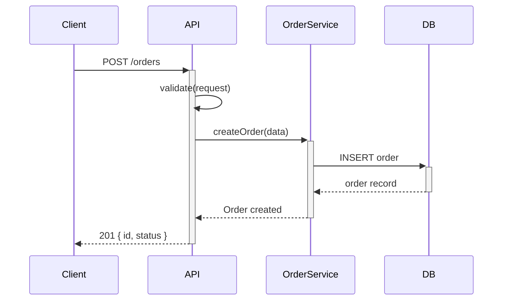
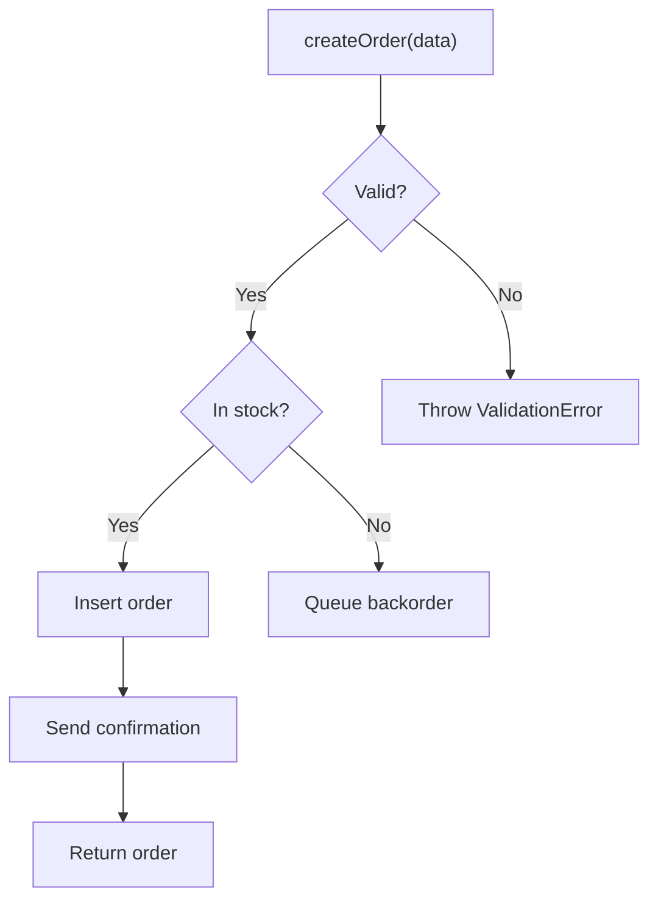
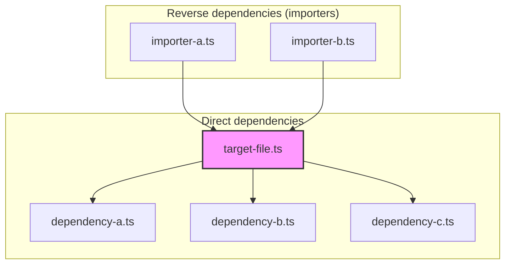
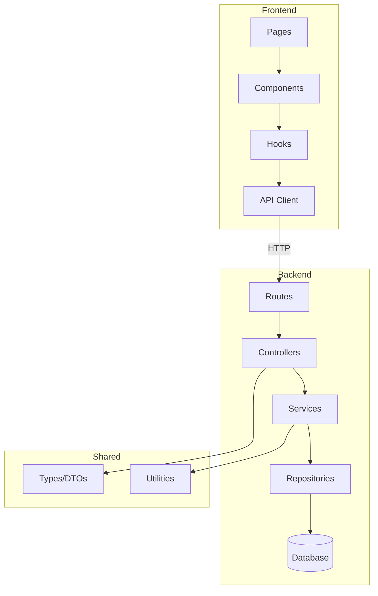
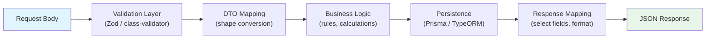

# zuvo:explain — Visual Code Explanation

Generate visual explanations of how code works through Mermaid diagrams and annotated walkthroughs. Produces flow diagrams, dependency graphs, sequence diagrams, and architecture maps that render in GitHub, VS Code, and most markdown viewers.

**Scope:** Explaining how code works through visual diagrams and annotated step-by-step walkthroughs.
**Out of scope:** Auditing code quality (`zuvo:code-audit`), reviewing changes (`zuvo:review`), generating documentation (`zuvo:docs`), architecture decision records (`zuvo:architecture`).

## Argument Parsing

Parse `$ARGUMENTS` for these flags and positional arguments:

| Argument | Effect |
|----------|--------|
| `[file/path or symbol]` | What to explain (file, function, class, module) |
| `flow [function/endpoint]` | Execution flow diagram (sequence diagram or flowchart) |
| `deps [file/module]` | Dependency graph (what imports what, who calls whom) |
| `arch [directory]` | Architecture map (modules, boundaries, data flow) |
| `data [model/entity]` | Data flow diagram (how data moves from input to storage) |
| `--depth [N]` | How many levels deep to trace (default: 2) |
| `--audience [dev/new/manager]` | Detail level: dev=full detail, new=simplified, manager=high-level (default: dev) |
| `--save [path]` | Save explanation to file as .md with embedded Mermaid (default: print to console) |

**Examples:**
- `zuvo:explain flow src/services/order.ts:createOrder`
- `zuvo:explain deps src/utils/auth.ts --depth 3`
- `zuvo:explain arch src/modules/payments --audience manager --save docs/explanations/payments.md`
- `zuvo:explain data User --depth 3 --audience new`

**Defaults when ambiguous:**
- No mode keyword: infer from target. File → `deps`, function → `flow`, directory → `arch`, model/entity → `data`.
- No target: ask the user what to explain.

---

## Environment Compatibility

Read `{plugin_root}/shared/includes/env-compat.md` for agent dispatch patterns, path resolution, and progress tracking across Claude Code, Codex, and Cursor.

---

## CodeSift Integration

Read `{plugin_root}/shared/includes/codesift-setup.md` for the full initialization sequence.

**Key tools for this skill:**

| Mode | Task | CodeSift tool | Fallback |
|------|------|--------------|----------|
| flow | Trace execution path | `trace_call_chain(repo, symbol_name, direction="both", depth=N)` | Read files, grep for function calls |
| flow | Understand function with context | `get_context_bundle(repo, symbol_name)` | Read the entire file |
| deps | Find who imports/uses a file | `find_references(repo, symbol_name)` | Grep for import statements |
| deps | Detect module clusters | `detect_communities(repo)` | Manual directory analysis |
| arch | Directory structure | `get_file_tree(repo, path_prefix, compact=true)` | `ls -R` the directory |
| arch | Module boundaries | `detect_communities(repo)` | Infer from directory layout |
| data | Trace data through layers | `trace_call_chain(repo, model_name, direction="down", depth=N)` | Grep for model references |
| data | Find schema definitions | `search_symbols(repo, query="Schema", kind="variable", include_source=true)` | Grep for type/schema definitions |
| any | Batch lookups | `codebase_retrieval(repo, queries=[...])` | Sequential Read/Grep calls |

---

## Mandatory File Reading

Before starting work, read each file below. Print the checklist with status.

```
CORE FILES LOADED:
  1. {plugin_root}/shared/includes/auto-docs.md      -- READ/MISSING
  2. {plugin_root}/shared/includes/session-memory.md  -- READ/MISSING
```

Where `{plugin_root}` is resolved per `env-compat.md`.

**If any file is missing:** Proceed in degraded mode. Note in output block.

---

## Phase 0: Understand Target

Parse the arguments to determine what needs explaining.

1. **Resolve the target.** Convert the user's input to a concrete code location:
   - File path → verify it exists, read it
   - Symbol name → search for its definition (CodeSift `search_symbols` or grep)
   - Directory → verify it exists, list its contents
   - Model/entity name → find its definition file

2. **Determine the mode.** If not explicitly provided, infer:
   - Target is a function or method → `flow`
   - Target is a file or module → `deps`
   - Target is a directory → `arch`
   - Target is a model, entity, or DTO → `data`

3. **Gather context using CodeSift** (or fallback):

   | Mode | CodeSift approach | Fallback approach |
   |------|-------------------|-------------------|
   | `flow` | `trace_call_chain(repo, symbol, direction="both", depth=N)` + `get_context_bundle(repo, symbol)` | Read the file, grep for calls to and from the function |
   | `deps` | `detect_communities(repo)` + `find_references(repo, symbol)` | Grep for import/require statements referencing the file |
   | `arch` | `get_file_tree(repo, path_prefix)` + `detect_communities(repo)` | `ls -R` the directory, read key files (index, barrel exports) |
   | `data` | `trace_call_chain(repo, model, direction="down", depth=N)` + `search_symbols(repo, "Schema")` | Grep for the model name across the codebase, read each reference |

4. **Set depth.** Use `--depth` value or default to 2. Depth controls how many levels of callers/callees/importers to trace.

Output:
```
TARGET RESOLVED
  Subject:    [resolved path or symbol]
  Mode:       [flow / deps / arch / data]
  Depth:      [N]
  Audience:   [dev / new / manager]
  CodeSift:   [available / fallback mode]
```

---

## Phase 1: Analyze Structure

Map the relationships relevant to the chosen mode.

### For `flow` mode:
1. Identify the entry point (function signature, route handler, event listener)
2. Trace the execution path: caller → target → callees, respecting `--depth`
3. Note decision points: conditionals, error branches, early returns
4. Note async boundaries: await, callbacks, event emissions, queue publishes
5. Note side effects: database writes, API calls, file I/O, logging

### For `deps` mode:
1. List all imports of the target file/module
2. List all files that import the target (reverse dependencies)
3. Group by layer or directory (utils, services, components, etc.)
4. Identify circular dependencies if any
5. Note re-exports and barrel files

### For `arch` mode:
1. Map the directory structure with purpose annotations
2. Identify module boundaries (what talks to what)
3. Trace cross-module dependencies
4. Identify shared utilities and their consumers
5. Note external service integrations (databases, APIs, queues)

### For `data` mode:
1. Find the data definition (model, schema, type, interface)
2. Trace input path: where does data enter the system (API endpoint, CLI, event)?
3. Trace transformation: validation → mapping → business logic → storage
4. Trace output path: how is data returned or emitted?
5. Note serialization boundaries (JSON parse/stringify, DTO mapping)

### Classify Complexity

Based on analysis results:

| Classification | Criteria |
|---------------|----------|
| **SIMPLE** | Linear flow, fewer than 5 nodes, no branching |
| **MEDIUM** | Some branching, 5-15 nodes, 1-2 async boundaries |
| **COMPLEX** | More than 15 nodes, multiple paths, nested async, cross-service |

Output:
```
STRUCTURE ANALYZED
  Nodes:       [N] ([list key nodes])
  Edges:       [N] relationships mapped
  Boundaries:  [async boundaries, module boundaries, service boundaries]
  Complexity:  [SIMPLE / MEDIUM / COMPLEX]
```

---

## Phase 2: Generate Diagrams

Generate Mermaid diagrams based on the mode and complexity.

### `flow` mode — Sequence Diagram or Flowchart

Use a **sequence diagram** when the flow involves multiple actors (services, classes, layers):



Use a **flowchart** when the flow is within a single function with branching:



### `deps` mode — Dependency Graph



### `arch` mode — Architecture Map



### `data` mode — Data Flow Diagram



### Diagram Rules

1. **Keep diagrams readable.** If complexity is COMPLEX (more than 15 nodes), split into sub-diagrams with a top-level overview linking to detail views.
2. **Use real names.** Node labels should be actual file names, function names, or service names from the codebase — not generic placeholders.
3. **Annotate edges.** Show what flows between nodes: data types, HTTP methods, event names.
4. **Highlight the target.** Use Mermaid styling to visually distinguish the explained element.
5. **Validate syntax.** Ensure the Mermaid block is syntactically valid (matching quotes, valid node IDs, proper arrow syntax).

---

## Phase 3: Annotated Walkthrough

Write a step-by-step explanation of the diagram, adapted to the `--audience` level.

### Audience: `dev` (full technical detail)

Each step includes:
- **File and line reference:** `src/services/order.ts:42`
- **What happens:** Technical description of the operation
- **Why it matters:** Design decision or constraint that explains the choice
- **Edge cases:** Error paths, null handling, timeout behavior
- **Key code:** Inline snippet if the logic is non-obvious (max 3 lines)

### Audience: `new` (simplified for newcomers)

Each step includes:
- **What happens:** Plain language, no jargon without explanation
- **Why:** The reasoning behind the design, not just the mechanism
- **Analogy:** Where helpful, relate to familiar concepts

No file references. No code snippets. Explain WHY, not just WHAT.

### Audience: `manager` (business-level overview)

Each step includes:
- **Business action:** What happens from the user's perspective
- **Data flow:** What information moves where (no code references)
- **Impact:** User-facing effects, SLA considerations, failure modes in business terms

No technical details. Focus on business logic and user impact.

---

## Phase 4: Save or Display

### If `--save [path]` is provided:

1. Create the output directory if it does not exist
2. Write the file as Markdown with embedded Mermaid blocks:
   ```markdown
   # [Target Name] — [Mode] Explanation

   > Generated by zuvo:explain on [date]
   > Audience: [dev/new/manager] | Depth: [N]

   ## Diagram

   [Mermaid block]

   ## Walkthrough

   [Annotated steps]

   ## Metadata

   - Complexity: [SIMPLE/MEDIUM/COMPLEX]
   - Nodes: [N]
   - Generated from: [source files read]
   ```
3. Report the file path in the output block

### If no `--save`:

Print the diagram and walkthrough directly to the console.

### Complexity Handling

If complexity is **COMPLEX**:
1. Generate a high-level overview diagram first (top-level modules/services only)
2. Generate detail diagrams for each major section
3. Suggest the user run targeted follow-ups:
   ```
   Suggestion: This is a complex system. For deeper understanding:
     zuvo:explain flow OrderService.createOrder --depth 1
     zuvo:explain flow PaymentService.charge --depth 1
     zuvo:explain data Order --depth 2
   ```

---

## Output Block

```
EXPLANATION COMPLETE
----------------------------------------------------
Target:      [resolved path or symbol name]
Type:        [flow / deps / arch / data] ([diagram type])
Complexity:  [SIMPLE / MEDIUM / COMPLEX] ([N] nodes, [details])
Diagram:     Mermaid [diagram type] ([N] lines)
Walkthrough: [N] steps, audience: [dev / new / manager]
Saved:       [file path | "printed to console"]

Next steps:
  zuvo:explain [other-mode] [related-target]  -- explore related area
  zuvo:docs readme                            -- generate full documentation
  zuvo:architecture                           -- full architecture analysis
----------------------------------------------------
```

---

## Auto-Docs

After printing the EXPLANATION COMPLETE block, update project documentation per `{plugin_root}/shared/includes/auto-docs.md`:

- **project-journal.md**: Log the explanation target, mode, complexity, and audience.
- **architecture.md**: Update if the explanation revealed undocumented module boundaries or data flows.

Use context already gathered during the explanation — do not re-read source files. If auto-docs fails, log a warning and proceed to Session Memory.

---

## Session Memory

After Auto-Docs, update `memory/project-state.md` per `{plugin_root}/shared/includes/session-memory.md`:

- **Recent Activity**: Prepend entry with explanation target, mode, complexity classification.
- **Active Work**: Update current branch if relevant.
- **Tech Stack**: Add new discoveries if explanation revealed undocumented integrations.

If `memory/project-state.md` doesn't exist, create it (full Tech Stack detection + all sections).

---

## Run Log

Append one TSV line to `memory/zuvo-runs.log` per `{plugin_root}/shared/includes/run-logger.md`. All fields are mandatory:

| Field | Value |
|-------|-------|
| DATE | ISO 8601 timestamp |
| SKILL | `explain` |
| PROJECT | Project directory basename (from `pwd`) |
| CQ_SCORE | `-` |
| Q_SCORE | `-` |
| VERDICT | PASS if explanation generated |
| TASKS | Number of diagrams produced |
| DURATION | `-` |
| NOTES | `[mode] target — [complexity]` (max 80 chars) |
