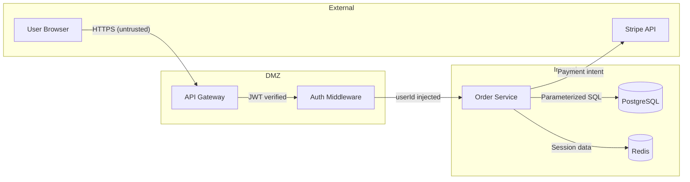

# zuvo:threat-model — STRIDE Threat Modeling

Proactive threat identification from actual code analysis. Not "what IS broken" (`zuvo:pentest`) — but "what COULD be broken." Maps attack surfaces, trust boundaries, and data flows, then systematically evaluates STRIDE threats per component.

**Scope:** Identifying threats, attack vectors, trust boundaries, and data flows. Produces a threat model document with ranked threats and mitigations.
**Out of scope:** Active exploitation testing (`zuvo:pentest`), vulnerability scanning (`zuvo:security-audit`), code review (`zuvo:review`), fixing vulnerabilities (output recommends skills for that).

## Argument Parsing

Parse `$ARGUMENTS`:

| Flag | Effect |
|------|--------|
| _(empty)_ | Model entire project |
| `[path or module]` | Scope to specific directory or module |
| `--focus [auth\|data\|api\|infra]` | Focus on specific threat domain |
| `--depth [quick\|standard\|deep]` | Analysis depth (default: standard) |
| `--output [path]` | Save report (default: `docs/threat-model.md`) |
| `--diagram` | Generate Mermaid data flow diagrams |

## Environment Compatibility

Read `{plugin_root}/shared/includes/env-compat.md` for agent dispatch patterns, path resolution, and progress tracking across Claude Code, Codex, and Cursor.

## CodeSift Integration

Read `{plugin_root}/shared/includes/codesift-setup.md` for the full initialization sequence.

**Threat-model-specific CodeSift usage:**

| Task | CodeSift tool | Fallback |
|------|--------------|----------|
| Find entry points | `search_symbols(repo, query="router\|controller\|handler", kind="function")` | Grep for route decorators |
| Map external calls | `search_text(repo, query="(fetch\|axios\|got)\\(", file_pattern="*.ts")` | Grep |
| Trace data flow | `trace_call_chain(repo, symbol_name, direction="down", depth=3)` | Manual read |
| Module boundaries | `detect_communities(repo)` | File tree analysis |
| Sensitive data scan | `search_text(repo, query="password\|secret\|token\|apiKey", file_pattern="*.{ts,js,py}")` | Grep |
| Recent changes | `changed_symbols(repo, since="HEAD~20")` | git log |

## Mandatory File Reading

```
CORE FILES LOADED:
  1. {plugin_root}/shared/includes/auto-docs.md      -- READ/MISSING
  2. {plugin_root}/shared/includes/session-memory.md  -- READ/MISSING
```

---

## STRIDE Reference

| Letter | Threat | Question |
|--------|--------|----------|
| **S** | Spoofing | Can an attacker pretend to be someone else? |
| **T** | Tampering | Can data be modified in transit or at rest? |
| **R** | Repudiation | Can actions be denied without evidence? |
| **I** | Information Disclosure | Can sensitive data leak? |
| **D** | Denial of Service | Can availability be disrupted? |
| **E** | Elevation of Privilege | Can a user gain unauthorized access? |

---

## Phase 0: Map Attack Surface

Systematically identify all components that interact with external actors or handle sensitive data.

### 0.1: Entry Points

Find all ways data enters the system:

- **API endpoints**: REST routes, GraphQL resolvers, tRPC procedures, WebSocket handlers
- **File uploads**: multipart handlers, S3 presigned URLs
- **Webhooks**: incoming webhook handlers from third parties
- **CLI commands**: if the project has a CLI
- **Background jobs**: queue consumers, cron handlers
- **SSR/SSG**: server-side rendering entry points

### 0.2: Data Stores

- **Databases**: PostgreSQL, MySQL, MongoDB, SQLite (from ORM config)
- **Caches**: Redis, Memcached
- **File storage**: local disk, S3, GCS
- **Session stores**: cookie, JWT, Redis sessions
- **Search indices**: Elasticsearch, Algolia

### 0.3: External Integrations

- **Auth providers**: OAuth (Google, GitHub, Auth0), SAML, LDAP
- **Payment**: Stripe, PayPal, Braintree
- **Email/SMS**: SendGrid, Twilio, SES
- **Analytics**: Segment, Mixpanel, GA
- **Third-party APIs**: any outbound HTTP calls

### 0.4: Trust Boundaries

Identify where trust levels change:
- Unauthenticated → Authenticated
- User → Admin
- Internal service → External service
- Client-side → Server-side
- Public network → Private network

### 0.5: Sensitive Data Inventory

Catalog all sensitive data types in the codebase:
- **PII**: names, emails, addresses, phone numbers
- **Credentials**: passwords, API keys, tokens, secrets
- **Financial**: payment cards, bank accounts, transaction amounts
- **Health/Legal**: if applicable

Print:
```
ATTACK SURFACE
  Entry points:      [N] (API: N, WebSocket: N, Webhook: N, Jobs: N)
  Data stores:       [N] (DB: N, Cache: N, Files: N)
  External services: [N]
  Trust boundaries:  [N]
  Sensitive data:    [N] types identified
```

---

## Phase 1: Data Flow Analysis

For each major flow, trace data from entry to storage to output.

### 1.1: Identify Major Flows

Based on the project, identify 3-7 critical data flows:
- Authentication flow (login, token refresh, logout)
- Primary business flow (e.g., order creation, content publishing)
- Payment flow (if applicable)
- User data flow (registration, profile update, deletion)
- Admin flow (elevated operations)

### 1.2: Trace Each Flow

For each flow, document:
1. Entry point (where data comes in)
2. Validation point (where data is checked)
3. Processing (business logic)
4. Storage (where data persists)
5. Output (where data goes out)
6. Trust boundary crossings (where trust level changes)

### 1.3: Generate Data Flow Diagrams

If `--diagram` flag (or by default for `--depth deep`):



Mark each arrow with: protocol, trust level, data sensitivity.

---

## Phase 2: STRIDE Analysis

### Depth Scaling

| Depth | Entry points analyzed | Flows traced | Detail |
|-------|----------------------|--------------|--------|
| `quick` | Top 5 (highest risk) | 2-3 | Threat per component, no evidence |
| `standard` | All | 3-5 | Threat per component + code evidence |
| `deep` | All + background jobs | All | Full STRIDE matrix + mitigations + diagrams |

### 2.1: Per-Component STRIDE Matrix

For each entry point / component, evaluate all 6 STRIDE categories:

```
STRIDE MATRIX
Component              S    T    R    I    D    E    Risk
───────────────────────────────────────────────��─────────
POST /api/auth/login   ⚠️    ✅   ⚠️    ✅   ⚠️    ✅   HIGH
GET  /api/users/:id    ✅   ✅   ✅   ⚠️    ✅   ⚠️    MEDIUM
POST /api/orders       ✅   ⚠️    ⚠️    ⚠️    ✅   ✅   MEDIUM
POST /api/admin/users  ⚠️    ⚠️    ✅   ✅   ✅   ⚠️    HIGH
WebSocket /ws/chat     ⚠️    ⚠️    ⚠️    ✅   ⚠️    ✅   HIGH
```

### 2.2: Threat Detail

For each ⚠️ in the matrix, document:

```
THREAT: T-[N]
  Component:   POST /api/orders
  Category:    Tampering (T)
  Scenario:    Attacker modifies price field in request body; server uses
               client-provided price instead of looking up from product catalog
  Evidence:    order.controller.ts:45 — req.body.price passed directly to service
  Likelihood:  HIGH (trivially exploitable via request modification)
  Impact:      CRITICAL (financial loss)
  Risk:        CRITICAL
  Mitigation:  Server-side price lookup from product catalog, ignore client price
  Code ref:    order.service.ts:78 — replace req.body.price with product.price
```

### 2.3: Focus Mode

If `--focus` specified, deep-dive into that domain:

| Focus | STRIDE emphasis | Key checks |
|-------|----------------|------------|
| `auth` | S, E | Token handling, session management, password storage, OAuth flows, MFA |
| `data` | T, I | Encryption at rest/transit, access controls, data retention, GDPR |
| `api` | S, T, I | Input validation, rate limiting, auth on all endpoints, response filtering |
| `infra` | D, T | DDoS protection, config secrets, container security, dependency supply chain |

---

## Phase 3: Risk Assessment

### 3.1: Risk Matrix

| | Low Impact | Medium Impact | High Impact | Critical Impact |
|---|---|---|---|---|
| **High Likelihood** | MEDIUM | HIGH | CRITICAL | CRITICAL |
| **Medium Likelihood** | LOW | MEDIUM | HIGH | CRITICAL |
| **Low Likelihood** | LOW | LOW | MEDIUM | HIGH |

### 3.2: Prioritized Threat List

Group all threats by risk level:

**CRITICAL** — Immediate action required:
- Include specific code fix location
- Estimate effort (hours, not days)
- Suggest which skill to use for remediation

**HIGH** — Address this sprint:
- Include mitigation approach
- Reference relevant CQ gates

**MEDIUM** — Plan for next sprint:
- Include recommendation
- May bundle with related work

**LOW** — Document and monitor:
- Accept risk or address opportunistically

---

## Phase 4: Generate Report

Save to `--output` path (default: `docs/threat-model.md`):

```markdown
# Threat Model: [Project Name]

**Date:** YYYY-MM-DD
**Scope:** [what was analyzed]
**Depth:** [quick/standard/deep]
**Analyst:** zuvo:threat-model

## Executive Summary

[2-3 sentences: overall risk posture, critical findings count, top recommendation]

## Attack Surface

| Category | Count | Details |
|----------|-------|---------|
| Entry points | N | API: N, WS: N, Webhook: N |
| Data stores | N | DB: N, Cache: N |
| External services | N | Auth, Payment, Email |
| Trust boundaries | N | [listed] |

## Data Flow Diagrams

[Mermaid DFDs if --diagram]

## STRIDE Matrix

[Per-component table]

## Threat Details

### CRITICAL

[T-1, T-2, ... with full detail]

### HIGH

[T-N, ... with mitigation approach]

### MEDIUM / LOW

[Summary table]

## Mitigations Summary

| # | Threat | Mitigation | Priority | Effort | Skill |
|---|--------|-----------|----------|--------|-------|
| 1 | T-1: Price tampering | Server-side lookup | P0 | 1h | hotfix |
| 2 | T-4: No rate limit | Add rate limiter middleware | P1 | 2h | build |

## Recommendations

[Ordered list of security improvements]
```

---

## Phase 5: Create Action Items

1. Add CRITICAL and HIGH threats to `memory/backlog.md` as high-severity entries
2. For each actionable threat, suggest the appropriate remediation skill:

| Threat type | Recommended skill |
|-------------|------------------|
| Simple code fix | `zuvo:hotfix` |
| Missing validation/auth | `zuvo:security-audit` → `zuvo:build` |
| Architecture gap | `zuvo:architecture` |
| Need deeper testing | `zuvo:pentest` |
| Missing tests | `zuvo:write-tests` |

3. If >5 CRITICAL threats found, recommend a security sprint.

---

## Output Block

```
----------------------------------------------------
THREAT MODEL COMPLETE
  Scope:       [path or "full project"]
  Depth:       [quick/standard/deep]
  Surface:     [N] entry points, [N] data stores, [N] external services
  Threats:     [N] CRITICAL, [N] HIGH, [N] MEDIUM, [N] LOW
  Report:      docs/threat-model.md
  Diagrams:    [N] data flow diagrams (Mermaid)
  Backlog:     [N] items added
  Top threat:  [one-line summary of highest risk]
----------------------------------------------------
```

---

## Auto-Docs

After output block, update per `{plugin_root}/shared/includes/auto-docs.md`:

- **project-journal.md**: Log the threat model scope, threat counts, critical findings.
- **architecture.md**: Update if trust boundaries or security architecture documented.

---

## Session Memory

After Auto-Docs, update `memory/project-state.md` per `{plugin_root}/shared/includes/session-memory.md`:

- **Recent Activity**: Prepend entry with threat model scope and finding counts.
- **Key Decisions** (CLAUDE.md): If threat model reveals architectural security decisions.

---

## Run Log

Log this run to `memory/zuvo-runs.log` per `{plugin_root}/shared/includes/run-logger.md`:

| Field | Value |
|-------|-------|
| SKILL | `threat-model` |
| CQ_SCORE | `-` |
| Q_SCORE | `-` |
| VERDICT | PASS if report generated |
| TASKS | Number of components modeled |
| DURATION | `quick` / `standard` / `deep` |
| NOTES | `[N]C [N]H threats in [scope]` (max 80 chars) |

---

## Next-Action Routing

| Finding | Recommended action |
|---------|--------------------|
| CRITICAL threats found | `zuvo:hotfix` for immediate fixes |
| Auth gaps | `zuvo:security-audit --focus auth` |
| Missing validation | `zuvo:security-audit` for detailed fix plan |
| Want active testing | `zuvo:pentest` for exploitation verification |
| Architecture redesign needed | `zuvo:architecture` for ADR |
| Missing security tests | `zuvo:write-tests` for security test coverage |
| Re-evaluate after changes | Re-run `zuvo:threat-model` with same scope |
